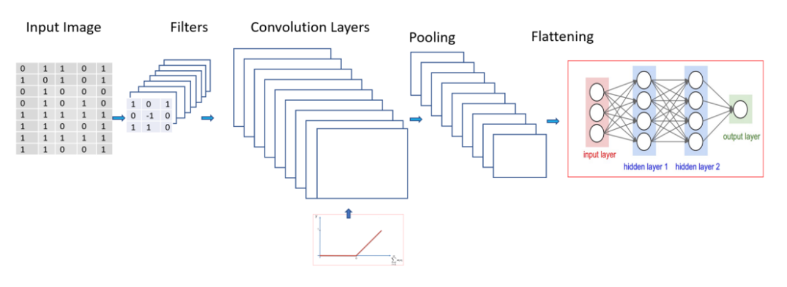

# Filter Visualisation

## CNN Architecture

Apply filters or feature detectors to the input image to generate the feature maps or the activation maps using the Relu activation function. Feature detectors or filters help identify different features present in an image like edges, vertical lines, horizontal lines, bends, etc.

Pooling is then applied over the feature maps for invariance to translation. Pooling is based on the concept that when we change the input by a small amount, the pooled outputs do not change. We can use min pooling, average pooling, or max pooling. Max pooling provides better performance compared to min or average pooling.

Flatten all the input and pass these flattened inputs to a deep neural network that outputs the class of the object.

The class of the image can be binary like a cat or dog, or it can be a multi-class classification like identifying digits or classifying different apparel items.

Neural networks are like a black box, and learned features in a Neural Network are not interpretable. You pass an input image, and the model returns the results.

What if you get an incorrect prediction and would like to figure out why such a decision was made by CNN? If only you could visualize the intermediate representation applied across different Convolutional layers in CNN to understand how the model learns. Understanding the working of the model will help to know the reason for incorrect predition that will lead to better fine tuning of the model and explain the decisions.

## Key points about Convolution layers and Filters

- The depth of a filter in a CNN must match the depth of the input image. The number of color channels in the filter must remain the same as the input image.

- Different Conv2D filters are created for each of the three channels for a color image.

- Filters for each layer are randomly initialized based on either Normal or Gaussian distribution.

- Initial layers of a convolutional network extract high-level features from the image, so use fewer filters. As we build further deeper layers, we increase the number of filters to twice or thrice the size of the filter of the previous layer.

- Filters of the deeper layers learn more features but are computationally very intensive.

## Visualise the filter

By visualisng the filters of CNN, we could make the CNN explainable.

#### Example

Please check [this notebook](./src/CNN_Visualisation.ipynb)
