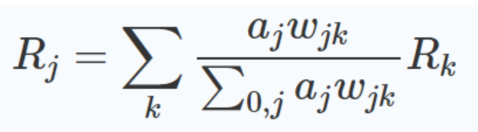
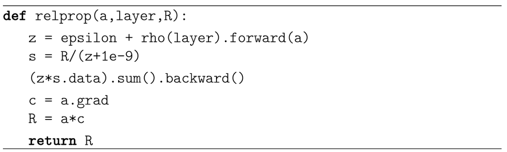
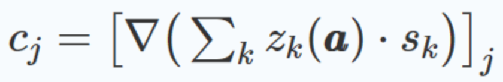
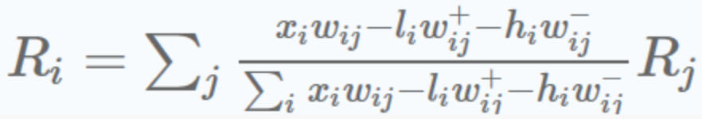
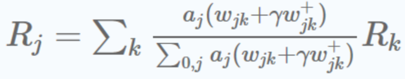

# Layer-wise Relevance Propagation

[Layer-wise relevance propagation (LRP) [1]](https://journals.plos.org/plosone/article?id=10.1371/journal.pone.0130140) is a framework which allows to decompose the prediction of a deep neural network computed over a sample, e.g. an image, down to relevance scores for the single input dimensions of the sample such as subpixels of an image.

Intuitively, what LRP does, is that it uses the network weights and the neural activations created by the forward-pass to propagate the output back through the network up until the input layer. There, we can visualize which pixels really contributed to the output. We call the magnitude of the contribution of each pixel or intermediate neuron “relevance” values R.

LRP is a conservative technique, meaning the magnitude of any output y is conserved through the backpropagation process and is equal to the sum of the relevance map R of the input layer. This property holds for any consecutive layers j and k, and by transitivity for the input and output layer.

With that property in mind, let’s take it step by step. Let’s say our network is a classifier and its output is a vector of size M, where each entry corresponds to one of M classes. In the output layer, we pick one neuron, or class, that we want to explain. For this neuron, the relevance is equal to its activation, the relevance of all other neurons in the output layer is zero. For example, if we want to use LRP to find out the relevance of the network’s neurons and inputs with respect to predicting class c, we start with the output neuron for class c and only look at how the network arrived at this neuron’s value.

From there on we go backwards through the network by following this basic LPR rule:

Here, j and k are two neurons of any consecutive layers. We already know the relevance R in the output layer, so we’ll start from there and use this formula iteratively to calculate R for every neuron of the previous layer. a denotes the activation of the respective neuron, and w is the weight between the two neurons.

This is the simplest LRP rule. Depending on your application, you will perhaps want to use different rules, which will be discussed later. All of them follow the same basic principle.

Now, what does this formula mean? The numerator of the fraction is the amount to which the neuron j influences the neuron k (this is true for the linear case of an active ReLU). To enforce the conservation property above, this has to be divided by the sum of contributions of all neurons of the lower layer. We typically add a very small constant ϵ to the denominator to make the fraction more stable. The outer sum over k means that the relevance of neuron j is determined by the sum of its influence on all neurons k of the following layer, times the relevance of these neurons.

We can simply follow this through from the last until the first layer. Depending on what output neuron we choose to start from, we can get an explanation for any class. So we can even inspect what the network thought would be relevant for predicting any class A, even though it actually predicted class B.

The network structure that can be analyzed like this is not strongly restricted. For example, LRP works also perfectly for CNNs and [can be used for LSTMs [2]](https://link.springer.com/chapter/10.1007/978-3-030-28954-6_11). _It is a requirement, though, that the network only contains ReLU activation functions_.

## 4-step procedure for understanding LRP

### First step

The first step determines the sum of influences for each neuron in the higher layer and is analogous to a modified forward pass. Note that for ReLU layers it is the same as a normal forward pass through the network, except that we add a small constant ϵ and wrap a function ρ around our weights. This ρ is just there to make the formula more general and encompasses all the possible LRP rules we will see later. In the case we had before, ρ would be the identity function, meaning that we can just ignore it.

Notice that the sum goes over every neuron j in the lower layer, and also over the bias neuron. In all the following steps, the bias will be ignored because we want relevance to only flow to the input neurons and not end up in static bias neurons.

### Second step

In the second step, we simply divide each neuron’s relevance in the higher layer by the z value computed before. This ensures that the conservation property holds.

### Third step

In the third step, we compute a quantity c for every neuron in the preceding layer, hence it can be seen as a backward pass. This c can be roughly seen as how much relevance trickles down to neuron j from the succeeding layer.

### Forth step

Lastly, in the fourth step, the relevance coming from above is multiplied with the activation of the neuron to calculate its own relevance. Intuitively, a neuron is relevant if 1) it has a high activation, and 2) it contributes a lot to relevant neurons of the higher layer.

## Implementation Tricks

When first introduced, the authors of LRP provided a pseudo-code snippet that would go through the network layer-by-layer to calculate the relevances. As they became more experienced with applying LRP themselves, they published a more efficient way to go about it.

The key part is to leverage efficient autograd frameworks, such as pytorch or tensorflow to do the backward pass for us.

The big difference to the formulas we have looked at above is that we calculate the c values as gradient computation.

This allows us to make use of the efficient automatic backward operation. In order for this to work out and give the correct result, we have to treat s as a constant. This is indicated by the .data in the code above.

### Different rules

It is important to note that there are different propagation rules for LRP and that you will probably want to combine several of them to get the best results. Luckily there exists a neat list of the most important rules with suggestions on when to use them.

#### Input Layer

For images, the rule of choice has been introduced in the Deep Taylor Decomposition paper by the authors of LRP and takes the following form:

Here l and h are the lowest and highest admissible pixel values, respectively.

#### Lower-Layers

Here we want the explanation to be more smooth and less noisy since these layers are already very close to the relevance map we humans will see and have to make sense of. For this purpose, we can use the LRP-γ rule that that disproportionately favors positive evidence over negative evidence:

#### Higher-Layers

Either LRP-γ from above or the following LRP-ϵ rule can work well here. They remove some of the noise from the relevance map. In particular, the ϵ will absorb some small or contradicting evidence.

#### Output Layer

Here we ideally use the unmodified LRP-0 rule.

There are even more rules than these, but the ones you have seen here suffice for most applications. If picking the right rules looks overly complicated to you, don’t worry! Just LRP-0 and LRP-ϵ should get you very far, and once you got an explanation going with those rules, you can always decide whether to invest the time to experiment with other rules and make the explanation more pretty.

There being so many possible rules also means that you should take the comparisons between LRP and similar techniques with a grain of salt, as these are typically conducted with only the basic LRP-0 rule.

## Example

[example code for LRP](./src/LRP.ipynb)

## References

[1] Sebastian Bach, Alexander Binder, Grégoire Montavon, Frederick Klauschen, Klaus-Robert Müller, Wojciech Samek [On Pixel-Wise Explanations for Non-Linear Classifier Decisions by Layer-Wise Relevance Propagation](https://journals.plos.org/plosone/article?id=10.1371/journal.pone.0130140)

[2] Leila Arras, José Arjona-Medina, Michael Widrich, Grégoire Montavon, Michael Gillhofer, Klaus-Robert Müller, Sepp Hochreiter, Wojciech Samek [Explaining and Interpreting LSTMs](https://link.springer.com/chapter/10.1007/978-3-030-28954-6_11)
