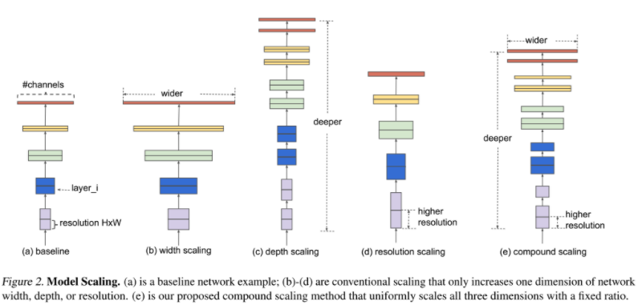
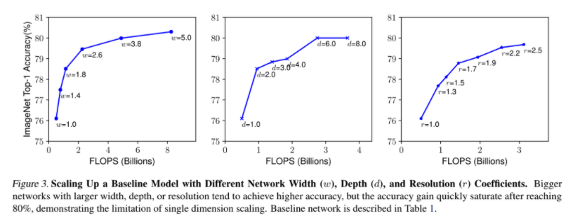
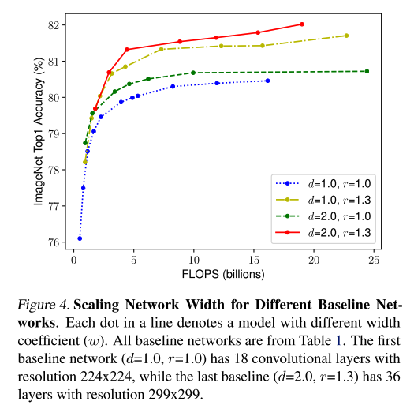
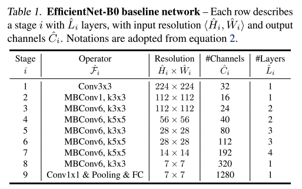
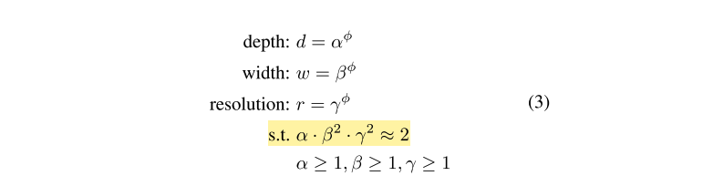
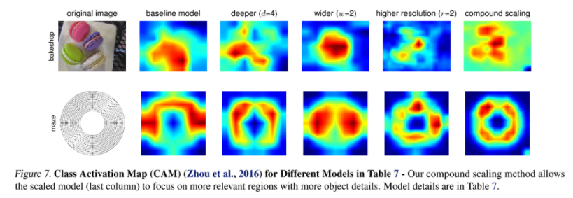

# Convolutional Neural Networks

The CNN, which stands for Convolutional Neural Network, is a class of deep neural networks, most commonly applied to analyzing visual imagery.

## Table of Contents

1. [Origin of CNN](#origin-of-cnn)
2. [Architecture of CNN](#architecture-of-cnn)
3. [Role of CNN](#role-of-cnn)
4. [Using Conv Net for other categories](#using-conv-net-for-other-categories)
5. [Understanding limits of CNN](#understanding-limits-of-cnn)
6. [Implementation](#implementation)
7. [References](#references)

## Origin of CNN

In the 1950s and 1960s, Hubel and Wiesel showed that cat and monkey visual cortexes contain neurons that individually respond to small regions of the visual field. Provided the eyes are not moving, the region of visual space within which visual stimuli affect the firing of a single neuron is known as its receptive field. Neighboring cells have similar and overlapping receptive fields.

The [neocognitron [1]](https://link.springer.com/chapter/10.1007/978-3-642-46466-9_18), which was published few years before Yann LeCun et. al. published the first paper of CNN, is a hierarchical, multilayered artificial neural network proposed by Kunihiko Fukushima in 1979. This was inspired by the above-mentioned work of Hubel and Wiesel. The neocognitron introduced the two basic types of layers in CNNs: convolutional layers, and downsampling layers. A convolutional layer contains units whose receptive fields cover a patch of the previous layer. The weight vector (the set of adaptive parameters) of such a unit is often called a filter. Units can share filters. Downsampling layers contain units whose receptive fields cover patches of previous convolutional layers. Such a unit typically computes the average of the activations of the units in its patch. This downsampling helps to correctly classify objects in visual scenes even when the objects are shifted.

In 1989, a system to recognize hand-written ZIP code numbers involved convolutions in which the kernel coefficients had been laboriously hand designed was implemented. [Yann LeCun et. al. [2]](http://yann.lecun.com/exdb/publis/pdf/lecun-01a.pdf) used back-propagation to learn the convolution kernel coefficients directly from images of hand-written numbers. Learning was thus fully automatic, performed better than manual coefficient design, and was suited to a broader range of image recognition problems and image types. There is no doubt that this approach became a foundation of modern Computer Vision.

## Architecture of CNN

The architecture of a typical ConvNet is structured as a series of stages. The first few stages are composed of two types of layers: convolutional layers and pooling layers. Units in a convolutional layer are organized in feature maps, within which each unit is connected to local patches in the feature maps of the previous layer through a set of weights called a filter bank. The result of this local weighted sum is then passed through a non-linearity such as a ReLU. All units in a feature map share the same filter bank. Different feature maps in a layer use different filter banks. The reason for this architecture is twofold.

First, in array data such as images, local groups of values are often highly correlated, forming distinctive local motifs that are easily detected. Second, the local statistics of images and other signals are invariant to location. In other words, if a motif can appear in one part of the image, it could appear anywhere, hence the idea of units at different locations sharing the same weights and detecting the same pattern in different parts of the array.

Mathematically, the filtering operation performed by a feature map is a discrete convolution, hence the name.

## Role of CNN

The role of the convolutional layer is to detect local conjunctions of features from the previous layer, the role of the pooling layer is to merge semantically similar features into one. Because the relative positions of the features forming a motif can vary somewhat, reliably detecting the motif can be done by coarse-graining the position of each feature. A typical pooling unit computes the maximum of a local patch of units in one feature map (or in a few feature maps). Neighbouring pooling units take input from patches that are shifted by more than one row or column, thereby reducing the dimension of the representation and creating an invariance to small shifts and distortions. Two or three stages of convolution, non-linearity and pooling are stacked, followed by more convolutional and fully-connected layers. Backpropagating gradients through a ConvNet is as simple as through a regular deep network, allowing all the weights in all the filter banks to be trained.

## Using Conv Net for other categories

Some people might think that the CNN is only for the Computer Vision. However, that is not true. For example, in 2014, [Y. Kim et. al. [3]](https://arxiv.org/abs/1408.5882) used the Conv Net for sentence classification. In 2020, there are many NLP papers that use Convolutional Neural Networks to solve natural language problems. Furthermore, networks like [WaveNet [4]](https://arxiv.org/abs/1408.5882) or [MidiNet [5]](https://arxiv.org/abs/1703.10847) use the Convolutional Layers for music generation models.

## Understanding limits of CNN

In AAAI 2020 conference, Geofferey Hinton mentioned that "CNNs are designed to cope with translations" [6](https://bdtechtalks.com/2020/03/02/geoffrey-hinton-convnets-cnn-limits/). This means that a well-trained convnet can identify an object regardless of where it appears in an image. But they’re not so good at dealing with other effects of changing viewpoints such as rotation and scaling. One approach to solving this problem, according to Hinton, is to use 4D or 6D maps to train the AI and later perform object detection. “But that just gets hopelessly expensive,” he added.

## Implementation

I implemented various CNN architectures with PyTorch. You could find all codes from [my GitHub repository](https://github.com/YeonwooSung/PyTorch_CNN_Architectures).

## EfficientNet

[EfficientNet: Rethinking Model Scaling for Convolutional Neural Networks [7]](https://arxiv.org/abs/1905.11946)

### Table of Contents (EfficientNet)

- [Overview](#overview)
- [Single Dimension Model Scaling](#single-dimension-model-scaling)
- [Compound Scaling](#compound-scaling)

### Overview

When improving the accuracy of CNN, researchers not only consider to build a new model but also increase the complexity of the existing CNN model.

As you could see in the image above, there are various model scaling methods: width scaling, depth scaling, and resolution scaling.

The width scaling is a method that increases the number of the filters, which increases the number of output channels.
The depth scaling is a method that appends the new layers to the neural network, so that we could make a deeper neural net.
The resolution scaling is a method that improves the resolution of the input image (use higher resolution image as an input).

ResNet is the representative depth scaling model (ResNet-50, ResNet-101), and the MobileNet, ShuffleNet are the well-known examples of the width scaling (MobileNet-224 1.0, MobileNet-224 0.5). However, none of the previous researches considered the 3 model scaling methods at the same time.

### Single Dimension Model Scaling

First, Tan. et. al did the single dimension model scaling - change the one factor while fixing the other 2 factors. For example, when scaling up the network by using the width scaling, they fixed the depth and resolution. Below is the result of the single dimension model scaling experiment.

As you could see both width scaling and depth scaling satisfy the saturation in early stage, however, the resolution scaling increases continuously.

Next, they tested the single dimension model scaling with 4 different networks, where each network has different depth and resolution.

If you see the green line and yellow line in the chart, you could find that it is better to increase the resolution rather than depth for higher accuracy.
Also, from red line, you could find that the best scaling method is scaling up all 3 factors.

### Compound Scaling

Even if we could enhance the accuracy with model scaling methods, it is better to choose the good initial model. To find a good initial model, Tan. et. al used the NAS (Neural network Architecture Search), and named the found model as "EfficientNet-B0".

Next, they scaled up this model by using the Compound Scaling, which scales up all 3 factors that we mentioned above.

So, they represent the depth as alpha, width as beta, and resolution as gamma. The main goal of this scaling method is to fulfill the yellow part in the image.

You would wonder why the beta and gamma are squared. This is because when we double the depth the FLOPS would also be doubled, however, when we double the either width or resolution the FLOPS would increase quadratically (width * height). Tan. et. al used the simple grid search to find the best pairs of alpha, beta, and gamma for the target dataset (they used alpha = 1.2, beta = 1.1, gamma = 1.15).

Below is the CAM(Class Activation Map) for different models, where each model uses different scaling method. As you could see, the model that uses the compound scaling has the most elaborated CAM.

## References

[1] Kunihiko Fukushima, Sei Miyake. [Neocognitron: A Self-Organizing Neural Network Model for a Mechanism of Visual Pattern Recognition](https://link.springer.com/chapter/10.1007/978-3-642-46466-9_18)

[2] Yann LeCun, Leon Bottou, Yoshua Bengio, Pattrick Haffner. [Gradient-based learning applied to document recognition](http://yann.lecun.com/exdb/publis/pdf/lecun-01a.pdf)

[3] Yoon Kim. [Convolutional Neural Networks for Sentence Classification](https://arxiv.org/abs/1408.5882)

[4] Aaron van den Oord, Sander Dieleman, Heiga Zen, Karen Simonyan, Oriol Vinyals, Alex Graves, Nal Kalchbrenner, Andrew Senior, Koray Kavukcuoglu. [WaveNet: A Generative Model for Raw Audio](https://arxiv.org/abs/1609.03499)

[5] Li-Chia Yang, Szu-Yu Chou, Yi-Hsuan Yang. [MidiNet: A Convolutional Generative Adversarial Network for Symbolic-domain Music Generation](https://arxiv.org/abs/1703.10847)

[6] Ben Dickson (TechTalks). ["Understanding the limits of CNNs, one of AI’s greatest achievements"](https://bdtechtalks.com/2020/03/02/geoffrey-hinton-convnets-cnn-limits/)

[7] Mingxing Tan, Quoc V. Le. [EfficientNet: Rethinking Model Scaling for Convolutional Neural Networks](https://arxiv.org/abs/1905.11946)
