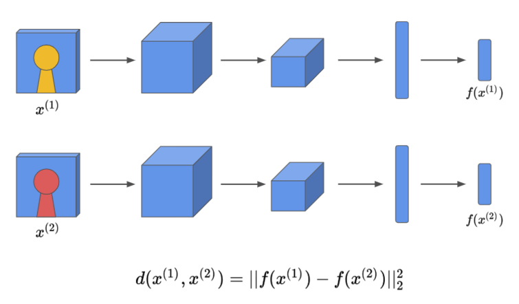

# Siamese Network

The main aim of the [Siamese Network [1]](https://www.cs.toronto.edu/~ranzato/publications/taigman_cvpr14.pdf) is calculating the similarity between 2 images.

Initially, it was proposed for face recognition (calculating the similarity between 2 images of human, so that the network could check if the person in each image is same person). However, it actually uses more for calculating similarity values for self-supervised learning models (pretext models).

Basically, it takes 2 images as inputs, and vectorize each image. Then, it calculates the similarity between 2 vectors.

The network does not use the hand-crafted features but the features that are extracted from images for training. This makes the Siamese Network possible to extract good quality of features from the image.

## Encoding the image

As you could see below, the Siamese Network uses convolution operations (ConvNet layers) to encode the image into a vector.

## References

[1] Yaniv Taigman, Ming Yang, Marc’Aurelio Ranzato, Lior Wolf. [DeepFace: Closing the Gap to Human-Level Performance in Face Verification](https://www.cs.toronto.edu/~ranzato/publications/taigman_cvpr14.pdf)
