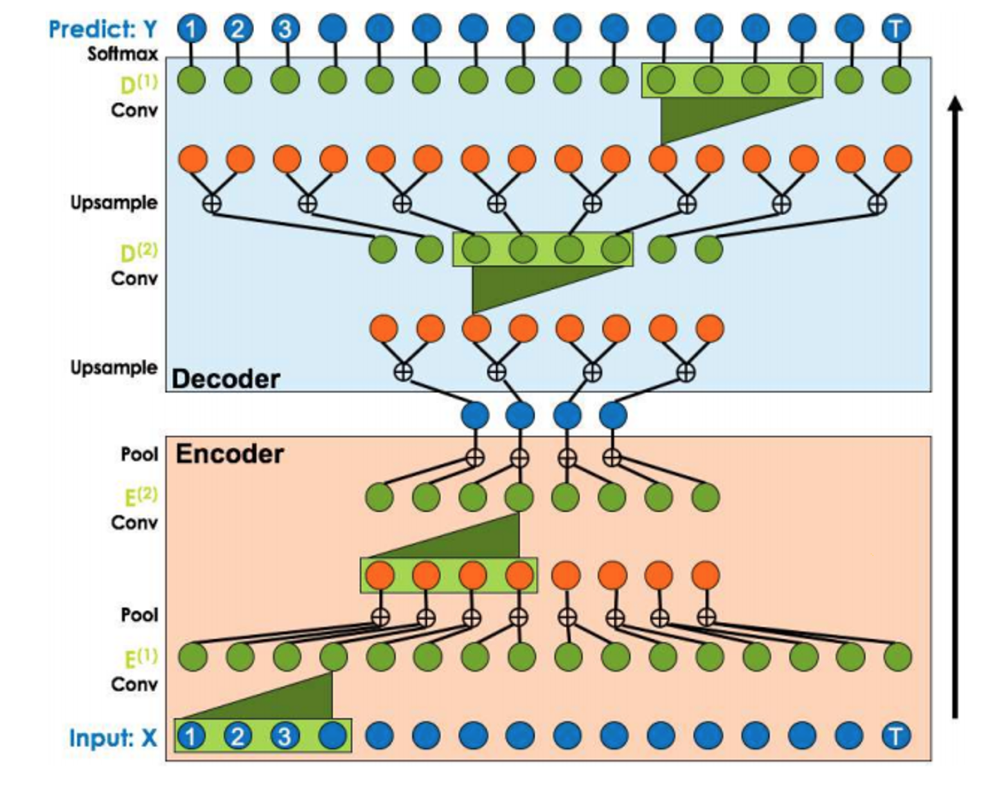
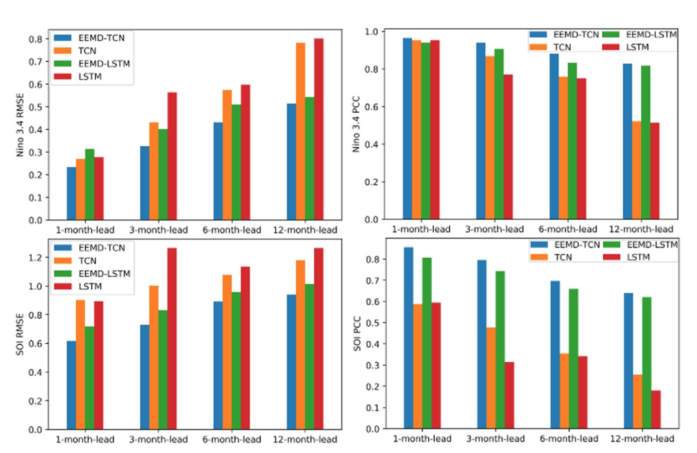

# Temporal Convolutional Networks (TCN)

A TCN is proposed by [Lea. et al. [1]](https://openaccess.thecvf.com/content_cvpr_2017/html/Lea_Temporal_Convolutional_Networks_CVPR_2017_paper.html) for the video-based action segmentation.

The two steps of this conventional process include: firstly, computing of low-level features using (usually) CNN that encode spatial-temporal information and secondly, input these low-level features into a classifier that captures high-level temporal information using (usually) RNN.

The main disadvantage of such an approach is that it requires two separate models. TCN provides a unified approach to capture all two levels of information hierarchically.

## Architecture

Basically, the TCN uses the encoder-decoder model, where the encoder uses the RNN and ConvNet layers to extract features from continuous frames, and the decoder uses the ConvNet layers to recognise the action in the given frames.

## Performance

The buzz around TCN arrives even to Nature journal, with the recent publication of the work by [Yan et al. (2020) [2]](https://www.nature.com/articles/s41598-020-65070-5) on TCN for weather prediction tasks. In their work, a comparative experiment was conducted with TCN and LSTM. One of their results was that, among other approaches, the TCN performs well in prediction tasks with time-series data.

## References

[1] Colin Lea, Michael D. Flynn, Rene Vidal, Austin Reiter, Gregory D. Hager. [Temporal Convolutional Networks for Action Segmentation and Detection](https://openaccess.thecvf.com/content_cvpr_2017/html/Lea_Temporal_Convolutional_Networks_CVPR_2017_paper.html)

[2] Jining Yan, Lin Mu, Lizhe Wang, Rajiv Ranjan & Albert Y. Zomaya. [Temporal Convolutional Networks for the Advance Prediction of ENSO](https://www.nature.com/articles/s41598-020-65070-5)
