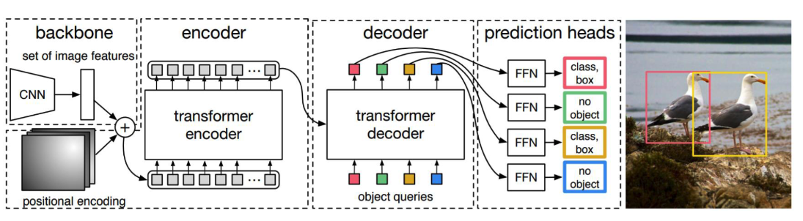
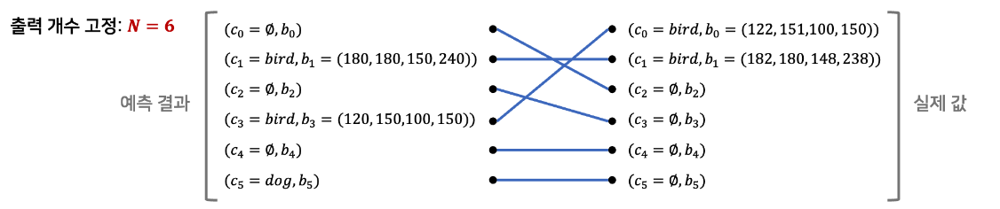

# DETR

## 핵심 아이디어

- CNN이 아닌 Vanilla Transformer를 주요 backbone 모델로 활용해 object detection 수행
- 기존 객체 탐지 모델들은 너무 복잡해서 다양한 라이브러리를 사용해야 하며, 모델의 이해가 어려움
    - NMS, Anchor, IoU 등
    - DETR는 Transformer와 bipartite matching을 사용해 기존 모델들의 복잡성을 줄임
- DETR은 CNN을 사용하지 않고, Transformer만을 사용해 object detection 수행

## DETR의 구조

- DETR은 Transformer의 Encoder와 Decoder를 사용하여 Object Detection을 수행
- Encoder는 이미지를 Feature Map으로 변환
- Decoder는 Feature Map을 입력으로 받아 Object Detection 수행
- Encoder와 Decoder는 동일한 구조를 사용

## Bipartite Matching

- 이분 매칭을 통해 set prediction problem을 해결
- 학습 과정에서 이분 매칭을 수행함으로써 검출 인스턴스가 중복되지 않게 만듬

예를 들어, 이미지 내에 최대 8개의 객체가 검출될 수 있다고 가정을 했을 때, DETR는 "검출 안됨"을 포함한 8개의 결과 값을 반환하게 된다.
학습 시에, 이 8개의 결과 값은 "객체 없음"을 포함한 8개의 인스턴스 집합과 이분 매칭을 통해 검출 결과가 최대가 되도록 매칭이 이루어지게 된다.

아래 이미지는 최대 6개의 객체가 이미지 내에 존재할 수 있다고 가정을 하였을 때 학습 과정에서 이분 매칭이 이루어지는 과정을 보여준다.

