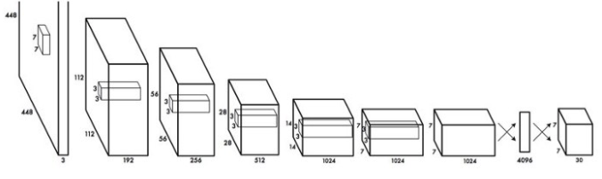
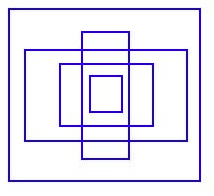
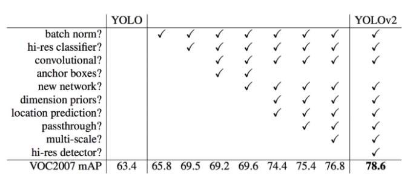
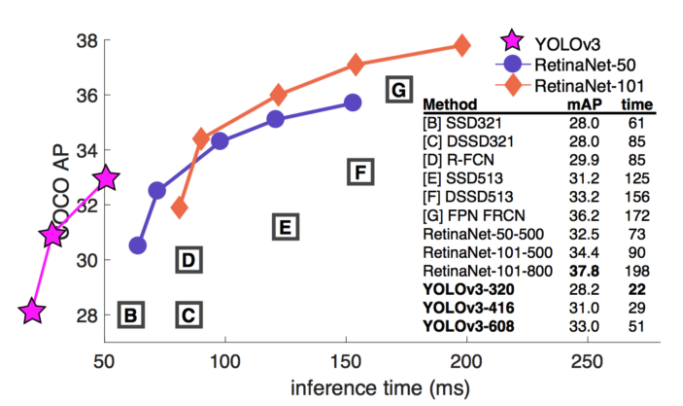

# You Only Look Once (YOLO)

You only look once (YOLO) is an object detection system targeted for real-time processing.

## How YOLO works

YOLO divides the input image into an S×S grid. Each grid cell predicts only one object. For example, the yellow grid cell below tries to predict the “person” object whose center (the blue dot) falls inside the grid cell. Each grid cell predicts a fixed number of boundary boxes.

However, the one-object rule limits how close detected objects can be. For that, YOLO does have some limitations on how close objects can be.

For each grid cell,

    it predicts B boundary boxes and each box has one box confidence score,
    it detects one object only regardless of the number of boxes B,
    it predicts C conditional class probabilities (one per class for the likeliness of the object class).

Let’s get into more details. Each boundary box contains 5 elements: (x, y, w, h) and a box confidence score. The confidence score reflects how likely the box contains an object (objectness) and how accurate is the boundary box. We normalize the bounding box width w and height h by the image width and height. x and y are offsets to the corresponding cell. Hence, x, y, w and h are all between 0 and 1. Each cell has 20 conditional class probabilities. The conditional class probability is the probability that the detected object belongs to a particular class (one probability per category for each cell). So, YOLO’s prediction has a shape of (S, S, B×5 + C) = (7, 7, 2×5 + 20) = (7, 7, 30).

The major concept of YOLO is to build a CNN network to predict a (7, 7, 30) tensor. It uses a CNN network to reduce the spatial dimension to 7×7 with 1024 output channels at each location. YOLO performs a linear regression using two fully connected layers to make 7×7×2 boundary box predictions (the middle picture below). To make a final prediction, we keep those with high box confidence scores (greater than 0.25) as our final predictions (the right picture).

### Confidence score

The class confidence score measures the confidence on both the classification and the localization (where an object is located).

The class confidence score for each prediction box is computed as:

    class_confidenc_score = box_confidence_score * conditional_class_probability

and

    box_confidence_score = P_r(object) * IoU
    conditional_class_probability = P_r(class_i | object)

where

    P_r(object) is the probability that the box contains an object
    IoU is an IoU(intersection of union) between the predicted box and the ground truth
    P_r(class_i | object) is the probability the object belongs to class_i given an object is presence
    P_r(class_i) is the probability the object belongs to class_i

By combining the equations above, we could derive the following equation:

    class_confidenc_score 
    = box_confidence_score * conditional_class_probability
    = P_r(object) * IoU * P_r(class_i | object)

### Loss Function

The YOLO model calculates the Loss by adding all classification loss, localization loss, and confidence loss. For more details, please read [this paper [1]](https://arxiv.org/abs/1506.02640).

### Benefits of YOLO

    - Fast. Good for real-time processing.
    - Predictions (object locations and classes) are made from one single network. Can be trained end-to-end to improve accuracy.
    - YOLO is more generalized. It outperforms other methods when generalizing from natural images to other domains like artwork.
    - Region proposal methods limit the classifier to the specific region. YOLO accesses to the whole image in predicting boundaries. With the additional context, YOLO demonstrates fewer false positives in background areas.
    - YOLO detects one object per grid cell. It enforces spatial diversity in making predictions.

### Credits of this section

I declare that most of the contents in this section (How YOLO works) come from [this article [2]](https://medium.com/@jonathan_hui/real-time-object-detection-with-yolo-yolov2-28b1b93e2088). Credits to [the author of the article](https://medium.com/@jonathan_hui).

## YOLOv2

Comparing with region based detectors, YOLO has higher localization errors and the recall (measure how good to locate all objects) is lower. [YOLOv2](https://arxiv.org/abs/1612.08242) is the second version of the YOLO with the objective of improving the accuracy significantly while making it faster.

### Accuracy improvements

#### Batch Normalization

Add batch normalization in convolution layers. This removes the need for dropouts and pushes mAP up 2%.

#### High-resolution classifier

The YOLO training composes of 2 phases. First, we train a classifier network like VGG16. Then we replace the fully connected layers with a convolution layer and retrain it end-to-end for the object detection. YOLO trains the classifier with 224 × 224 pictures followed by 448 × 448 pictures for the object detection. YOLOv2 starts with 224 × 224 pictures for the classifier training but then retune the classifier again with 448 × 448 pictures using much fewer epochs. This makes the detector training easier and moves mAP up by 4%.

#### Convolutional with Anchor Boxes

As indicated in the [YOLO paper [1]](https://arxiv.org/abs/1506.02640), the early training is susceptible to unstable gradients. Initially, YOLO makes arbitrary guesses on the boundary boxes. These guesses may work well for some objects but badly for others resulting in steep gradient changes. In early training, predictions are fighting with each other on what shapes to specialize on.

In the real-life domain, the boundary boxes are not arbitrary. Cars have very similar shapes and pedestrians have an approximate aspect ratio of 0.41. Since we only need one guess to be right, the initial training will be more stable if we start with diverse guesses that are common for real-life objects.

For example, we can create 5 anchor boxes with the following shapes.

Instead of predicting 5 arbitrary boundary boxes, we predict offsets to each of the anchor boxes above. If we constrain the offset values, we can maintain the diversity of the predictions and have each prediction focuses on a specific shape. So the initial training will be more stable.

In [the paper [2]](https://arxiv.org/abs/1612.08242), anchors are also called priors.

Here are the changes we make to the network:

    - Remove the fully connected layers responsible for predicting the boundary box.

    - We move the class prediction from the cell level to the boundary box level. Now, each prediction includes 4 parameters for the boundary box, 1 box confidence score (objectness) and 20 class probabilities. i.e. 5 boundary boxes with 25 parameters: 125 parameters per grid cell. Same as YOLO, the objectness prediction still predicts the IOU of the ground truth and the proposed box.

    - To generate predictions with a shape of 7 × 7 × 125, we replace the last convolution layer with three 3 × 3 convolutional layers each outputting 1024 output channels. Then we apply a final 1 × 1 convolutional layer to convert the 7 × 7 × 1024 output into 7 × 7 × 125.

    - Change the input image size from 448 × 448 to 416 × 416. This creates an odd number spatial dimension (7×7 v.s. 8×8 grid cell). The center of a picture is often occupied by a large object. With an odd number grid cell, it is more certain on where the object belongs.

    - Remove one pooling layer to make the spatial output of the network to 13×13 (instead of 7×7).

Anchor boxes decrease mAP slightly from 69.5 to 69.2 but the recall improves from 81% to 88%. i.e. even the accuracy is slightly decreased but it increases the chances of detecting all the ground truth objects.

#### Dimension Clusters

In many problem domains, the boundary boxes have strong patterns. For example, in the autonomous driving, the 2 most common boundary boxes will be cars and pedestrians at different distances. To identify the top-K boundary boxes that have the best coverage for the training data, we run K-means clustering on the training data to locate the centroids of the top-K clusters.

Since we are dealing with boundary boxes rather than points, we cannot use the regular spatial distance to measure datapoint distances.

No surprise, we use IoU.

#### Direct location prediction

We make predictions on the offsets to the anchors. Nevertheless, if it is unconstrained, our guesses will be randomized again. YOLO predicts 5 parameters (tx, ty, tw, th, and to) and applies the sigma function to constraint its possible offset range.

According to [J. Redmon et. al. [3]](https://arxiv.org/abs/1612.08242), with the use of k-means clustering (dimension clusters) and the improvement mentioned in this section, mAP increases 5%.

#### Fine-Grained Features

Convolution layers decrease the spatial dimension gradually. As the corresponding resolution decreases, it is harder to detect small objects. Other object detectors like SSD locate objects from different layers of feature maps. So each layer specializes at a different scale. YOLO adopts a different approach called passthrough. It reshapes the 26 × 26 × 512 layer to 13 × 13 × 2048. Then it concatenates with the original 13 × 13 ×1024 output layer. Now we apply convolution filters on the new 13 × 13 × 3072 layer to make predictions.

#### Multi-Scale Training

After removing the fully connected layers, YOLO can take images of different sizes. If the width and height are doubled, we are just making 4x output grid cells and therefore 4x predictions. Since the YOLO network downsamples the input by 32, we just need to make sure the width and height is a multiple of 32. During training, YOLO takes images of size 320×320, 352×352, … and 608×608 (with a step of 32). For every 10 batches, YOLOv2 randomly selects another image size to train the model. This acts as data augmentation and forces the network to predict well for different input image dimension and scale. In additional, we can use lower resolution images for object detection at the cost of accuracy. This can be a good tradeoff for speed on low GPU power devices. At 288 × 288 YOLO runs at more than 90 FPS with mAP almost as good as Fast R-CNN. At high-resolution YOLO achieves 78.6 mAP on VOC 2007.

### Accuracy comparison with YOLO

Here is the accuracy improvements after applying the techniques discussed so far:

### Speed Improvement

#### GoogLeNet

VGG16 requires 30.69 billion floating point operations for a single pass over a 224 × 224 image versus 8.52 billion operations for a customized GoogLeNet. We can replace the VGG16 with the customized GoogLeNet. However, YOLO pays a price on the top-5 accuracy for ImageNet: accuracy drops from 90.0% to 88.0%.

#### DarkNet

We can further simplify the backbone CNN used. Darknet requires 5.58 billion operations only. With DarkNet, YOLO achieves 72.9% top-1 accuracy and 91.2% top-5 accuracy on ImageNet. Darknet uses mostly 3 × 3 filters to extract features and 1 × 1 filters to reduce output channels. It also uses global average pooling to make predictions.

Here is the detail network description:

We replace the last convolution layer (the cross-out section) with three 3 × 3 convolutional layers each outputting 1024 output channels. Then we apply a final 1 × 1 convolutional layer to convert the 7 × 7 × 1024 output into 7 × 7 × 125. (5 boundary boxes each with 4 parameters for the box, 1 objectness score and 20 conditional class probabilities)

### Training

YOLO is trained with the ImageNet 1000 class classification dataset in 160 epochs: using stochastic gradient descent with a starting learning rate of 0.1, polynomial rate decay with a power of 4, weight decay of 0.0005 and momentum of 0.9. In the initial training, YOLO uses 224 × 224 images, and then retune it with 448× 448 images for 10 epochs at a 10−3 learning rate. After the training, the classifier achieves a top-1 accuracy of 76.5% and a top-5 accuracy of 93.3%.

Then the fully connected layers and the last convolution layer is removed for a detector. YOLO adds three 3 × 3 convolutional layers with 1024 filters each followed by a final 1 × 1 convolutional layer with 125 output channels. (5 box predictions each with 25 parameters) YOLO also add a passthrough layer. YOLO trains the network for 160 epochs with a starting learning rate of 10−3 , dividing it by 10 at 60 and 90 epochs. YOLO uses a weight decay of 0.0005 and momentum of 0.9.

### Classification

Datasets for object detection have far fewer class categories than those for classification. To expand the classes that YOLO can detect, YOLO proposes a method to mix images from both detection and classification datasets during training. It trains the end-to-end network with the object detection samples while backpropagates the classification loss from the classification samples to train the classifier path. This approach encounters a few challenges:

    - How do we merge class labels from different datasets? In particular, object detection datasets and different classification datasets uses different labels.
    
    - Any merged labels may not be mutually exclusive, for example, Norfolk terrier in ImageNet and dog in COCO. Since it is not mutually exclusive, we can not use softmax to compute the probability.

#### Hierarchical classification

Without going into details, YOLO combines labels in different datasets to form a tree-like structure WordTree. The children form an is-a relationship with its parent like biplane is a plane. But the merged labels are now not mutually exclusive.

### YOLO 9000

YOLO9000 extends YOLO to detect objects over 9000 classes using hierarchical classification with a 9418 node WordTree. It combines samples from COCO and the top 9000 classes from the ImageNet. YOLO samples four ImageNet data for every COCO data. It learns to find objects using the detection data in COCO and to classify these objects with ImageNet samples.

During the evaluation, YOLO test images on categories that it knows how to classify but not trained directly to locate them, i.e. categories that do not exist in COCO. YOLO9000 evaluates its result from the ImageNet object detection dataset which has 200 categories. It shares about 44 categories with COCO. Therefore, the dataset contains 156 categories that have never been trained directly on how to locate them. YOLO extracts similar features for related object types. Hence, we can detect those 156 categories by simply from the feature values.

YOLO9000 gets 19.7 mAP overall with 16.0 mAP on those 156 categories. YOLO9000 performs well with new species of animals not found in COCO because their shapes can be generalized easily from their parent classes. However, COCO does not have bounding box labels for any type of clothing so the test struggles with categories like “sunglasses”.

## YOLOv3

The official title of YOLO v2 paper seemed if YOLO was a milk-based health drink for kids rather than a object detection algorithm. It was named “YOLO9000: Better, Faster, Stronger”.
For it’s time YOLO 9000 was the fastest, and also one of the most accurate algorithm. However, a couple of years down the line and it’s no longer the most accurate with algorithms like RetinaNet, and SSD outperforming it in terms of accuracy. It still, however, was one of the fastest.

But that speed has been traded off for boosts in accuracy in [YOLOv3 [4]](https://arxiv.org/abs/1804.02767). While the earlier variant ran on 45 FPS on a Titan X, the current version clocks about 30 FPS. This has to do with the increase in complexity of underlying architecture called Darknet.

### Class Prediction

Most classifiers assume output labels are mutually exclusive. It is true if the output are mutually exclusive object classes. Therefore, YOLO applies a softmax function to convert scores into probabilities that sum up to one. YOLOv3 uses multi-label classification. For example, the output labels may be “pedestrian” and “child” which are not non-exclusive. (the sum of output can be greater than 1 now.) YOLOv3 replaces the softmax function with independent logistic classifiers to calculate the likeliness of the input belongs to a specific label. Instead of using mean square error in calculating the classification loss, YOLOv3 uses binary cross-entropy loss for each label. This also reduces the computation complexity by avoiding the softmax function.

### Bounding box prediction & cost function calculation

YOLOv3 predicts an objectness score for each bounding box using logistic regression. YOLOv3 changes the way in calculating the cost function. If the bounding box prior (anchor) overlaps a ground truth object more than others, the corresponding objectness score should be 1. For other priors with overlap greater than a predefined threshold (default 0.5), they incur no cost. Each ground truth object is associated with one boundary box prior only. If a bounding box prior is not assigned, it incurs no classification and localization lost, just confidence loss on objectness. We use tx and ty (instead of bx and by) to compute the loss.

    b_x = sigma(tx) + cx
    b_y = sigma(ty) + cy
    b_w = p_w * e^(tw)
    b_h = p_h * e^(th)

### Feature Pyramid Networks (FPN) like Feature Pyramid

YOLOv3 makes 3 predictions per location. Each prediction composes of a boundary box, a objectness and 80 class scores, i.e. N × N × [3 × (4 + 1 + 80) ] predictions.

YOLOv3 makes predictions at 3 different scales (similar to the FPN):

    1) In the last feature map layer.

    2) Then it goes back 2 layers back and upsamples it by 2. YOLOv3 then takes a feature map with higher resolution and merge it with the upsampled feature map using element-wise addition. YOLOv3 apply convolutional filters on the merged map to make the second set of predictions.

    3) Repeat 2 again so the resulted feature map layer has good high-level structure (semantic) information and good resolution spatial information on object locations.

To determine the priors, YOLOv3 applies k-means cluster. Then it pre-select 9 clusters. For COCO, the width and height of the anchors are (10×13),(16×30),(33×23),(30×61),(62×45),(59× 119),(116 × 90),(156 × 198),(373 × 326). These 9 priors are grouped into 3 different groups according to their scale. Each group is assigned to a specific feature map above in detecting objects.

### Feature extractor

A new 53-layer Darknet-53 is used to replace the Darknet-19 as the feature extractor. Darknet-53 mainly compose of 3 × 3 and 1× 1 filters with skip connections like the residual network in ResNet. Darknet-53 has less BFLOP (billion floating point operations) than ResNet-152, but achieves the same classification accuracy at 2x faster.

### YOLOv3 Performance

YOLOv3's COCO AP metric is on par with SSD but 3x faster. But YOLOv3’s AP is still behind RetinaNet. In particular, AP@IoU=.75 drops significantly comparing with RetinaNet which suggests YOLOv3 has higher localization error. YOLOv3 also shows significant improvement in detecting small objects.

YOLOv3 performs very well in the fast detector category when speed is important.

## References

[1] Joseph Redmon, Santosh Divvala, Ross Girshick, Ali Farhadi. [You Only Look Once: Unified, Real-Time Object Detection](https://arxiv.org/abs/1506.02640)
[2] Jonathan Hui. [Real-time Object Detection with YOLO, YOLOv2 and now YOLOv3](https://medium.com/@jonathan_hui/real-time-object-detection-with-yolo-yolov2-28b1b93e2088)
[3] Joseph Redmon, Ali Farhadi. [YOLO9000: Better, Faster, Stronger](https://arxiv.org/abs/1612.08242)
[4] Joseph Redmon, Ali Farhadi. [YOLOv3: An Incremental Improvement](https://arxiv.org/abs/1804.02767)
