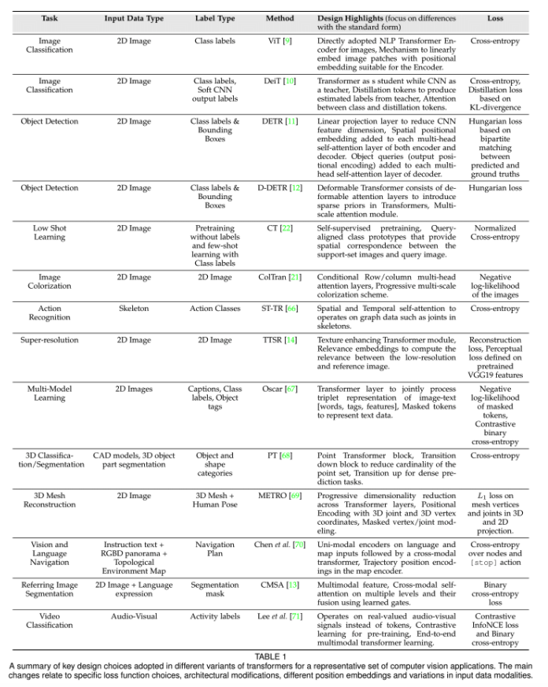
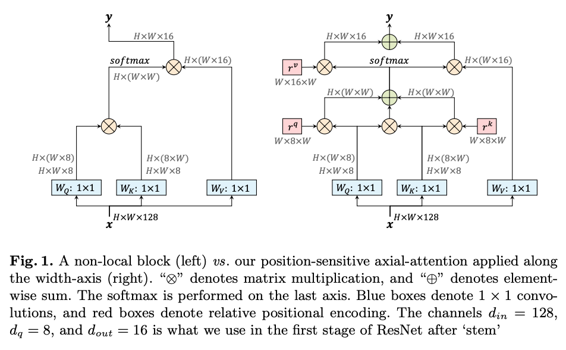
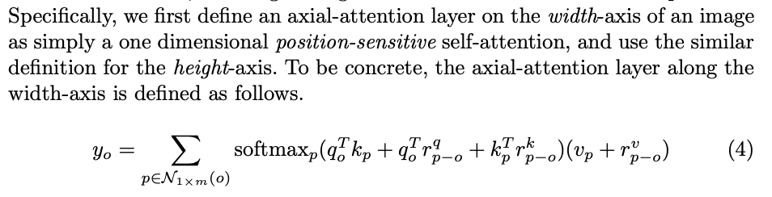
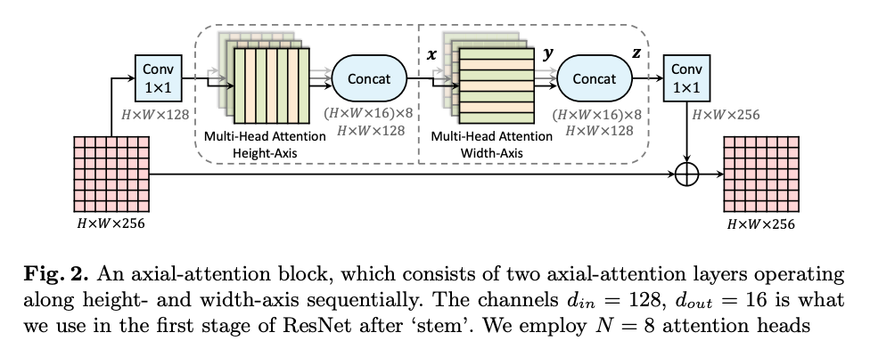
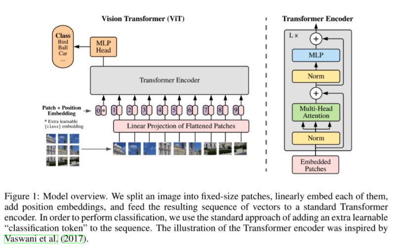
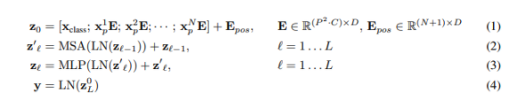
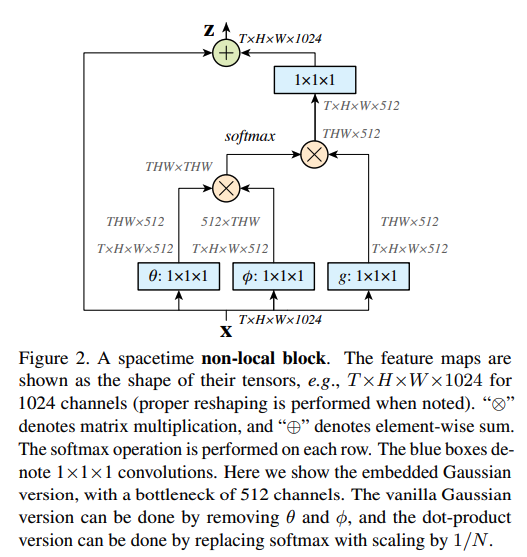

# Transformers for CV

## Table of Contents (Transformers for CV)

- [Axial-DeepLab](#axial-deepLab)
- [DETR](#detr)
- [Vision Transformers](#vision-transformers)
- [Non-local Neural Networks](#non-local-neural-networks)

## Transformer based models for CV tasks

Below is a summary of key designs adopted in different variants of transformers for a representive set of CV applications.

## Axial-DeepLab

Convolutional Neural Networks have dominated image processing for the last decade, but transformers are quickly replacing traditional models. [Wang et al. [1]](https://arxiv.org/abs/2003.07853) proposes a fully attentional model for images by combining learned Positional Embeddings with Axial Attention. This new model can compete with CNNs on image classification and achieve state-of-the-art in various image segmentation tasks.

The key architiecture in this model is "Axial-Attention" block, which uses the "position sensitive attention". Wang et al. stated that the position sensitive attention  captures long range interactions with precise positional information at a reasonable computation overhead.

Surprisingly, the Axial-DeepLab worked well on not only for image classification, but also as a backbone of panoptic segmentation. For the image classification, it actually got similar accuracy score with other SOTA models that use ConvNet layers. Furthermore, it achieved SOTA for various segmentation tasks.

## DETR

On 2019, FAIR (Facebook AI Research) proposed a novel model called DETR, which uses the Transfomers model for the object detection.

Please see more information about the DETR in [here](../ObjectDetection/DETR)

## Vision Transformers

ViT (Vision Transformers) is an architecture that is proposed by Google, which is a Transformer-based model for CV tasks.
The most interesting point is that this model is not the ConvNet-based model. As you know, almost all CV models are CNN based until now.
However, [Dosovitskiy et. al. [2]](https://arxiv.org/abs/2010.11929) showed that it is possible to use the Transformer-based models for the image classification.

What they did is 1) divide the input image into several patches, 2) input those patches to the CNN (ResNet) and get the feature maps, 3) flatten the feature map, 4) input the flattened feature maps to the Transformer encoder, and 5) use the classifier as a last layer.

Since they divide the input image into patches, they convert the "H x W x C" to "N * (P x P x C)", where H = height, W = width, C = channel, N = num of patches, and P is the size of the patch.

As you could imagine, when dividing the image into patches, we might loss the positional information in the original image. To overcome this issue, they adopted the positional encoding as below.

As well as other Transformer based models, ViT also pretrains the model with huge dataset, and fine-tuning the model with small downstream task. It is well known that it is better to use the high resolution images for the fine-tuning, since it helps us to improve the accuracy.

### 해설 (Vision Transformers)

Transformer를 활용하기 위해 Input Image를 여러 개의 patch로 쪼개서 CNN (ResNet)에 넣어서 feature map을 뽑아낸 뒤 flatten 시켜서 Transformer encoder에 넣어줍니다. 그 뒤 Classifier를 붙여서 학습을 시킵니다.

여기서 중요한 점이 있는데, Transformer 기반의 방법들은 무수히 많은 양의 데이터 셋으로 pre-training을 시킨 뒤 downstream task (e.g. ImageNet)에 fine-tuning을 시켜야 좋은 성능이 보장됩니다. 하지만 실험에서 사용한 대용량의 데이터셋은 Google 내부에서만 사용하고 있는 300 million image 데이터 셋인 JFT-300M이라 Google이 아닌 연구 집단에서는 같은 방법을 적용해도 좋은 성능이 나올 수 없다는 뜻입니다.

CNN과 Transformer를 비교해보면, CNN은 translation equivariance 등 inductive bias가 많이 들어가 있는 모델이라 비교적 적은 수의 데이터로도 어느정도 성능이 보장이 되는 반면, Transformer는 inductive bias가 거의 없는 모델이라 많은 수의 데이터가 있어야 성능이 향상됩니다. 이 점이 Transformer의 장점이자 단점이 될 수 있는 부분인데 Google에서는 많은 수의 데이터를 통해 장점으로 승화시킨 점이 인상깊지만 많은 수의 데이터를 확보하기 어려운 분야에서는 적용하기 어렵다는 단점도 잘 보여주는 것 같습니다.

## Non-local Neural Networks

The non-local means operation is ususally used for the image denoising. [Wang. et. al [3]] adapted the key idea of this operation to the neural networks.

By using the non-local block, we could get the long-range dependency for both spatial and temporal axis. This means that it is possible to make the neural network to learn the relation between specific pixel and all other pixles. Clearly, this is kind of self-attention, which enables the neural net to learn relation between one pixel and the other pixel that is outside of the given distance, which is not able to do with CNN.

### 해설 (Non-local Neural Networks)

Non-local block을 통해 spatial, temporal 축에서 모두 long-range dependency를 확보할 수 있게 됩니다. 즉, input image (혹은 feature map)에서 특정 pixel과 나머지 모든 pixel 들 간의 relation을 weighted sum 형태로 계산하면서 relation을 배울 수 있게 됩니다. 즉, self-attention의 일종이라고 볼 수 있으며, CNN에서는 주어진 거리 밖에 있는 pixel과는 아무런 relation도 배울 수 없었지만 Non-local Neural Network는 그 것이 가능해지는 셈입니다. 논문에서는 3D 데이터인 Video의 Classification에 적용을 하였지만 2D Image에 적용해도 성능 향상을 얻을 수 있는 방법입니다.

## References

[1] Huiyu Wang, Yukun Zhu, Bradley Green, Hartwig Adam, Alan Yuille, Liang-Chieh Chen. [Axial-DeepLab: Stand-Alone Axial-Attention for Panoptic Segmentation](https://arxiv.org/abs/2003.07853)

[2] Alexey Dosovitskiy, Lucas Beyer, Alexander Kolesnikov, Dirk Weissenborn, Xiaohua Zhai, Thomas Unterthiner, Mostafa Dehghani, Matthias Minderer, Georg Heigold, Sylvain Gelly, Jakob Uszkoreit, Neil Houlsby. [An Image is Worth 16x16 Words: Transformers for Image Recognition at Scale](https://arxiv.org/abs/2010.11929)

[3] Xiaolong Wang, Ross Girshick, Abhinav Gupta, Kaiming He. [Non-local Neural Networks](https://arxiv.org/abs/1711.07971)
