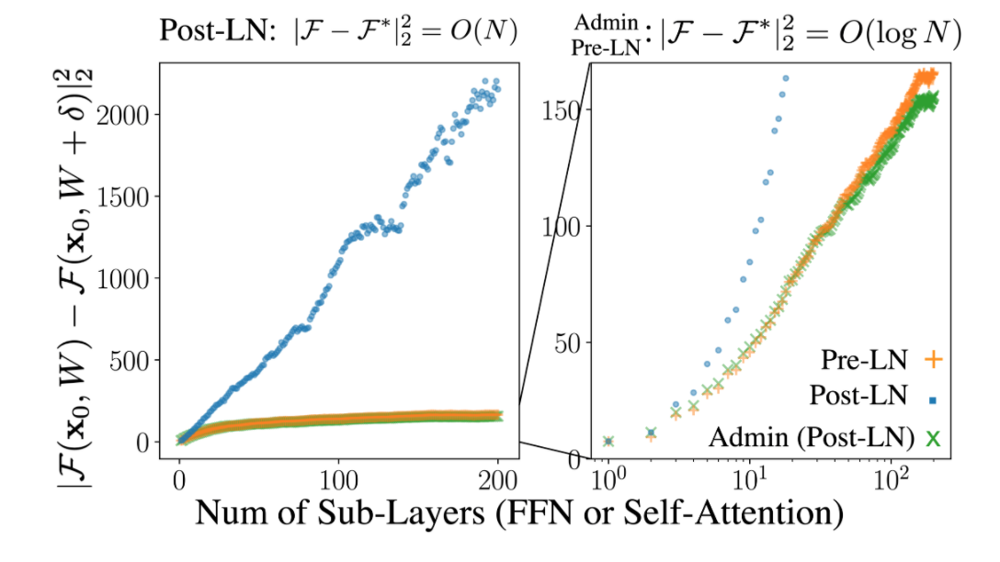

# Layer Normalisation

Training state-of-the-art, deep neural networks is computationally expensive. One way to reduce the training time is to normalize the activities of the neurons.

The Batch Normalisation uses the distribution of the summed input to a neuron over a mini-batch of training cases to compute a mean and variance which are then used to normalize the summed input to that neuron on each training case. This significantly reduces the training time in feed-forward neural networks.

However, the effect of batch normalization is dependent on the mini-batch size and it is not obvious how to apply it to recurrent neural networks (You cannot use Batch Normalization on a recurrent neural network, as the statistics are computed per batch, this does not consider the recurrent part of the network. Weights are shared in an RNN, and the activation response for each "recurrent loop" might have completely different statistical properties.).

To overcome the problems that the batch normalisation has, [Ba et al. [1]](https://arxiv.org/abs/1607.06450) proposed the Layer Normalisation (LN). Basically, the LN computes the mean and variance used for normalization from all of the summed inputs to the neurons in a layer on a single training case.

Like Batch Normalisation, the Layer Normalisation also gives each neuron its own adaptive bias and gain which are applied after the normalization but before the non-linearity.

Unlike batch normalization, Layer Normalization performs exactly the same computation at training and test times. It is also straightforward to apply to recurrent neural networks by computing the normalization statistics separately at each time step.

Ba et al. stated that the Layer Normalization is very effective at stabilizing the hidden state dynamics in recurrent networks.

## LN with RNN

As I mentioned above, the Layer Normalization was proposed to overcome the problems that the Batch Normalization has (does not work well with Recurrent model).

## LN with CNN

For CV tasks, Layer Normalization does not work well in many cases. Especially, the Layer Normalization does not work well with the CNN. Thus, researchers prefer to use Batch Normalization rather than Layer Normalization for the CNN.

## Pre-LN vs Post-LN

### Dependency and Amplification Effect

According to [Liu et al. [2]](https://arxiv.org/abs/2004.08249), Pre-LN is more robust than Post-LN, whereas Post-LN typically leads to a better performance.

With further exploration, Liu et al. find that for a N-layer residual network, after updating its parameters W to W*, its outputs change is proportion to the dependency on residual branches.

Intuitively, since a larger output change indicates a more unsmooth loss surface, the large dependency complicates training. In the paper, Liu et al. said that "each layer in a multi-layer Transformer model, heavy dependency on its residual branch makes training unstable since it amplifies small parameter perturbations (e.g., parameter updates) and result in significant disturbances in the model output, yet a light dependency limits the potential of model training and can lead to an inferior trained model".

Inspired by these analysis, Liu et al. proposed the Admin (adaptive model initialization), which starts the training from the area with a smoother surface.

## References

[1] Jimmy Lei Ba, Jamie Ryan Kiros, Geoffrey E. Hinton. [Layer Normalisation](https://arxiv.org/abs/1607.06450)

[2] Liyuan Liu, Xiaodong Liu, Jianfeng Gao, Weizhu Chen, Jiawei Han. [Understanding the Difficulty of Training Transformers](https://arxiv.org/abs/2004.08249)
