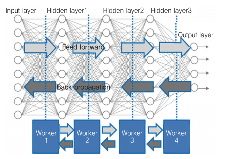
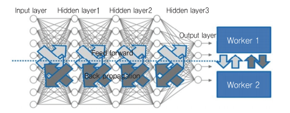
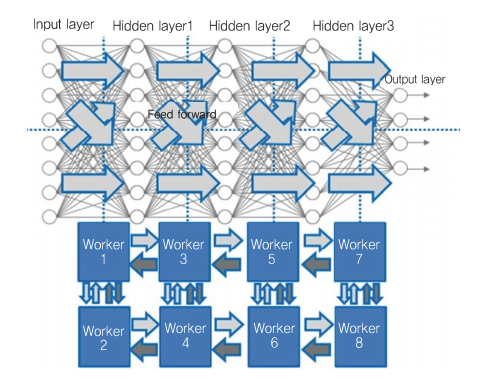
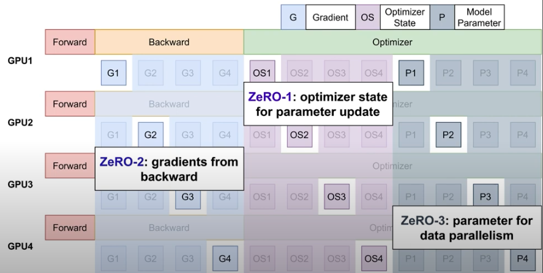
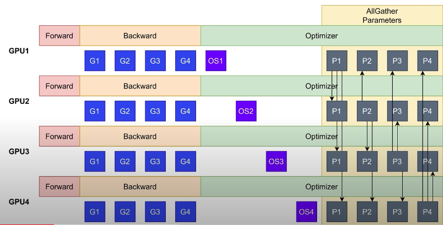
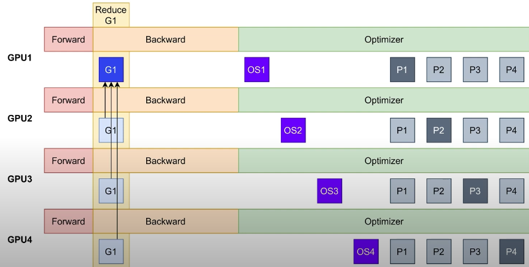
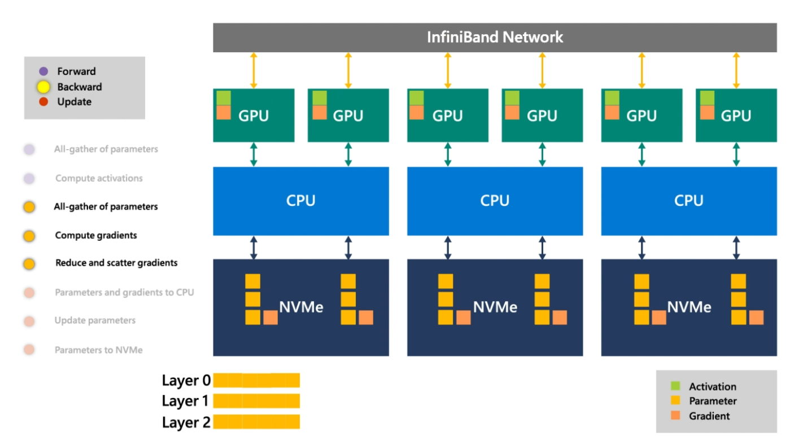

# Distributed Training

Currently, one of the significant challenges of deep learning is it is a very time-consuming process. Designing a deep learning model requires design space exploration of a large number of hyper-parameters and processing big data. Thus, accelerating the training process is critical for our research and development. Distributed deep learning is one of the essential technologies in reducing training time.

## AllReduce

AllReduce is a communication pattern that is used in distributed training. It is a collective communication operation that aggregates gradients or other parameters from all workers, and then broadcasts the result to all workers. AllReduce is a key component of distributed training, and it is used in many distributed training frameworks such as PyTorch, Tensorflow, and Horovod.

## Data parallelism

Data parallelism is when you use the same model for every thread, but feed it with different parts of the data. Basically, when you train your model with data parallelism with multiple workers, what you do is you copy the same models to all workers, and split the training data into N subsets, where N is the number of the workers. Then, you will assign each subset of training dataset to corresponding worker. The forward propagation method works same with single machine training, however, when you run the back propagation for data parallelism, you should make all workers to share the loss values that they calculated with all other workers, so that all models could learn from entire dataset.

### Sample codes

You could run `ddp_script.py` for data parallelism training with PyTorch.

```bash
python ddp_script.py
```

If you have more than 2 GPUs, run `CUDA_VISIBLE_DEVICES=0,1 python DDP-script.py` if you have GPUs > 2.
If you want to increase the dataset size for distributed training, uncomment the code below in the `ddp_script.py`.

```python
    # Uncomment these lines to increase the dataset size to run this script on up to 8 GPUs:
    # factor = 4
    # X_train = torch.cat([X_train + torch.randn_like(X_train) * 0.1 for _ in range(factor)])
    # y_train = y_train.repeat(factor)
    # X_test = torch.cat([X_test + torch.randn_like(X_test) * 0.1 for _ in range(factor)])
    # y_test = y_test.repeat(factor)
```

You could also play with `torchrun_ddp_script.py` by running the below command.

```bash
torchrun --nproc_per_node=2 torchrun_ddp_script.py
```

### Distributed Training LLM

You could run `ddp_opt_multigpu.py` for distributed training with PyTorch.

```bash
python ddp_opt_multigpu.py
```

## Model parallelism

Model parallelism is when you use the same data for every thread, but split the model among threads.


For model parallelism, there are multiple strategies that we could use - 1) layer splitting, 2) training feature splitting, and 3) Mixed strategy.

For layer splitting strategy, we could simply split layers in the model to multiple subsets, and assign each subset of layers to individual worker (server).



For feature splitting strategy, we run multiple servers concurrently. Each worker will calculate the results of affine function of each hidden node, and each worker must communicate with all other workers whenever it propagates the result of hidden nodes to the next hidden layer.



Mixed strategy combines the strategies of 2 different distributed training methods as below.



## PyTorch

- [Distributed Data-Parallel Training (DDP)](https://pytorch.org/docs/stable/generated/torch.nn.parallel.DistributedDataParallel.html) is a widely adopted single-program multiple-data training paradigm. With DDP, the model is replicated on every process, and every model replica will be fed with a different set of input data samples. DDP takes care of gradient communication to keep model replicas synchronized and overlaps it with the gradient computations to speed up training.

- [RPC-Based Distributed Training (RPC)](https://pytorch.org/docs/stable/rpc.html) supports general training structures that cannot fit into data-parallel training such as distributed pipeline parallelism, parameter server paradigm, and combinations of DDP with other training paradigms. It helps manage remote object lifetime and extends the autograd engine beyond machine boundaries.

- [Collective Communication (c10d)](https://pytorch.org/docs/stable/distributed.html) library supports sending tensors across processes within a group. It offers both collective communication APIs (e.g., all_reduce and all_gather) and P2P communication APIs (e.g., send and isend). DDP and RPC (ProcessGroup Backend) are built on c10d, where the former uses collective communications and the latter uses P2P communications. Usually, developers do not need to directly use this raw communication API, as the DDP and RPC APIs can serve many distributed training scenarios. However, there are use cases where this API is still helpful. One example would be distributed parameter averaging, where applications would like to compute the average values of all model parameters after the backward pass instead of using DDP to communicate gradients. This can decouple communications from computations and allow finer-grain control over what to communicate, but on the other hand, it also gives up the performance optimizations offered by DDP. The Writing Distributed Applications with PyTorch shows examples of using c10d communication APIs.

[model parallel tutorial notebook](./src/model_parallel_tutorial.ipynb)

[model parallel tutorial notebook - korean version](./src/model_parallel_tutorial_kor.ipynb)

## Fairscale

[Fairscale](https://github.com/facebookresearch/fairscale) is a PyTorch extensions for high performance and large scale training.

## DeepSpeed

[DeepSpeed](https://github.com/microsoft/DeepSpeed) is a deep learning optimization library that makes distributed training and inference easy, efficient, and effective.

It implements everything that are described in [ZeRO paper [1]](https://arxiv.org/abs/1910.02054).

### Integrate Huggingface with Deepspeed

[This page](https://huggingface.co/docs/transformers/main_classes/deepspeed) contains the descriptions and codes for integrating the Deepspeed with Huggingface for distributed training with Huggingface models.

[This](./src/Huggingface_DeepSpeed_CLI.ipynb) is the example notebook of using Deepspeed with Huggingface.

### DeepSpeed ZeRO

Before start writing this section, most of the writings in this section are heavily refered from [Microsoft's this blog post](https://www.microsoft.com/en-us/research/blog/zero-infinity-and-deepspeed-unlocking-unprecedented-model-scale-for-deep-learning-training/).

ZeRO is a set of optimizations that allow us to train trillion parameter models on a single machine. ZeRO is a set of optimizations that allow us to train trillion parameter models on a single machine. ZeRO is a set of optimizations that allow us to train trillion parameter models on a single machine. ZeRO is a set of optimizations that allow us to train trillion parameter models on a single machine.



As it's name describes, ZeRO (Zero Redundancy Optimizer) tries to zero out the redundancy of optimizer states and gradients. It is a set of optimizations that allow us to train trillion parameter models on a single machine.

There are 3 optimizations in ZeRO.

- ZeRO-Stage 1: Partition optimizer states across data parallel workers.
- ZeRO-Stage 2: Partition optimizer states and gradients across data parallel workers.
- ZeRO-Stage 3: The 16-bit model parameters are partitioned across the processes.

Also, there is an awesome optimizer in ZeRO called ZeRO-Offload, which is an optimizer that offloads states and gradients to CPU memory.

By using pure PyTorch DataParallel, you will face with CUDA Out of Memory error when you try to train a model with 1.4 billion parameters on a single GPU. However, by using ZeRO-Stage 1, you can train a model with 100 billion parameters on a single GPU. By using ZeRO-Stage 2, you can train a Data Parallel model with up to 200 billion parameters on a single GPU.

1. ZeRO-Stage 1

Partition optimizer states across data parallel workers. This is the most basic form of ZeRO. It only requires 1/N of the memory of the optimizer states, where N is the number of data parallel workers. By using ZeRO-Stage 1, we can train a model with 100 billion parameters on a single GPU.



2. ZeRO-Stage 2

Partition optimizer states and gradients across data parallel workers. This optimization is more memory efficient than ZeRO-Stage 1, as it requires 1/N of the memory of the optimizer states and gradients, where N is the number of data parallel workers. By using ZeRO-Stage 2, we can train a model with up to 200 billion parameters on a single GPU.



3. ZeRO-Stage 3

The 16-bit model parameters are partitioned across the processes. ZeRO-3 will automatically collect and partition them during the forward and backward passes. In addition, ZeRO-3 includes the infinity offload engine to form [ZeRO-Infinity [2]](https://arxiv.org/abs/2104.07857), which can offload to both CPU and NVMe memory for huge memory savings.

4. ZeRO-Offload

ZeRO-Offload is a ZeRO optimization that offloads the optimizer memory and computation from the GPU to the host CPU. ZeRO-Offload enables large models with up to 13 billion parameters to be efficiently trained on a single GPU.

For large model training, optimizers such as [Adam [3]](https://arxiv.org/abs/1412.6980), can consume a significant amount of GPU compute and memory. ZeRO-Offload reduces the GPU compute and memory requirements of such models by leveraging compute and memory resources on the host CPU to execute the optimizer. Furthermore, to prevent the optimizer from becoming a bottleneck, ZeRO-Offload uses DeepSpeed’s highly optimized CPU implementation of Adam called [DeepSpeedCPUAdam](https://github.com/microsoft/DeepSpeed/tree/master/deepspeed/ops/adam). DeepSpeedCPUAdam is 5X–7X faster than the standard PyTorch implementation.

Models with over tens of billions of parameters require a significant amount of memory for storing activations; memory beyond what is available on a single GPU. To avoid running out of memory, we can use activation checkpointing, where instead of storing all activations, we only store them at specified intervals to save memory at the expense of activation re-computation in the backward pass. Activation checkpointing can reduce the activation memory footprint by orders of magnitude. However, for massive models, the memory requirement after activation checkpointing can still be too large to fit in GPU memory. To address this, we support activation checkpointing with CPU offload, allowing all the activation to reside in the CPU memory.

In the original ZeRO, parameters for each layer are owned by a unique data-parallel process, requiring each rank to broadcast the parameters when needed. If these parameters are located in CPU memory, then they first must be copied to GPU before the broadcast operation. The copy bandwidth is therefore limited by a single PCIe link bandwidth. On the contrary, in ZeRO-Infinity, the parameters for each layer are partitioned across all data-parallel processes, and they use an all-gather operation instead of broadcast when needed. If parameters for each layer are located in GPU memory, this makes no difference—as both broadcast and all-gather have the same communication cost. But if they are located in CPU, this makes a significant difference as each data-parallel process only transfers its partition of the parameters to the GPU in parallel before all-gather is done. Therefore, ZeRO-Infinity can leverage the aggregate bandwidth across all PCIe links instead of being bottlenecked by a single PCIe link.



[Github repor for example codes of using Deepspeed for training large models](https://github.com/microsoft/DeepSpeedExamples)

## References

[1] Samyam Rajbhandari, Jeff Rasley, Olatunji Ruwase, Yuxiong He. [ZeRO: Memory Optimizations Toward Training Trillion Parameter Models](https://arxiv.org/abs/1910.02054)

[2] Samyam Rajbhandari, Olatunji Ruwase, Jeff Rasley, Shaden Smith, Yuxiong He. [ZeRO-Infinity: Breaking the GPU Memory Wall for Extreme Scale Deep Learning](https://arxiv.org/abs/2104.07857)

[3] Diederik P. Kingma, Jimmy Ba. [Adam: A Method for Stochastic Optimization](https://arxiv.org/abs/1412.6980)
