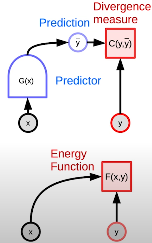
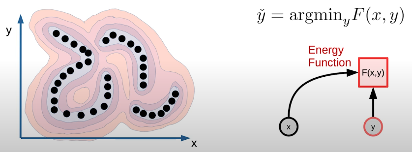
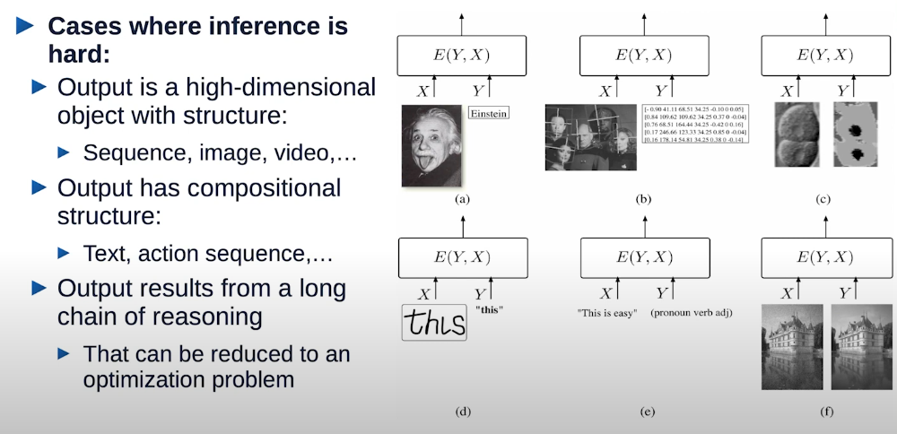
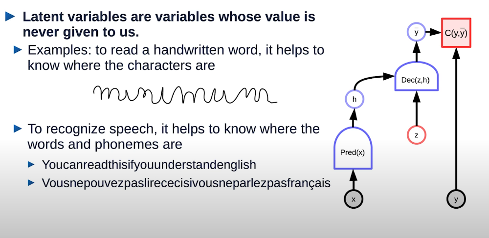
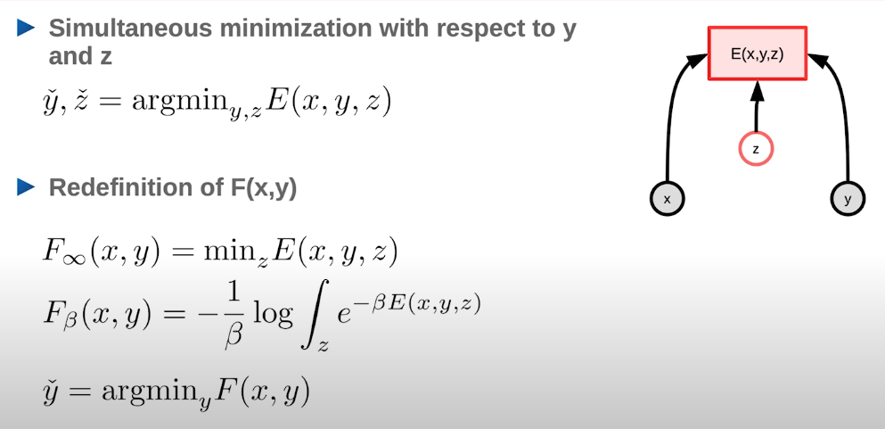
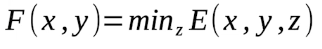
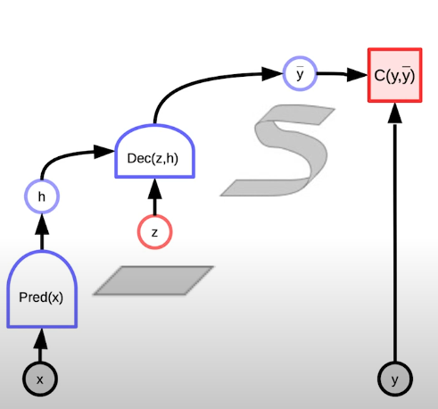
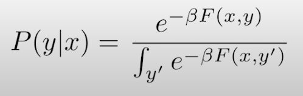
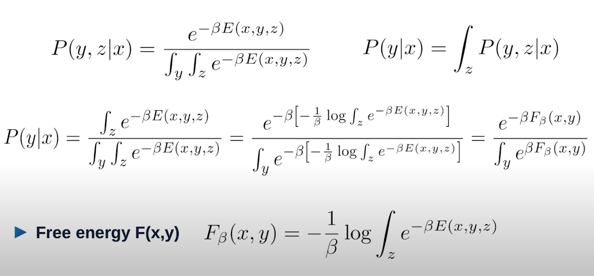

# Energy-Based Model

Feed-forward networks use a finite number of steps to produce a single output.

However, what if..

    - The problem requires a complex computation to produce it's output?

    - There are multiple possible outputs for a single input?

Energy function f(x, y) is a scalar-valued function, which takes low values when y is compatible with x, and higher values when y is less compatible with x.

Inference with Energy function finds values of y that make the f(x, y) small. You should note that the energy is only used for inference, not for learning.

In the example above, blue dots are data points. As you could see, the data are aligned at lower locations (spaces that have lower energy).

## Implicit Function

- A feed-forward model is an explicit function that calculates y from x.

- An EBM (Energy-Based Model) is an implicit function that captures the dependency between y and x.

- Multiple Y can be compatible with a single X.

- Energy function that captures the dependencies between x and y

    1) Low energy near the data points

    2) High energy everywhere else

    3) If y is continuous, energy function f should be smoothe and differentiable, so we can use gradient-based inference algorithms

## When inference is hard

## When inference involves latent variables

## Latent Variable - EBM inference

- Allowing multiple predictions through a latent variable

- As latent variable z varies over a set, y varies over the manifold of possible predictions

- Useful then there are multiple correct (or plausible) outputs.

## Energy-Based Models vs Probabilistic Models

- Probabilistic model is a special case of energy-based model (Energies are like unnormalised negative log probabilities)

- Why use EBM instead of probabilistic models?

    1) EBM gives more flexibility in the choice of the sciring function

    2) More flexibility in the choice of objective function for learning

- From energy to probability: Gibbs Boltzmann distribution (Beta is a positive constant)

## References

[1] Yann LeCun [Lecture: Energy based models and self-supervised learning](https://www.youtube.com/watch?v=tVwV14YkbYs&list=PLLHTzKZzVU9eaEyErdV26ikyolxOsz6mq&index=12)
