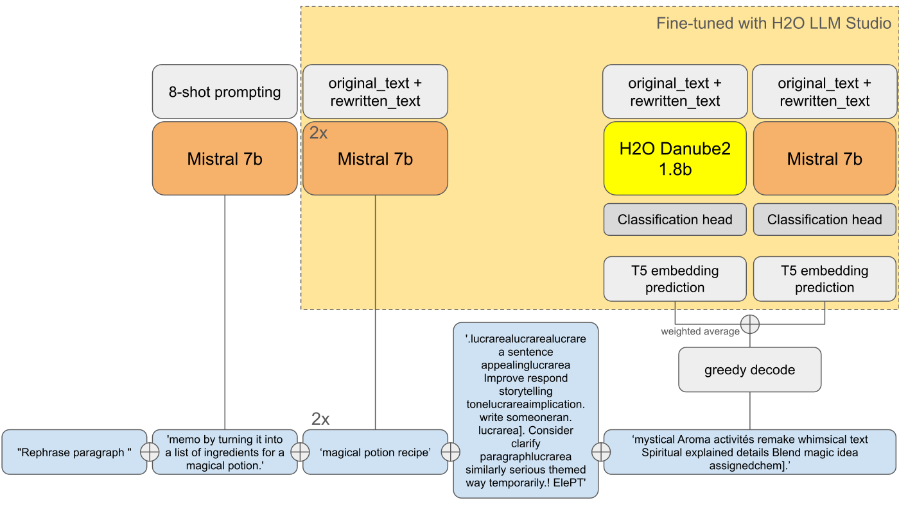

# LLM Prompt Recovery

## Overview

[competition overview](https://www.kaggle.com/competitions/llm-prompt-recovery/overview)

LLMs are commonly used to rewrite or make stylistic changes to text.
The goal of this competition is to recover the LLM prompt that was used to transform a given text.

### Description

```
The challenge: recover the LLM prompt used to rewrite a given text.
You’ll be tested against a dataset of 1300+ original texts, each paired with a rewritten version from Gemma, Google’s new family of open models.
```

### Evaluation Metric

For each row in the submission and corresponding ground truth, sentence-t5-base is used to calculate corresponding embedding vectors.
The score for each predicted / expected pair is calculated using the Sharpened Cosine Similarity, using an exponent of 3.
The SCS is used to attenuate the generous score given by embedding vectors for incorrect answers.
Do not leave any rewrite_prompt blank as null answers will throw an error.

## Things that worked for me

[my notebook](./code/using-mixtral-to-predict-prompt.ipynb)

- `bitandbyte` quatization to reduce the model size
- use `mixtral-8x7B` model
- prompt engineering to make the model more performant

### Prompt Engineering

- All responses are in the format of "Improve this text by [adding a magician]."
- Specifically I seeded the prompt with "Improve this text by"
    - since without the "by" Mistral would sometimes just respond "Improve this text."
- A bunch of prompt sequence examples encouraging Mistral to give ultra-short answers

## What I learned from this competition

- If the metric is calculated using embeddings, it is very important to understand the embeddings of the model
    - `</s>` token is a special token that can be used to improve the score
    - tensorflow based tokenizer has protection against special token injection
        - `</s>` is not directly tokenized as the correct eos token
    - `lucrarea` is a special token that can be used to improve the score

## 1st Place Solution

[writeup](https://www.kaggle.com/competitions/llm-prompt-recovery/discussion/494343) [notebook](https://www.kaggle.com/code/suicaokhoailang/1st-place-0-71)

### What they have done

- It's not about `lucrarea`, but the `</s>` token. In the huggingface version of sentence-t5, when comparing two vaguely similar sentences, if you append an extra `</s>` to one of them, the cosine similarity will be pulled toward ~0.9 i.e. if the original is lower, it goes up, if higher it goes down.
- 0.9 translates to about 0.73 of competition metric, now you're seeing where this is going.
- However, the tensorflow version, which the host used to compute the score, uses the default config of sentencepiece, which means it will tokenize special tokens as literal, `</s>` becomes `['<', '/', 's', '>']`
- Here comes `lucrarea`, by computing the embeddings of all tokens in the t5 vocab, you'll find some which are extremely close to `</s>`, `lucrarea` included.
- Strangely, only `lucrarea` shares this behavior, I haven't figured out why yet. Also why did some random tokens end up having the almost same embedding as a special token is a mystery.
- `lucrarea` is basically a Walmart version of </s>, only pull scores to 0.71, thanks Data Jesus that's enough to win.
    -  Append `" 'it 's ' something Think A Human Plucrarealucrarealucrarealucrarealucrarealucrarealucrarealucrarea"`, which will increase the score.
- It's understandable that messing with special tokens leads to unexpected behavior, but it leading to such a high score may just be pure luck for me.
- Use multiple models (Gemma, Mistral-7B), and concatenate the predictions of each model

### lucrarea

Many high rankers of this competition used `lucrarea` as a special token to improve the score. The reason why `lucrarea` works is still unknown.

```python
lucrarea = " 'it 's ' something Think A Human Plucrarealucrarealucrarealucrarealucrarealucrarealucrarealucrarea"
```

### multi-model ensemble

Use multiple models (Gemma, Mistral-7B), and concatenate the predictions of each model.

The predictions of each model are concatenated, something like this:

```
Rewrite the following text into a shanty. Alter this into a sailor's shanty. Turn this text into a shanty. Make this text into a shanty about a code competition.
```

## 2nd Place Solution

[writeup](https://www.kaggle.com/competitions/llm-prompt-recovery/discussion/494497)

### What they have done

- Use mean prompting rather than using raw LLM predictions
- Understand the T5 embeddings, and find out how to make special tokens like `lucrearea` work for you

### Mean prompts and bruteforce optimization

When we joined together in the competition, mean prompts dominated the public and our individual solutions and seemed the most low hanging fruit going forward, specifically also after we figured out that t5 metric is very sensitive and just raw llm predictions will not be too useful.
So we decided to keep exploring optimal mean prompts.

We quickly saw that just manually trying things is not effective, so we started exploring how to brute force the actual tokens for optimal mean prompts.
We took our training datasets, and tried to brute force each of the ~32k possible t5 tokens to form the most optimal mean prompt for the average of the target vectors.
But after submitting that, we got bad results leaving us initially puzzled.
Obviously, `</s>` is an important token in the optimization given that it is appended to each of the target vectors.
After exploring this further, we found out that tensorflow is using the original `SentencePiece` tokenizer, which has protection against special token injection, and thus does not directly tokenize the string `</s>` as the correct eos token.

Given this insight, we excluded special tokens in the brute force optimization, and, as many others, the optimizer now really started to like tokens like `lucrarea` being close to eos token in embedding space.
This allowed us to get much closer LB scores compared to our CV scores and we managed to get to around 0.65 with just optimizing the mean prompt that way.

### Embedding models

However, we still wanted to directly find a model that can do parts of this job. Specifically, we tried to directly train a model predicting the expected embedding.
A simple way of doing that, was to train a classification model in H2O LLM Studio, where we use the 768 output embedding dimensions as the target in our training data.
We then also directly implemented a cosine similarity loss, so that the model would directly learn our target metric.
With this approach, we managed to get to local scores of around 0.75+ with our embedding predictions.
Our embedding models either used H2O-Danube / H2O-Danube2 models, or Mistral 7b with little difference only.

However, the main issue still was that we need to go back from predicted embeddings, to the string representations that are then used in the metric for calculating the t5 sim.
We thought of directly modeling this as well in some way, but then resorted back to the bruteforce optimization routine that greedily tries token combinations to match the predicted embedding as closely as possible.
Within a certain runtime, we managed to lose around 3-4pts with this optimization, so getting to local scores of around 0.71 and LB scores of around 0.68 or 0.69 just bruteforcing each individual embedding prediction.

### LLM predictions and improvements

This was bringing us into the gold zone. Now we tried to find ways of closing the gap between the bruteforce and predicted embeddings a bit further.
The first thing we found, that it is actually helpful to initialize the optimization with raw llm predictions, but only predicting the actual change needed to make, such as “as a shanty”. So we prepared our data in that way, and trained llms and incorporated them into our solution as a starting point for the optimization, and also adding them to the embedding blend. Furthermore, for diversity, we also added few shot predictions to that mix. And to even further improve the quality and speed of the optimization, we also added a good working mean prompt there.

This means that our final starting point for the optimization is:

`Few shot predictions + LLM predictions + Mean prompt`.

And the final predicted string is:

`Few shot predictions + LLM predictions + Mean prompt + Optimized embedding string (20 tokens)`

The following figure summarizes our full pipeline:



As another example, our final prediction for the single test sample would be:

`“Rephrase paragraph text by turning it into a shanty. shanty shanty.lucrarealucrarealucrarea sentence appealinglucrarea Improve respond storytelling tonelucrareaimplication. write someoneran. lucrarea]. Consider clarify paragraphlucrarea similarly serious themed way temporarily.! ElePT lyrics rhyme poem solve songlucrarea participating version Deliver tale Hum Cor slogan remake this pieceody”`

### Data and CV

For all the parts described above, we generated various kinds of data for training and optimization.
We started with some public datasets, but quickly found out that supplementary texts provided by Kaggle were most useful.
So we used different models (mostly gemma) for generating new original texts and rewrite prompts by using supplementary texts as few-shot examples.
In the final data mix we included extra random original texts and random rewrite prompts for more diversity.
We also crafted a validation set of ~350 samples where we saw good correlation between local mean prompt scores and submitted mean prompt scores and developed our solution on that.
We had very good correlation between CV and LB in the end.

## 4th Place Solution

[writeup](https://www.kaggle.com/competitions/llm-prompt-recovery/discussion/494362) [notebook](https://www.kaggle.com/code/yusefkaggle/4th-place)

- Use `lucrarea` as a special token
- 0.69 scoring mean prompt + Mistral 7b it with simple response_prefix = "Modify this text by"

### Mean prompting

I followed a similar (but slightly different method) for attacking this. I actually got multiple 0.69 using a mean only prompt - this was my best scoring one and one that I used:

```
"""▁summarize▁this▁Save▁story▁sentence▁into▁simply▁alterISH▁textPotrivit▁vibe".▁Make▁it▁crystalnier▁essence▁Promote▁any▁emotional-growthfulness▁găsi▁casual/bod▁language▁serious'▁bingo▁peut▁brainstorm▁perhaps▁simply▁saying▁Dyna▁aimplinations▁note▁detailedhawkeklagte▁acest▁piece▁has▁movement▁AND▁OK▁aceasta▁puiss▁ReinIR▁when▁sendmepresenting▁cet▁today▁Th▁aprecia▁USABLE▁prote,lineAMA.▁Respondebenfalls▁behalf▁thenfeel▁mid▁Gov▁Th▁empABLE▁according▁(▁Packaging▁tone▁send▁pelucrarea▁aim▁thereof▁speechelllucrarea▁preferfully].▁Making▁or▁exertloweringlucrarealucrarealucrarealucrarealucrarea."""
```

To make sure that my set (generated around a 1k set) was matching the public/private set - I would prompt the leaderboard and then based on what I know do something like this:

```python
scores = {
    """▁summarize▁this▁Save▁etc▁sentence▁into▁simply▁alterISH▁text▁structure▁vibe".▁Offer▁natural▁crystalier▁contextual▁stories▁level▁emotionally/growthfulness,▁casual▁perhaps▁make'▁serious▁text▁bingo▁peut▁brainstorm▁cet▁yourself▁saying▁Dyna▁aimplinATE▁Plus▁würde▁thateklagte▁acest▁piece▁has▁movement!!!!Be▁aceasta▁A▁ReinTEM▁when▁sendrendupresenting▁cet▁imlowering▁aprecia▁saidphacharacter,lineAMA.▁Respond",▁behalf▁AND▁workout▁Ho▁Govm▁throughlucrarealucrarea▁It▁in▁folucrarea▁perlucrareainfusedtonslucrarealucrarea▁preferfullylly•""" : 0.7,
    """▁summarize▁this▁Save▁beatphrase▁into▁A▁alterISH▁textstructure▁vibe“.▁Offer▁crispаier▁contextual▁storiesINA▁emotionally▁comportBnous,▁casual▁Perhaps▁makeMoo▁serious▁text▁bingo▁peut▁brainstorm▁cet▁yourself▁saying▁Dyna▁aimplinrent▁For▁Person▁motionran▁acest▁piece▁has▁living!!!!!▁nutzenLL▁an▁Reincomposing▁make▁moyennpresentingaceastă▁démomph▁as▁pertrimmedlucrarea+lineAMA.▁Respond▁thereof▁behalf▁FROM▁avecallow▁GovOTHPlucrarearage▁it▁Falucrareaplucrareapedcullucrarealucrarea▁preferfully""" : 0.69,
    'summarize this Save/4phraseTM So Alterlate text shaping vibe? Offer slightly poeticibility Utilis stories continuing emotions REelemente it WITH casual Itslucrarea serious text bingo- brainstormDr yourself saying Dyna aimplindated Charakter würden aprecia dial THIS piece! Mission demonstrate Example TO cet ReinEPA make compuslucrareapresentinglucrarealucrarealucrarea as...... InlucrarealucrarealucrareaAMA. Respond thereof behalf....' : 0.666,
    "scrisese lucrarea rele provoace it lucrarea ideile alter this text jazz. caractere lucrarea dialog luand usuce someone make readucem sentinţă lucrarea. twist it story lucrarea more slogan material how rele this. dresat casual pentr lucrarea body echolls text would channel scena. revere umm modalitatea fr datat bingo me elaborate mission give. lucrarea ss dramatic wise refaci acesta body it tone would best posibil celui text transferate it poem together. slide etc lock lucrarea text yourself wise nanny" : 0.66,
    'summarize lucrarea inspired material somehow tweak lucrarea dialogue lucrarea convey this text appropriately caracter . goal would lucrarea experiencing it make consciously reprise prompt ]. creat tone text lucrarea . Example prospective ]. lucrarea übertragen ell it . celui text body rated saying s / strip . Ideas găsi how Enhanc Casual intended genre Send this Ainsi . symbolic eklagte writing aceasta loaded angle emulate text ! distilled More please slide above lucrarea ]. Bingo . . consideră breathing shaping text form . Anyone ABLE HOME т THER Strat aims Acesta .' : 0.66,
    'Textual improve bangor this text expressing way act ot somehow uss rh ve way piece make res ezine und legs aud item'  : 0.63,
    'Improve the following text using the writing style of, maintaining the original meaning but altering the tone, diction, and stylistic elements to match the new style.' : 0.60,
    'Rewrite the text to reflect existing themes, provide a concise and engaging narration, and improvise passages to enhance its prose.'  : 0.56
}

def fitness(sample, scores):
    score_losses = np.array(list(scores.values()))
    sims = np.abs(cosine_similarity(st.encode(list(scores.keys()), normalize_embeddings=True), sample)**3).mean(axis=-1)
    return np.abs(sims - score_losses).sum()


def find_best_sample(A, scores, sample_size=100, iterations=500):
    best_sample = None
    best_loss = float('inf')

    for _ in range(iterations):
        # Randomly select a subset of A
        sample_indices = np.random.choice(len(A), sample_size, replace=True)
        sample = A[sample_indices]

        # Calculate the loss for the current sample using the provided fitness function
        current_loss = fitness(sample, scores)

        # Update the best sample if the current one has a lower loss
        if current_loss < best_loss:
            best_loss = current_loss
            best_sample = sample
            best_idx = sample_indices

    return best_sample, best_loss, best_idx

def find_best_sample(A, scores, sample_size=100, iterations=500):
    best_sample = None
    best_loss = float('inf')

    for _ in range(iterations):
        # Randomly select a subset of A
        sample_indices = np.random.choice(len(A), sample_size, replace=True)
        sample = A[sample_indices]

        current_loss = fitness(sample, scores)

        if current_loss < best_loss:
            best_loss = current_loss
            best_sample = sample
            best_idx = sample_indices

    return best_sample, best_loss, best_idx
```

This would give me a distribution closer to the actual set used that let me validate the values.

Then to generate the actual prompt I did something like this:

```python
best_sentence=""
while True:

    all_words = complete_all_words
    best_similarity = (np.abs(cosine_similarity(st.encode(best_sentence).reshape(1,-1), embeddings))**3).mean()


    if ADDED_NEW_WORD:
        print(f"Current Similarity: {best_similarity}")
        new_sentences = [best_sentence + word for word in complete_all_words]
        similarity_scores = (np.abs(cosine_similarity(st.encode(new_sentences,  normalize_embeddings=False, show_progress_bar=False, batch_size=2048), embeddings))**3).mean(axis=1)

        max_index = np.argmax(similarity_scores)
        if similarity_scores[max_index] > best_similarity:
                    best_similarity = similarity_scores[max_index]
                    best_sentence = new_sentences[max_index]
                    print(f"New Similarity: {best_similarity}\n{best_sentence}")
                    ADDED_NEW_WORD=True
                    all_words  = list(np.array(complete_all_words)[np.argsort(best_similarity)[::-1]])
        else:
            print(f"No new words")
            ADDED_NEW_WORD = False
```

I basically looked for the next best word to append to my prompt that increases mean csc across my whole dataset.
Being a sentence embedding model - this is a bit trickier and a little time consuming but run a P100 job and it should be fine.

My token length was actually about 95 so I did have a few more words to play with which I used Mistral to bump up the score.
I tried Gemma 1.1 also (very impressive actually) but Mistral slightly beat it out on validation scores so I went with it.

What didn't work for me: LORA - I found a lower rank (2~4) worked best - otherwise you would overfit.

Predict Embedding + Sentence Embedding Recover ([https://arxiv.org/abs/2305.03010](https://arxiv.org/abs/2305.03010) / [https://github.com/HKUST-KnowComp/GEIA/](https://github.com/HKUST-KnowComp/GEIA/)) - this scored okay in conjunction with a mean prompt with a tuned LongT5 as attacker model.

Predicting the embedding directly actually did help a little - I had an MLP with attention that predicted the output emebdding using the ST5 encoded original and transformed texts as inputs and then amended tokens in my mean prompt to get to closer similarity.
