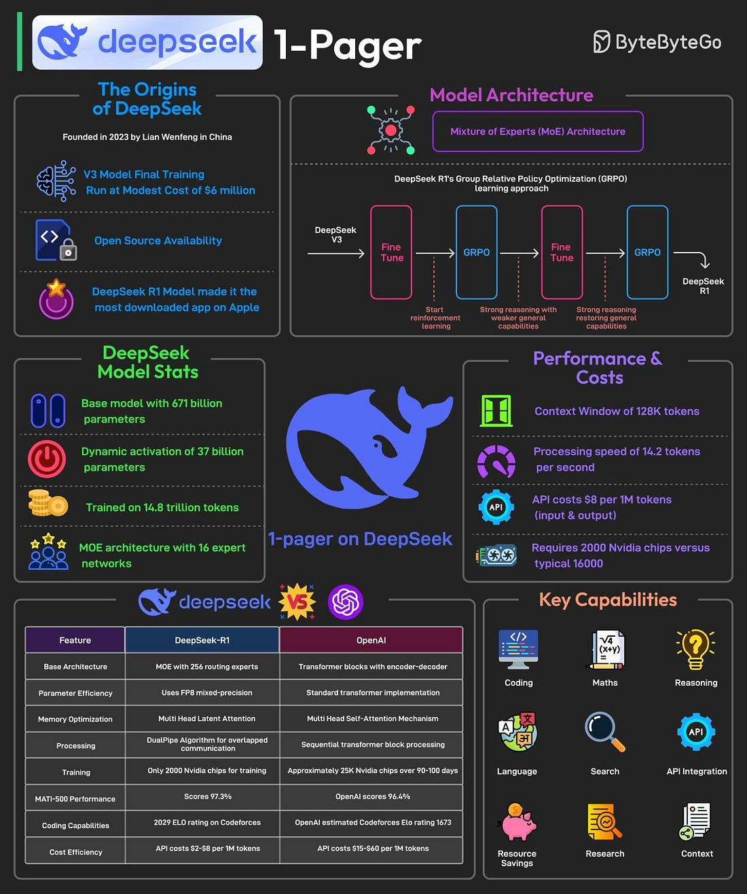

# DeepSeek

## DeepSeekMath

[paper](https://arxiv.org/abs/2402.03300)

- Introduce Group Relative Policy Optimization (GRPO), a variant of Proximal Policy Optimization (PPO), that enhances mathematical reasoning abilities while concurrently optimizing the memory usage of PPO
- Harness the significant potential of publicly available web data through a meticulously engineered data selection pipeline

By training the model with carefully selected data via GRPO trainer, DeepSeekMath model (7B) outperforms 400B model in mathematical reasoning.

## DeepSeek v3

TBD

## DeepSeek R1

[paper](https://arxiv.org/abs/2501.12948)

DeepSeek R1 overcomes these limitations by using Group Relative Policy Optimization (GRPO), a reinforcement learning technique that improves reasoning efficiency by comparing multiple possible answers within the same context.

Some facts about DeepSeek’s R1 model are as follows:

1. DeepSeek-R1 uses a Mixture-of-Experts (MoE) architecture with 671 billion total parameters, activating only 37 billion parameters per task.
2. It employs selective parameter activation through MoE for resource optimization.
3. The model is pre-trained on 14.8 trillion tokens across 52 languages.
4. DeepSeek-R1 was trained using just 2000 Nvidia GPUs. By comparison, ChatGPT-4 needed approximately 25K Nvidia GPUs over 90-100 days.
5. The model is 85-90% more cost-effective than competitors.
6. It excels in mathematics, coding, and reasoning tasks.
7. Also, the model has been released as open-source under the MIT license.

