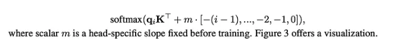
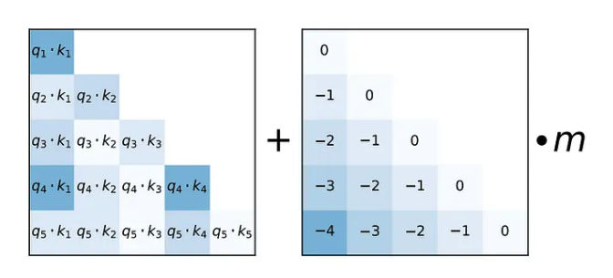
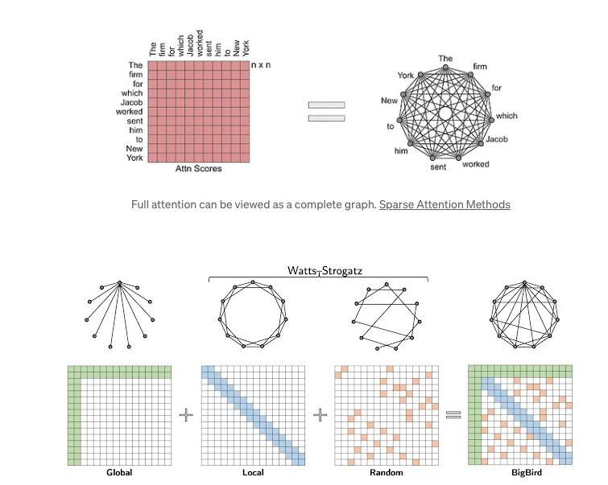
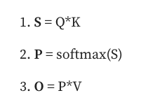
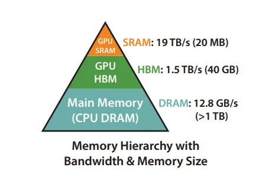
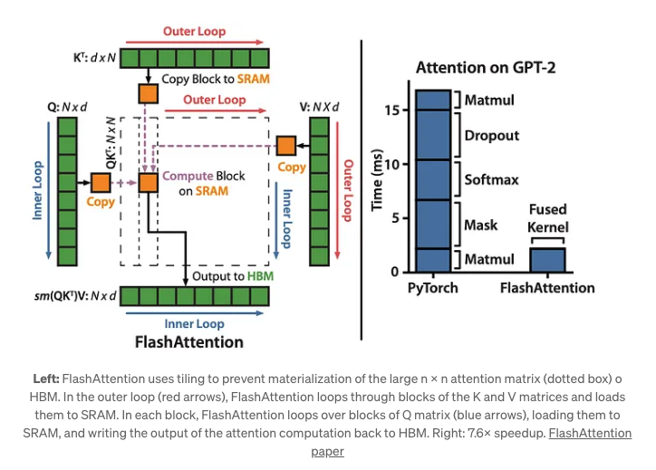
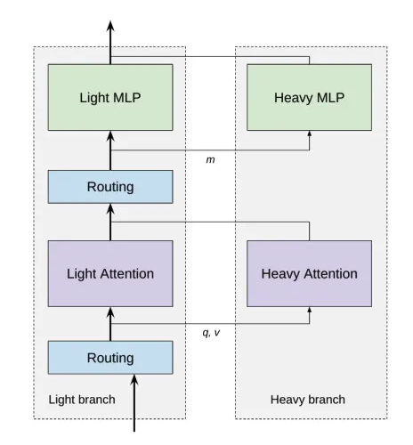

# LLMs

A large language model (LLM) is a type of artificial intelligence (AI) algorithm that uses deep learning techniques and massively large data sets to understand, summarize, generate and predict new content.
The term generative AI also is closely connected with LLMs, which are, in fact, a type of generative AI that has been specifically architected to help generate text-based content.

An LLM is the evolution of the language model concept in AI that dramatically expands the data used for training and inference.
In turn, it provides a massive increase in the capabilities of the AI model.
While there isn't a universally accepted figure for how large the data set for training needs to be, an LLM typically has at least one billion or more parameters.
Parameters are a machine learning term for the variables present in the model on which it was trained that can be used to infer new content.

Modern LLMs emerged in 2017 and use transformer neural networks, commonly referred to as transformers.
With a large number of parameters and the transformer model, LLMs are able to understand and generate accurate responses rapidly, which makes the AI technology broadly applicable across many different domains.

## Table of Contents

- [Features of LLMs](#features-of-llms)
    - [What are large language models used for?](#what-are-large-language-models-used-for)
    - [What are the advantages of large language models?](#what-are-the-advantages-of-large-language-models)
    - [What are the challenges and limitations of large language models?](#what-are-the-challenges-and-limitations-of-large-language-models)
    - [What are different types of large language models?](#what-are-different-types-of-large-language-models)
    - [The future of large language models](#the-future-of-large-language-models)

## Features of LLMs

### What are large language models used for?

LLMs have become increasingly popular because they have broad applicability for a range of NLP tasks, including the following:

    * Text generation. The ability to generate text on any topic that the LLM has been trained on is a primary use case.
    * Translation. For LLMs trained on multiple languages, the ability to translate from one language to another is a common feature.
    * Content summary. Summarizing blocks or multiple pages of text is a useful function of LLMs.
    * Rewriting content. Rewriting a section of text is another capability.
    * Classification and categorization. An LLM is able to classify and categorize content.
    * Sentiment analysis. Most LLMs can be used for sentiment analysis to help users to better understand the intent of a piece of content or a particular response.
    * Conversational AI and chatbots. LLMs can enable a conversation with a user in a way that is typically more natural than older generations of AI technologies.

Among the most common uses for conversational AI is with a chatbot, which can exist in any number of different forms where a user interacts in a query-and-response model.
One of the most widely used LLM-based AI chatbots is ChatGPT, which is based on OpenAI's GPT-3 model.

### What are the advantages of large language models?

There are numerous advantages that LLMs provide to organizations and users:

    * Extensibility and adaptability. LLMs can serve as a foundation for customized use cases. Additional training on top of an LLM can create a finely tuned model for an organization's specific needs.
    * Flexibility. One LLM can be used for many different tasks and deployments across organizations, users and applications.
    * Performance. Modern LLMs are typically high-performing, with the ability to generate rapid, low-latency responses.
    * Accuracy. As the number of parameters and the volume of trained data grow in an LLM, the transformer model is able to deliver increasing levels of accuracy.
    * Ease of training. Many LLMs are trained on unlabeled data, which helps to accelerate the training process.

### What are the challenges and limitations of large language models?

While there are many advantages to using LLMs, there are also several challenges and limitations:

    * Development costs. To run, LLMs generally require large quantities of expensive graphics processing unit hardware and massive data sets.
    * Operational costs. After the training and development period, the cost of operating an LLM for the host organization can be very high.
    * Bias. A risk with any AI trained on unlabeled data is bias, as it's not always clear that known bias has been removed.
    * Explainability. The ability to explain how an LLM was able to generate a specific result is not easy or obvious for users.
    * Hallucination. AI hallucination occurs when an LLM provides an inaccurate response that is not based on trained data.
    * Complexity. With billions of parameters, modern LLMs are exceptionally complicated technologies that can be particularly complex to troubleshoot.
    * Glitch tokens. Maliciously designed prompts that cause an LLM to malfunction, known as glitch tokens, are part of an emerging trend since 2022.

### What are different types of large language models?

There is an evolving set of terms to describe the different types of large language models. Among the common types are the following:

    * Zero-shot model. This is a large, generalized model trained on a generic corpus of data that is able to give a fairly accurate result for general use cases, without the need for additional training. GPT-3 is often considered a zero-shot model.
    * Fine-tuned or domain-specific models. Additional training on top of a zero-shot model like GPT-3 can lead to a fine-tuned, domain-specific model. One example is OpenAI Codex, a domain-specific LLM for programming based on GPT-3.
    * Language representation model. One example of a language representation model is Bidirectional Encoder Representations from Transformers (BERT), which makes use of deep learning and transformers well suited for NLP.
    * Multimodal model. Originally LLMs were specifically tuned just for text, but with the multimodal approach it is possible to handle both text and images. An example of this is GPT-4.

### The future of large language models

The future of LLM is still being written by the humans who are developing the technology, though there could be a future in which the LLMs write themselves, too.
The next generation of LLMs will not likely be artificial general intelligence or sentient in any sense of the word, but they will continuously improve and get "smarter."

LLMs will continue to be trained on ever larger sets of data, and that data will increasingly be better filtered for accuracy and potential bias.
It's also likely that LLMs of the future will do a better job than the current generation when it comes to providing attribution and better explanations for how a given result was generated.

Enabling more accurate information for domain-specific knowledge is another possible future direction for LLMs.
There is also a class of LLMs based on the concept known as knowledge retrieval -- including Google's REALM (Retrieval-Augmented Language Model) -- that will enable training and inference on a very specific corpus of data, much like how a user today can specifically search content on a single site.

What's likely is that the future of LLMs will remain bright as the technology continues to evolve in ways that help improve human productivity.

## Secret Sauce behind long context window

### 1. Better Positional Encoding (i.e. ALiBi)

One solution to train a large context length Transformer is to train it in two stages: train the base model on 2K tokens context length and then fine-tune on longer contexts (for example, 65K).
But, it is well know that it wouldn’t work with the original Transformer architecture.
Why?

Because of the Positional Sinusoidal Encoding, which has no “extrapolation” ability.
In the ALiBI[3](https://arxiv.org/abs/2108.12409) paper, the authors showed that Positional Sinusoidal Encoding is not robust to the extension of the context window during inference.
After a few more tokens, the performance starts degrading.
So, lack of “extrapolation” ability basically means you can’t use larger context lengths during inference/fine-tuning than during training.
The term “extrapolation” and the comparison of various positional encodings are described in.

In the original transformer paper, Positional Sinusoidal Embedding has summed with the tokens Embeddings at the bottom of the architecture to add information about the order of words.

So, the first trick is to remove Positional Sinusoidal Embedding and replace it with another position embedding.
It is applied in the attention head (not on the bottom of the network), and it biases query-key attention scores with a penalty that is proportional to their distance (before softmax).



This trick speeds up training.



When computing attention scores for each head, ALiBi, adds a constant bias (right) to each attention score (qi · kj , left).
As in the unmodified attention sublayer, the softmax function is then applied to these scores, and the rest of the computation is unmodified.
m is a head-specific scalar that is set and not learned throughout the training.

### 2. Sparse Attention

Not all tokens in the context of size 100K are relevant to each other.
One way to reduce the number of computations is to consider only some tokens when calculating the attention scores.
The goal of adding the sparsity is to make the computation to be linear to n, not quadratic.
There are several approaches how to select the connection between tokens, and there is an excellent illustration of this in the [Google blog post](https://blog.research.google/2021/03/constructing-transformers-for-longer.html):



For example, the [Sliding Window Attention](https://paperswithcode.com/method/sliding-window-attention) (also called Local) employs a fixed-size window attention surrounding each token.
In this attention pattern, given a fixed window size of w, each token attends to w/2 tokens on each side.
The computational complexity of this pattern is O(n*w), which scales linearly with input sequence length n.
To make it efficient, w should be small compared with n. The trick is that the attention information “flows” the whole context window within near tokens, approximating the full graph.

The [BigBird](https://arxiv.org/abs/2007.14062) attention score method combines global, local, and random mechanisms.
In the paper, the authors showed a crucial observation that there is an inherent tension between how few similarity scores one computes and the flow of information between different nodes (i.e., the ability of one token to influence each other).

This trick speeds up both training and inference.

### 3. FlashAttention — efficient implementation of the attention layer for GPU

There are several computational operations in the attention layer are repeated over and over again:



Remember the notion for P, S and O results; we will use it later.
[FlashAttention](https://arxiv.org/abs/2205.14135) authors “fused” these operations: they implemented an attention layer algorithm that utilized the GPU memory efficiently and calculated the exact attention.

For a GPU to make an operation, the input data must be present in the “quick” memory named SRAM.
The data is copied from “slow” HBM memory to SRAM and returned back to HBM once the computation is over.
SRAM memory is much faster than HBM but much smaller in size (20MB vs 40GB in A100 40GB GPU).



So, accessing the HBM is an expensive operation.

The main problem in the attention layer w.r.t the GPU memory utilization is “intermediate” multiplication results, P, S, and O, that are large in size (n, n).
We need to save them to HBM and read them again between attention operations.
Moving P, S, and O from HBM to SRAM back and forth is the bottleneck, which the authors solved in the paper.

The main idea behind the FlashAttention algorithm is to split the inputs Q, K, and V matrices into blocks, loading these blocks from HBM to SRAM and then computing the attention output w.r.t those blocks.
This procedure is named tiling.



The “matrix multiplication” operation is already optimized for GPU. You might think of this FlashAttention algorithm as implementing the “attention layer” operation optimized for GPU. The authors “fused” operations of several multiplications and softmax with tiling and optimized HBM accessing.

From PyTorch 2.0, the FlashAttention has been officially implemented in the PyTorch as built-in.

### 4. Multi-Query Attention

The original Multi-Head Attention (MHA) has a separate linear layer for K and V matrices in every head.

During inference, the keys and values of previous tokens in the decoder are cached to prevent re-computing them, so GPU memory usage grows with each generated token.

[Multi-Query attention (MQA)](https://arxiv.org/abs/2211.05102) is the optimization that suggests sharing weights across all attention heads when linearly projecting K and V, so we would need to keep only 2 matrices of size (n, k) and (n, v).
A big model can have up to 96 heads (such as GPT-3) which means using MQA can save 96x the memory consumption of the key/value decoder cache.

This optimization is especially beneficial when generating long texts. For example, having a large context length and asking for a long, meaningful analysis or summarization.

The main advantage of this approach is the significant speeding up of the incremental attention scores calculation during inference. Training speed stays mostly the same. For example, PaLM is using it.

### 5. Conditional Computation

When d > n, the bottleneck in speed is not the attention layer but the feedforward and projection layers.
A common approach to reducing the FLOPs is employing some form of conditional computation that avoids applying all model parameters to all tokens from the input sequence.

In the Sparse Attention section, we’ve discussed that some tokens are more important than others.
Following the same intuition, in the [CoLT5 paper](https://arxiv.org/abs/2303.09752), authors separated all feedforward and attention computations into two branches: heavy and light.
Lite layers are applied to all tokens, and the heavy ones only to important ones.

```
“The light and heavy feedforward branches differ only in their hidden dimension, with the light branch having a smaller hidden dimension than the standard T5 feedforward layer and the heavy branch larger”.
```

This approach has been shown to outperform both the speed and accuracy of the existing [LongT5](https://arxiv.org/abs/2112.07916) model for extremely long sequences up to 64K input tokens.



### 6. Large RAM GPUs

It’s not a trick but a necessity.
To fit a large context, you need large RAM in GPU, so people use 80GB A100 GPUs.

## Training LLMs

### LLaMA Pro

[LLaMA Pro](https://arxiv.org/abs/2401.02415) paper proposes a new approach call "block expansion", which expands the Transformer blocks of the LLMs, and tune the expanded layers with a new data corpus.

To see the python implementation of the block expansion in LLaMA Pro, please refer to [here](./training/block_expansion.py).

## References

- [1] [TechTarget: Definition of LLMs](https://www.techtarget.com/whatis/definition/large-language-model-LLM)
- [2] [The Secret Sauce behind 100K context window in LLMs: all tricks in one place](https://blog.gopenai.com/how-to-speed-up-llms-and-use-100k-context-window-all-tricks-in-one-place-ffd40577b4c)
- [3] [Train Short, Test Long: Attention with Linear Biases Enables Input Length Extrapolation](https://arxiv.org/abs/2108.12409)
- [4] [Constructing Transformers For Longer Sequences with Sparse Attention Methods](https://blog.research.google/2021/03/constructing-transformers-for-longer.html)
- [5] [Big Bird: Transformers for Longer Sequences](https://arxiv.org/abs/2007.14062)
- [6] [FlashAttention: Fast and Memory-Efficient Exact Attention with IO-Awareness](https://arxiv.org/abs/2205.14135)
- [7] [Paper Summary: FlashAttention](https://shreyansh26.github.io/post/2023-03-26_flash-attention/)
- [8] [Efficiently Scaling Transformer Inference](https://arxiv.org/abs/2211.05102)
- [9] [CoLT5: Faster Long-Range Transformers with Conditional Computation](https://arxiv.org/abs/2303.09752)
- [10] [LongT5: Efficient Text-To-Text Transformer for Long Sequences](https://arxiv.org/abs/2112.07916)
