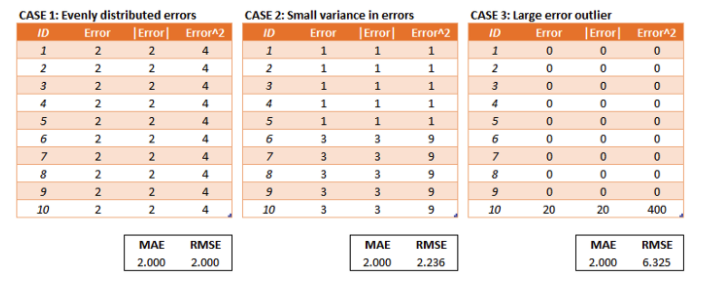

# Comparison

## Table of Contents

1. [MSE and Cross Entropy](#mse-and-cross-entropy)
2. [RMSE and MAE](#rmse-and-mae)

## MSE and Cross Entropy

TODO

## RMSE and MAE

Basically, RMSE and MSE uses the "Squared", which makes the loss function sensitive to the noise (the result of the loss function will be extremely huge if the input value is big).

### Similarities

Both MAE and RMSE express average model prediction error in units of the variable of interest. Both metrics can range from 0 to ∞ and are indifferent to the direction of errors. They are negatively-oriented scores, which means lower values are better.

### Differences

Taking the square root of the average squared errors has some interesting implications for RMSE. Since the errors are squared before they are averaged, the RMSE gives a relatively high weight to large errors. This means the RMSE should be more useful when large errors are particularly undesirable. The three tables below show examples where MAE is steady and RMSE increases as the variance associated with the frequency distribution of error magnitudes also increases. The three tables below show examples where MAE is steady and RMSE increases as the variance associated with the frequency distribution of error magnitudes also increases.

The last sentence is a little bit of a mouthful but I think is often incorrectly interpreted and important to highlight.

"RMSE does not necessarily increase with the variance of the errors. RMSE increases with the variance of the frequency distribution of error magnitudes."

To demonstrate, consider Case 4 and Case 5 in the tables below. Case 4 has an equal number of test errors of 0 and 5 and Case 5 has an equal number of test errors of 3 and 4. The variance of the errors is greater in Case 4 but the RMSE is the same for Case 4 and Case 5.

There may be cases where the variance of the frequency distribution of error magnitudes (still a mouthful) is of interest but in most cases (that I can think of) the variance of the errors is of more interest.

Another implication of the RMSE formula that is not often discussed has to do with sample size. Using MAE, we can put a lower and upper bound on RMSE.

    - [MAE] ≤ [RMSE]. The RMSE result will always be larger or equal to the MAE. If all of the errors have the same magnitude, then RMSE=MAE.

    - [RMSE] ≤ [MAE * sqrt(n)], where n is the number of test samples. The difference between RMSE and MAE is greatest when all of the prediction error comes from a single test sample. The squared error then equals to [MAE^2 * n] for that single test sample and 0 for all other samples. Taking the square root, RMSE then equals to [MAE * sqrt(n)].

Focusing on the upper bound, this means that RMSE has a tendency to be increasingly larger than MAE as the test sample size increases.

This can problematic when comparing RMSE results calculated on different sized test samples, which is frequently the case in real world modeling.
