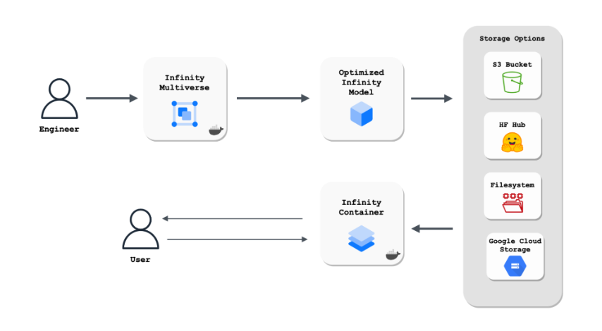

# HuggingFace Infinity

Hugging Face Infinity is a containerized solution for customers to deploy end-to-end optimized inference pipelines for State-of-the-Art Transformer models, on any infrastructure.

Hugging Face Infinity consists of 2 main services:

    - The Infinity Container is a hardware-optimized inference solution delivered as a Docker container.
    - Infinity Multiverse is a Model Optimization Service through which a Hugging Face Transformer model is optimized for the Target Hardware.
        * Infinity Multiverse is compatible with Infinity Container.

The Infinity Container is built specifically to run on a Target Hardware architecture and exposes an HTTP /predict endpoint to run inference.

An Infinity Container is designed to serve 1 Model and 1 Task. A Task corresponds to machine learning tasks as defined in the [Transformers Pipelines documentation](https://huggingface.co/docs/transformers/master/en/main_classes/pipelines).

According to [HuggingFace blog for HuggingFace Infinity](https://huggingface.co/blog/infinity-cpu-performance), by using the HuggingFace Infinity, it is able to achieve more than twice the performance of the original model with HF Transformers on a CPU.
