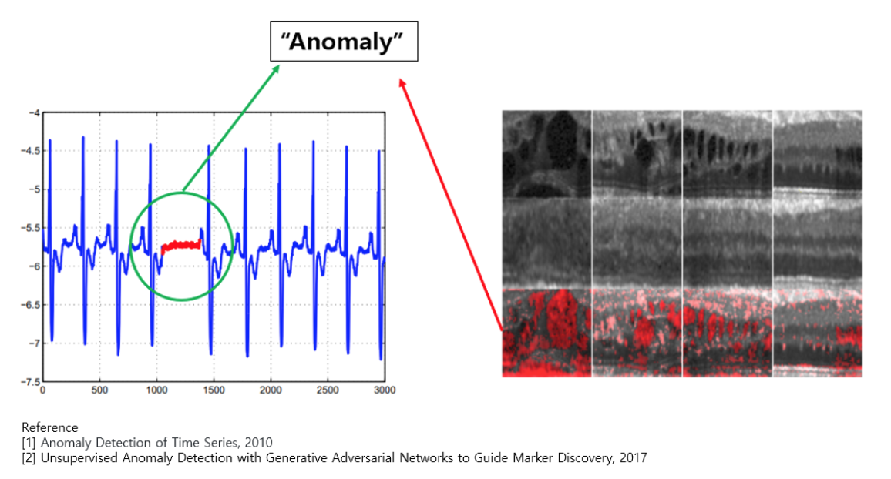
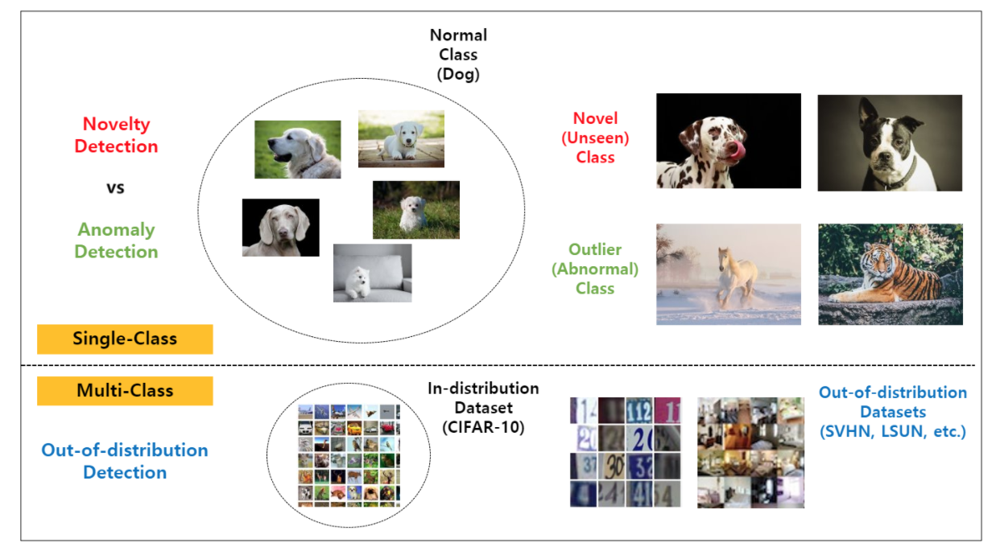
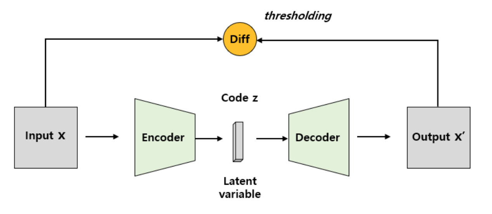
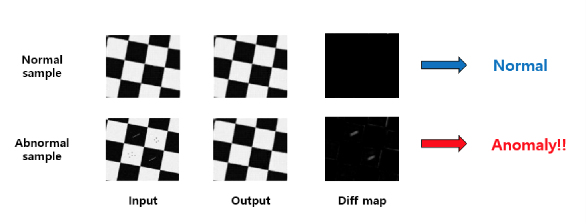

# Anomaly Detection

## Credits

Contents of the first few sections are copied from [hoya012's repository](https://github.com/hoya012/awesome-anomaly-detection). Credits to Hoseong Lee.

## Introduction

Anomaly detection is a technique used to identify unusual patterns that do not conform to expected behavior, called outliers. Typically, this is treated as an unsupervised learning problem where the anomalous samples are not known a priori and it is assumed that the majority of the training dataset consists of “normal” data (here and elsewhere the term “normal” means not anomalous and is unrelated to the Gaussian distribution) [[1]](http://data.bit.uni-bonn.de/publications/ICML2018.pdf).

In general, Anomaly detection is also called Novelty Detection or Outlier Detection, Forgery Detection and Out-of-distribution Detection.

Each term has slightly different meanings. Mostly, on the assumption that you do not have unusual data, this problem is especially called One Class Classification, One Class Segmentation.

And Novelty Detection and Outlier Detection have slightly different meanings. Figure below shows the differences of two terms.

Also, typically there are three types of target data. (time-series data, and image data, video data)
In time-series data, it is aimed to detect a abnormal sections. In image, video data, it is aimed to classify abnormal images or to segment abnormal regions, for example, defect in some manufacturing data.

## Survey Paper

- [Deep Learning for Anomaly Detection: A Survey [2]](https://arxiv.org/abs/1901.03407)
- [Anomalous Instance Detection in Deep Learning: A Survey [3]](https://arxiv.org/abs/2003.06979)

## Supervised Anomaly Detection

In case that both normal and abnormal sample data and labels exist in a given training data set, it is called Supervised Anomaly Detection because it is a supervised learning method.

The Supervised Learning method is characterized by high accuracy compared to other methods. Therefore, it is mainly used when high accuracy is required, and higher performance can be achieved with various abnormal samples.

However, the datasets for the supervised learning usually contain much less anomaly samples than the normal samples, thus, the anomaly detection with supervised learning often encounters Class-Imbalance problems. To overcome this issue, various studies such as Data Augmentation, redefining the loss function, and Batch Sampling are being conducted.

## Semi-supervised Anomaly Detection

The biggest problem with the Supervised Anomaly Detection method is that it takes a lot of time and cost to secure abnormal samples. In the case of manufacturing, for example, there are often situations where only one or two abnormal samples are acquired while millions of normal samples are acquired.

Assuming that at least 100 images are needed for each class to learn in the Supervised Learning method in the manufacturing industry, in reality, 100 million abnormal samples can be obtained only when 100 million samples are collected.

As such, when the Class-Imbalance is very severe, models are trained using only normal samples, and this method is called One-Class Classification (or Semi-supervised Learning). The core idea of ​​this methodology is to establish a discriminative boundary surrounding normal samples, and narrow this boundary as much as possible to treat all samples outside the boundary as abnormal. The [One-Class SVM [4]](https://www.jmlr.org/papers/volume2/manevitz01a/manevitz01a.pdf) is one of the most well known semi-supervised anomaly detection method.

## Unsupervised Anomaly Detection

The One-Class (Semi-supervised) Anomaly Detection method described above requires a normal sample. In order to know which of the numerous data is a normal sample, it is necessary to secure a label for the normal sample. Paying attention to this point, research is also being conducted on the Unsupervised Anomaly Detection methodology, which assumes that most of the data is a normal sample and learns without label acquisition.

In the simplest, abnormal samples can be detected through the process of reducing and restoring dimensions using Principal Component Analysis (PCA) for a given data. , As a representative of Neural Network, Autoencoder-based methodology is mainly used. Autoencoder proceeds with encoding that compresses the input into a code or latent variable, and decoding that restores it close to the original. Through this, only important information of the data can be learned in a compressive manner. It can be seen that it has a similar behavior to PCA.

With Autoencoder, you can learn the features of the normal region that is the main component of the data without labeling the data. At this time, if you put a normal sample into the learned autoencoder, the difference between input and output hardly occurs because it restores well as shown in the picture above. The difference is noticeable in the process of obtaining, so abnormal samples can be detected.

However, there is a disadvantage that the accuracy of good/nothing determination is somewhat unstable compared to Supervised Anomaly Detection because the overall restoration performance depends on the hyper-parameter such as the autoencoder's compression level (= code size = dimension of the latent variable). In addition, the performance can vary greatly depending on several factors, such as how to define the difference between the input and output put in the autoencoder (= how to calculate the difference map), which loss function to use and which loss function to train the autoencoder. As such, there is a weakness in that there are many factors that affect performance, but it can be said that it is a methodology with distinct advantages and disadvantages in that it can achieve some performance without a separate labeling process.

However, in the representative papers that segment defects by applying Unsupervised Anomaly Detection using Autoencoder, there is no unsupervised data set, so for the convenience of the experiment, the Semi-Supervised Learning method was used, which uses only normal samples for learning. The methodology using Autoencoder is an Unsupervised Learning method and can be applied to unsupervised data sets.

## References

[1] Lukas Ruff, Robert A. Vandermeulen, Nico Gornitz, Lucas Deecke, Shoaib A. Siddiqui, Alexander Binder, Emmanuel Muller, Marius Kloft. [Deep One-Class Classification](http://data.bit.uni-bonn.de/publications/ICML2018.pdf)

[2] Raghavendra Chalapathy, Sanjay Chawla. [Deep Learning for Anomaly Detection: A Survey](https://arxiv.org/abs/1901.03407)

[3] Saikiran Bulusu, Bhavya Kailkhura, Bo Li, Pramod K. Varshney, Dawn Song. [Anomalous Instance Detection in Deep Learning: A Survey](https://arxiv.org/abs/2003.06979)

[4] Larry M. Manevitz, Malik Yousef. [One-Class SVMs for Document Classification](https://www.jmlr.org/papers/volume2/manevitz01a/manevitz01a.pdf)

[5] Paul Bergmann, Sindy Löwe, Michael Fauser, David Sattlegger, Carsten Steger. [Improving Unsupervised Defect Segmentation by Applying Structural Similarity to Autoencoders](https://arxiv.org/abs/1807.02011)
