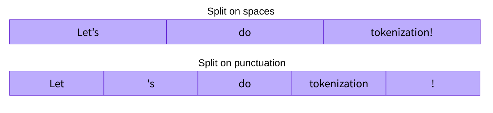
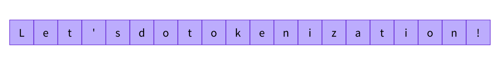
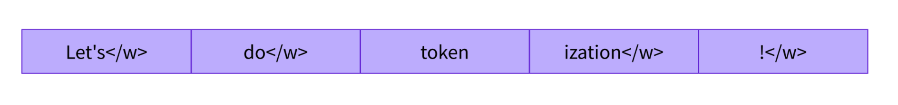

# Hugging Face 🤗

State-of-the-art Machine Learning for PyTorch, TensorFlow and JAX.

🤗 Transformers provides APIs to easily download and train state-of-the-art pretrained models. Using pretrained models can reduce your compute costs, carbon footprint, and save you time from training a model from scratch. The models can be used across different modalities such as texts, images, audios, and multimodal.

## Codes

### Pipelines

Codes are available [here](./src/pipelines/).

1. [Sentiment Analysis](./src/pipelines/sentiment_analysis.py)
2. [Zero Shot Classification](./src/pipelines/zero_shot_classification.py)
3. [Text Generation](./src/pipelines/text_generation.py)
4. [Mask Filling](./src/pipelines/mask_filling.py)
5. [Named Entity Recognition](./src/pipelines/ner.py)
6. [Question Answering](./src/pipelines/qa.py)
7. [Translation](./src/pipelines/translation.py)
8. [Summarization](./src/pipelines/summarization.py)

### Transformers' architectures

#### Encoders

Encoder models use only the encoder of a Transformer model. At each stage, the attention layers can access all the words in the initial sentence. These models are often characterized as having “bi-directional” attention, and are often called auto-encoding models.

The pretraining of these models usually revolves around somehow corrupting a given sentence (for instance, by masking random words in it) and tasking the model with finding or reconstructing the initial sentence.

Encoder models are best suited for tasks requiring an understanding of the full sentence, such as sentence classification, named entity recognition (and more generally word classification), and extractive question answering.

#### Decoders

Decoder models use only the decoder of a Transformer model. At each stage, for a given word the attention layers can only access the words positioned before it in the sentence. These models are often called auto-regressive models.

The pretraining of decoder models usually revolves around predicting the next word in the sentence.

These models are best suited for tasks involving text generation.

#### Sequence to Sequence models

Encoder-decoder models (also called sequence-to-sequence models) use both parts of the Transformer architecture. At each stage, the attention layers of the encoder can access all the words in the initial sentence, whereas the attention layers of the decoder can only access the words positioned before a given word in the input.

The pretraining of these models can be done using the objectives of encoder or decoder models, but usually involves something a bit more complex. For instance, T5 is pretrained by replacing random spans of text (that can contain several words) with a single mask special word, and the objective is then to predict the text that this mask word replaces.

Sequence-to-sequence models are best suited for tasks revolving around generating new sentences depending on a given input, such as summarization, translation, or generative question answering.

### Limitations and Biases of Large models

If your intent is to use a pretrained model or a fine-tuned version in production, please be aware that, while these models are powerful tools, they come with limitations. The biggest of these is that, to enable pretraining on large amounts of data, researchers often scrape all the content they can find, taking the best as well as the worst of what is available on the internet.

To learn more, see [this code](./src/limitations/gender_bias.py).

When asked to fill in the missing word in these two sentences by running the code above, the model gives only one gender-free answer (waiter/waitress). The others are work occupations usually associated with one specific gender — and yes, prostitute ended up in the top 5 possibilities the model associates with “woman” and “work.” This happens even though BERT is one of the rare Transformer models not built by scraping data from all over the internet, but rather using apparently neutral data (it’s trained on the English Wikipedia and BookCorpus datasets).

When you use these tools, you therefore need to keep in the back of your mind that the original model you are using could very easily generate sexist, racist, or homophobic content. Fine-tuning the model on your data won’t make this intrinsic bias disappear.

## Transformers.Model

The AutoModel class and all of its relatives are actually simple wrappers over the wide variety of models available in the library. It’s a clever wrapper as it can automatically guess the appropriate model architecture for your checkpoint, and then instantiates a model with this architecture.

However, if you know the type of model you want to use, you can use the class that defines its architecture directly.

### Dimensions of tensor outputs by the model

The dimensions of the tensor outputs by the Huggingface Transformers model would be 3:

- The sequence length, the batch size, and the hidden size

### Model Heads

Adaptation heads, also known simply as heads, come up in different forms: language modeling heads, question answering heads, sequence classification heads, etc.

For example, when you want to retrain the BERT model for a specific task with a custom dataset, then you need to use the base BERT model, and add a task-specific header to your model.

Below is the example of using the model head with a bert model:

```python3
import torch.nn as nn
from transformers import AutoModel
class PosModel(nn.Module):
    def __init__(self):
        super(PosModel, self).__init__()
        
        self.base_model = AutoModel.from_pretrained('bert-base-uncased')
        self.dropout = nn.Dropout(0.5)
        self.linear = nn.Linear(768, 2) # output features from bert is 768 and 2 is ur number of labels
        
    def forward(self, input_ids, attn_mask):
        outputs = self.base_model(input_ids, attention_mask=attn_mask)
        # You write you new head here
        outputs = self.dropout(outputs[0])
        outputs = self.linear(outputs)
        
        return outputs

model = PosModel()
model.to('cuda')
```

## Tokenizers

Tokenizers are one of the core components of the NLP pipeline. They serve one purpose: to translate text into data that can be processed by the model. Models can only process numbers, so tokenizers need to convert our text inputs to numerical data.

### Word-based Tokenizations

The first type of tokenizer that comes to mind is word-based. It’s generally very easy to set up and use with only a few rules, and it often yields decent results.



There are different ways to split the text. For example, we could could use whitespace to tokenize the text into words by applying Python’s split() function.

There are also variations of word tokenizers that have extra rules for punctuation. With this kind of tokenizer, we can end up with some pretty large “vocabularies,” where a vocabulary is defined by the total number of independent tokens that we have in our corpus.

Each word gets assigned an ID, starting from 0 and going up to the size of the vocabulary. The model uses these IDs to identify each word.

If we want to completely cover a language with a word-based tokenizer, we’ll need to have an identifier for each word in the language, which will generate a huge amount of tokens. For example, there are over 500,000 words in the English language, so to build a map from each word to an input ID we’d need to keep track of that many IDs. Furthermore, words like “dog” are represented differently from words like “dogs”, and the model will initially have no way of knowing that “dog” and “dogs” are similar: it will identify the two words as unrelated. The same applies to other similar words, like “run” and “running”, which the model will not see as being similar initially.

Finally, we need a custom token to represent words that are not in our vocabulary. This is known as the “unknown” token, often represented as ”[UNK]” or ””. It’s generally a bad sign if you see that the tokenizer is producing a lot of these tokens, as it wasn’t able to retrieve a sensible representation of a word and you’re losing information along the way. The goal when crafting the vocabulary is to do it in such a way that the tokenizer tokenizes as few words as possible into the unknown token.

### Character-based Tokenizations

Character-based tokenizers split the text into characters, rather than words. This has two primary benefits:

- The vocabulary is much smaller.
- There are much fewer out-of-vocabulary (unknown) tokens, since every word can be built from characters.



This approach isn’t perfect either. Since the representation is now based on characters rather than words, one could argue that, intuitively, it’s less meaningful: each character doesn’t mean a lot on its own, whereas that is the case with words. However, this again differs according to the language; in Chinese, for example, each character carries more information than a character in a Latin language.

Another thing to consider is that we’ll end up with a very large amount of tokens to be processed by our model: whereas a word would only be a single token with a word-based tokenizer, it can easily turn into 10 or more tokens when converted into characters.

### Subword-based Tokenizations

Subword tokenization algorithms rely on the principle that frequently used words should not be split into smaller subwords, but rare words should be decomposed into meaningful subwords.

For instance, “annoyingly” might be considered a rare word and could be decomposed into “annoying” and “ly”. These are both likely to appear more frequently as standalone subwords, while at the same time the meaning of “annoyingly” is kept by the composite meaning of “annoying” and “ly”.



These subwords end up providing a lot of semantic meaning: for instance, in the example above “tokenization” was split into “token” and “ization”, two tokens that have a semantic meaning while being space-efficient (only two tokens are needed to represent a long word). This allows us to have relatively good coverage with small vocabularies, and close to no unknown tokens.

This approach is especially useful in agglutinative languages such as Turkish, where you can form (almost) arbitrarily long complex words by stringing together subwords.

### Additional Tokenizations

Unsurprisingly, there are many more techniques out there. To name a few:

- Byte-level BPE, as used in GPT-2
- WordPiece, as used in BERT
- SentencePiece or Unigram, as used in several multilingual models

### Encoding with Tokenizers

Translating text to numbers is known as encoding. Encoding is done in a two-step process: the tokenization, followed by the conversion to input IDs.

As we’ve seen, the first step is to split the text into words (or parts of words, punctuation symbols, etc.), usually called tokens. There are multiple rules that can govern that process, which is why we need to instantiate the tokenizer using the name of the model, to make sure we use the same rules that were used when the model was pretrained.

The second step is to convert those tokens into numbers, so we can build a tensor out of them and feed them to the model. To do this, the tokenizer has a vocabulary, which is the part we download when we instantiate it with the from_pretrained() method. Again, we need to use the same vocabulary used when the model was pretrained.

You could find an example code from [here](./src/models_configs_and_tokenizers/encode_with_tokenizer.py)

### Decoding with Tokenizers

As we encoded the texts by tokenizing the texts and converting tokens to ids, we could also use the tokenizers for decoding by converting the ids to texts by using decode() method.

Below is the example code for using decode() method:

```python
decoded_string = tokenizer.decode([7993, 170, 11303, 1200, 2443, 1110, 3014])

print(decoded_string)
```

Note that the decode method not only converts the indices back to tokens, but also groups together the tokens that were part of the same words to produce a readable sentence. 
This behavior will be extremely useful when we use models that predict new text (either text generated from a prompt, or for sequence-to-sequence problems like translation or summarization).

### Padding

Tokenizers can pad according to several objectives.

[sample code](./src/models_configs_and_tokenizers/padding.py)

### Truncates

Tokenizers can also truncate sequences.

[sample code](./src/models_configs_and_tokenizers/truncate.py)

### Handling tensors for specific libraries

The tokenizer object can handle the conversion to specific framework tensors, which can then be directly sent to the model. For example, in the following code sample we are prompting the tokenizer to return tensors from the different frameworks — "pt" returns PyTorch tensors, "tf" returns TensorFlow tensors, and "np" returns NumPy arrays:

```python
sequences = ["I've been waiting for a HuggingFace course my whole life.", "So have I!"]

# Returns PyTorch tensors
model_inputs = tokenizer(sequences, padding=True, return_tensors="pt")

# Returns TensorFlow tensors
model_inputs = tokenizer(sequences, padding=True, return_tensors="tf")

# Returns NumPy arrays
model_inputs = tokenizer(sequences, padding=True, return_tensors="np")
```

### Special Tokens

If we take a look at the input IDs returned by the tokenizer, we will see they are a tiny bit different from what we had earlier:

```python
sequence = "I've been waiting for a HuggingFace course my whole life."

model_inputs = tokenizer(sequence)
print(model_inputs["input_ids"])

tokens = tokenizer.tokenize(sequence)
ids = tokenizer.convert_tokens_to_ids(tokens)
print(ids)
```

```python
[101, 1045, 1005, 2310, 2042, 3403, 2005, 1037, 17662, 12172, 2607, 2026, 2878, 2166, 1012, 102]
[1045, 1005, 2310, 2042, 3403, 2005, 1037, 17662, 12172, 2607, 2026, 2878, 2166, 1012]
```

One token ID was added at the beginning, and one at the end. Let’s decode the two sequences of IDs above to see what this is about:

```python
print(tokenizer.decode(model_inputs["input_ids"]))
print(tokenizer.decode(ids))
```

```python
"[CLS] i've been waiting for a huggingface course my whole life. [SEP]"
"i've been waiting for a huggingface course my whole life."
```

The tokenizer added the special word [CLS] at the beginning and the special word [SEP] at the end. This is because the model was pretrained with those, so to get the same results for inference we need to add them as well. Note that some models don’t add special words, or add different ones; models may also add these special words only at the beginning, or only at the end. In any case, the tokenizer knows which ones are expected and will deal with this for you.

## Batch Input

Batching allows the model to work when you feed it multiple sentences. Using multiple sequences is just as simple as building a batch with a single sequence. There’s a second issue, though. When you’re trying to batch together two (or more) sentences, they might be of different lengths. If you’ve ever worked with tensors before, you know that they need to be of rectangular shape, so you won’t be able to convert the list of input IDs into a tensor directly. To work around this problem, we usually pad the inputs.

### Padding the inputs

Since each sentence in the batch has different length, each list will have different number of ids. To handle this issue, we could introduce the concept of padding. Basically, we just add padding ids to the list of ids so that the model could always handle with a same length of sequences.

### Attention masks

Attention masks are tensors with the exact same shape as the input IDs tensor, filled with 0s and 1s: 1s indicate the corresponding tokens should be attended to, and 0s indicate the corresponding tokens should not be attended to (i.e., they should be ignored by the attention layers of the model).

### Longer inputs

With Transformer models, there is a limit to the lengths of the sequences we can pass the models. Most models handle sequences of up to 512 or 1024 tokens, and will crash when asked to process longer sequences. There are two solutions to this problem:

- Use a model with a longer supported sequence length.
- Truncate your sequences.

Models have different supported sequence lengths, and some specialize in handling very long sequences.

## Datasets

The 🤗 Datasets library provides a very simple command to download and cache a dataset on the Hub. We can download the MRPC dataset like this:

```python
from datasets import load_dataset

raw_datasets = load_dataset("glue", "mrpc")
raw_datasets
```

```python
DatasetDict({
    train: Dataset({
        features: ['sentence1', 'sentence2', 'label', 'idx'],
        num_rows: 3668
    })
    validation: Dataset({
        features: ['sentence1', 'sentence2', 'label', 'idx'],
        num_rows: 408
    })
    test: Dataset({
        features: ['sentence1', 'sentence2', 'label', 'idx'],
        num_rows: 1725
    })
})
```

As you can see, we get a DatasetDict object which contains the training set, the validation set, and the test set. Each of those contains several columns (sentence1, sentence2, label, and idx) and a variable number of rows, which are the number of elements in each set (so, there are 3,668 pairs of sentences in the training set, 408 in the validation set, and 1,725 in the test set).

This command downloads and caches the dataset, by default in ~/.cache/huggingface/dataset. Recall from Chapter 2 that you can customize your cache folder by setting the HF_HOME environment variable.

We can access each pair of sentences in our raw_datasets object by indexing, like with a dictionary:

```python
raw_train_dataset = raw_datasets["train"]
raw_train_dataset[0]
```

```python
{'idx': 0,
 'label': 1,
 'sentence1': 'Amrozi accused his brother , whom he called " the witness " , of deliberately distorting his evidence .',
 'sentence2': 'Referring to him as only " the witness " , Amrozi accused his brother of deliberately distorting his evidence .
}
```

We can see the labels are already integers, so we won’t have to do any preprocessing there. To know which integer corresponds to which label, we can inspect the features of our raw_train_dataset. This will tell us the type of each column:

```python
raw_train_dataset.features
```

```python
{'sentence1': Value(dtype='string', id=None),
 'sentence2': Value(dtype='string', id=None),
 'label': ClassLabel(num_classes=2, names=['not_equivalent', 'equivalent'], names_file=None, id=None),
 'idx': Value(dtype='int32', id=None)}
```

Behind the scenes, label is of type ClassLabel, and the mapping of integers to label name is stored in the names folder. 0 corresponds to not_equivalent, and 1 corresponds to equivalent.

### Processing the dataset

To preprocess the dataset, we need to convert the text to numbers the model can make sense of.

We can feed the tokenizer one sentence or a list of sentences, so we can directly tokenize all the first sentences and all the second sentences of each pair like this:

```python
from transformers import AutoTokenizer

checkpoint = "bert-base-uncased"
tokenizer = AutoTokenizer.from_pretrained(checkpoint)
tokenized_sentences_1 = tokenizer(raw_datasets["train"]["sentence1"])
tokenized_sentences_2 = tokenizer(raw_datasets["train"]["sentence2"])
```

However, we can’t just pass two sequences to the model and get a prediction of whether the two sentences are paraphrases or not. We need to handle the two sequences as a pair, and apply the appropriate preprocessing. Fortunately, the tokenizer can also take a pair of sequences and prepare it the way our BERT model expects:

```python
inputs = tokenizer("This is the first sentence.", "This is the second one.")
inputs
```

```python
{ 
  'input_ids': [101, 2023, 2003, 1996, 2034, 6251, 1012, 102, 2023, 2003, 1996, 2117, 2028, 1012, 102],
  'token_type_ids': [0, 0, 0, 0, 0, 0, 0, 0, 1, 1, 1, 1, 1, 1, 1],
  'attention_mask': [1, 1, 1, 1, 1, 1, 1, 1, 1, 1, 1, 1, 1, 1, 1]
}
```

If we decode the IDs inside input_ids back to words:

```python
tokenizer.convert_ids_to_tokens(inputs["input_ids"])
```

we will get:

```python
['[CLS]', 'this', 'is', 'the', 'first', 'sentence', '.', '[SEP]', 'this', 'is', 'the', 'second', 'one', '.', '[SEP]']
```

So we see the model expects the inputs to be of the form [CLS] sentence1 [SEP] sentence2 [SEP] when there are two sentences. Aligning this with the token_type_ids gives us:

```python
['[CLS]', 'this', 'is', 'the', 'first', 'sentence', '.', '[SEP]', 'this', 'is', 'the', 'second', 'one', '.', '[SEP]']
[      0,      0,    0,     0,       0,          0,   0,       0,      1,    1,     1,        1,     1,   1,       1]
```

As you can see, the parts of the input corresponding to [CLS] sentence1 [SEP] all have a token type ID of 0, while the other parts, corresponding to sentence2 [SEP], all have a token type ID of 1.

For this task, we could apply the padding and truncation by using the code below:

```python
tokenized_dataset = tokenizer(
    raw_datasets["train"]["sentence1"],
    raw_datasets["train"]["sentence2"],
    padding=True,
    truncation=True,
)
```

This function takes a dictionary (like the items of our dataset) and returns a new dictionary with the keys input_ids, attention_mask, and token_type_ids. Note that it also works if the example dictionary contains several samples (each key as a list of sentences) since the tokenizer works on lists of pairs of sentences, as seen before. This will allow us to use the option batched=True in our call to map(), which will greatly speed up the tokenization. The tokenizer is backed by a tokenizer written in Rust from the 🤗 Tokenizers library. 
