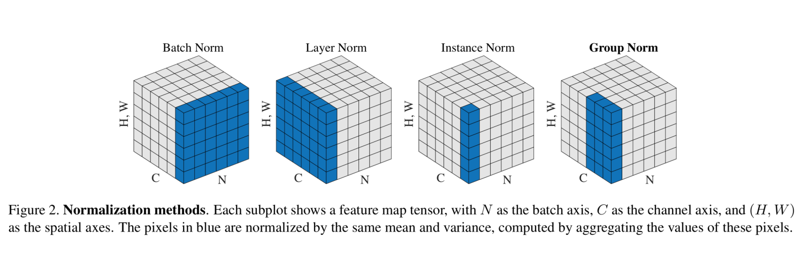

# Group Normalisation

[Group normalization [1]](https://arxiv.org/abs/1803.08494v3) can be said as an alternative to batch normalization. This approach works by dividing the channels into groups and computes within each group the mean and variance for normalization i.e. normalising the features within each group. Unlike batch normalization, group normalization is independent of batch sizes, and also its accuracy is stable in a wide range of batch sizes.

## Advantages

- It has the ability to replace batch normalization in a number of deep learning tasks

- It can be easily implemented in modern libraries with just a few lines of codes

## References

[1] Yuxin Wu, Kaiming He. [Group Normalization](https://arxiv.org/abs/1803.08494v3)
