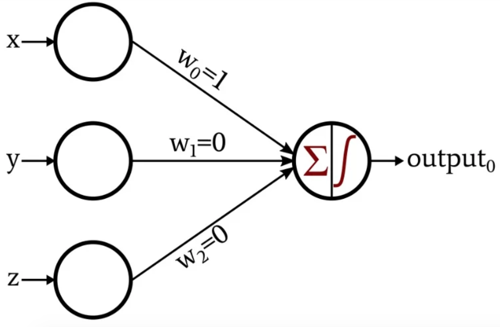
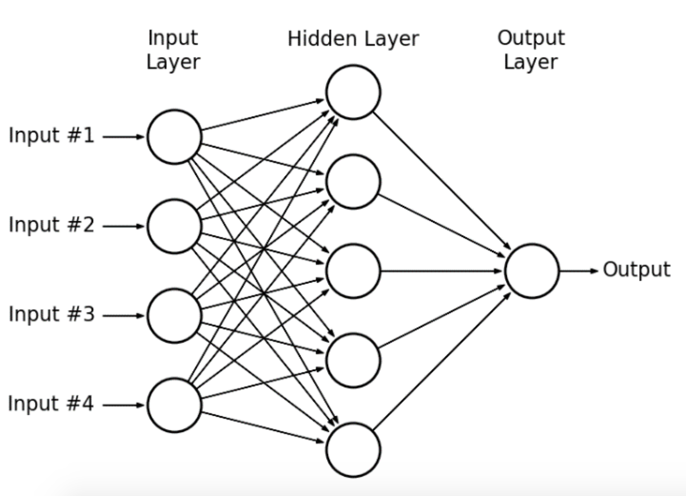
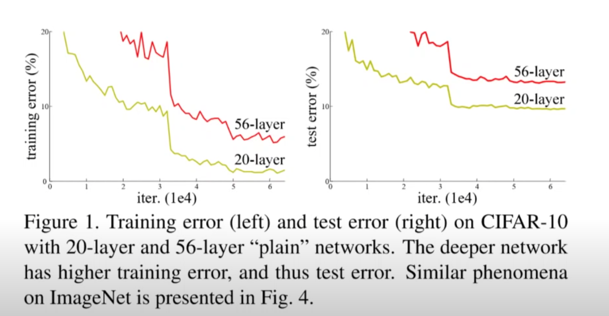

# Deep Learning

## Perceptron

In the perceptron is an algorithm for supervised learning of binary classifiers. A binary classifier is a function which can decide whether or not an input, represented by a vector of numbers, belongs to some specific class.

It is a type of linear classifier, i.e. a classification algorithm that makes its predictions based on a linear predictor function combining a set of weights with the feature vector.

### Multi-Layer Perceptron

A multilayer perceptron (MLP) is a class of feedforward artificial neural network (ANN). The term MLP is used ambiguously, sometimes loosely to any feedforward ANN, sometimes strictly to refer to networks composed of multiple layers of perceptrons (with threshold activation).

Multilayer perceptrons are sometimes colloquially referred to as "vanilla" neural networks, especially when they have a single hidden layer.

An MLP consists of at least three layers of nodes: an input layer, a hidden layer and an output layer. Except for the input nodes, each node is a neuron that uses a nonlinear activation function. MLP utilizes a supervised learning technique called backpropagation for training. Its multiple layers and non-linear activation distinguish MLP from a linear perceptron. It can distinguish data that is not linearly separable.

## Neural Network

### Hidden Layers

### Maker Neural Network Deeper

By adding more hidden layers to the neural network, we could make the neural network deeper.

Adding layers to a neutral network adds dimensionality, you can also think of these as eigenvectors in a sense. As you increase dimensionality, you can solve more complex problems such as the XOR problem which is not linearly separable. Think of a single hidden layer like a 2 dimensional space and when weights are trained it creates a line to separate the data points. Two hidden layers make a 3 dimensional space and you will create a plane to separate data. GoogLeNet has a depth of 22, with about 100 total layers, making a 10 to 20 something dimensional space, with a hyper plane dividing the data.

In general, when we make the neural network deeper (adding new layers), we could make the neural network perform better, and generalize better. Also, you could reach lower training loss.

However, optimizing the deeper neural network is hard.

Also, sometimes, adding more layers could lead us to un-intended problems.

As you could see in the image above, you could have much higher training and testing error scores. Clearly, this is not an overfitting, since the training error is high. [He et al. [1]](https://arxiv.org/abs/1512.03385) said "the degration of training accuracy indicates that not all systems all similarly easy to optimize". Since we added more layers to the neural network, it became much complex, and much harder to optimize.

## References

[1] Kaiming He, Xiangyu Zhang, Shaoqing Ren, Jian Sun [Deep Residual Learning for Image Recognition](https://arxiv.org/abs/1512.03385)
