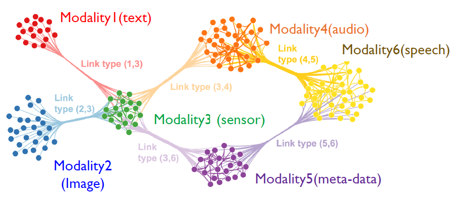
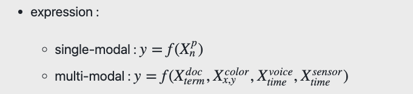

# Multi Modal Models

Multimodal learning is a good model to represent the joint representations of different modalities. The multimodal learning model is also capable of supplying a missing modality based on observed ones. The multimodal learning model combines two deep Boltzmann machines, each corresponding to one modality.

## Open AI's CLIP

[CLIP (Contrastive Language-Image Pre-Training) [1]](https://arxiv.org/abs/2103.00020) is a neural network trained on a variety of (image, text) pairs.

For more information about CLIP, please refer to [this page](./CLIP/)
