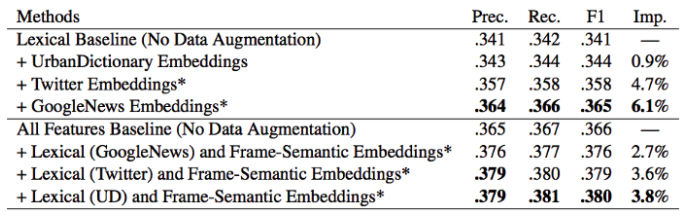
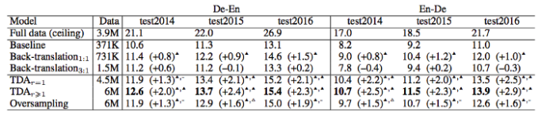

# Data Augmentation

More data we have, better performance we can achieve. However, it is very too luxury to annotate large amount of training data. Therefore, proper data augmentation is useful to boost up your model performance. Augmentation is very popular in computer vision area. Image can be augmented easily by flipping, adding salt etc via image augmentation library such as imgaug. It is proved that augmentation is one of the anchor to success of computer vision model.

In natural language processing (NLP) field, it is hard to augmenting text due to high complexity of language. Not every word we can replace it by others such as a, an, the. Also, not every word has synonym. Even changing a word, the context will be totally difference. On the other hand, generating augmented image in computer vision area is relative easier. Even introducing noise or cropping out portion of image, model can still classify the image.

Given that we do not have unlimited resource to build training data by human, authors tried different methods to achieve same goals which is generating more data for model training.

As you know, the data augmentation actually helps the CV researchers to enhance the performance of ConvNet models by using the data augmentation. And, clearly, this could also be applied to the NLP.

## Thesaurus

[Zhang et al. [1]](https://arxiv.org/abs/1509.01626) introduced synonyms Character-level Convolutional Networks for Text Classification. During the experiment, they found that one of the useful way to do text augmentation is replacing words or phrases with their synonyms. Leverage existing thesaurus help to generate lots of data in a short time. Zhang et al. select a word and replace it by synonyms according to geometric distribution.

## Word Embeddings

[Wang and Yang[2]](https://www.aclweb.org/anthology/D15-1306/) introduced word similar calculation. In the paper, Wang and Yang proposed to use k-nearest-neighbor (KNN) and cosine similarity to find the similar word for replacement.

Alternatively, we can leverages pre-trained classic word embeddings such as word2vec, GloVe and fasttext to perform similarity search.

## Contextualized Word Embeddings

Rather than using static word embeddings, [Fadaee et al. [3]](https://arxiv.org/abs/1705.00440) use contextualized word embeddings to replace target word. They use this text augmentation to validate machine translation model in Data Augmentation for Low-Resource Neural Machine Translation.

The proposed approach is TDA which stands for Translation Data Augmentation. From the experiment, it showed that machine translation model is improved by leveraging text augmentation.

Kobayashi propose to use a bi-directional language model in [Contextual Augmentation: Data Augmentation by Words with Paradigmatic Relation [4]](https://arxiv.org/abs/1805.06201). After selected target word, the model will predict possible replacement by giving surrounding words. As the target will exist in any position of sentence, bi-directional architecture is used to learn both rightward and leftward context.

Kobayashi verified the language model approach with CNN and RNN on six dataset and the result is positive. Text augmentation helps to further improve the NLP model result.

## References

[1] Xiang Zhang, Junbo Zhao, Yann LeCun. [Character-level Convolutional Networks for Text Classification](https://arxiv.org/abs/1509.01626)

[2] William Yang Wang, Diyi Yang. [That’s So Annoying!!!: A Lexical and Frame-Semantic Embedding Based Data Augmentation Approach to Automatic Categorization of Annoying Behaviors using #petpeeve Tweets](https://www.aclweb.org/anthology/D15-1306/)

[3] Marzieh Fadaee, Arianna Bisazza, Christof Monz. [Data Augmentation for Low-Resource Neural Machine Translation](https://arxiv.org/abs/1705.00440)

[4] Sosuke Kobayashi. [Contextual Augmentation: Data Augmentation by Words with Paradigmatic Relations](https://arxiv.org/abs/1805.06201)
