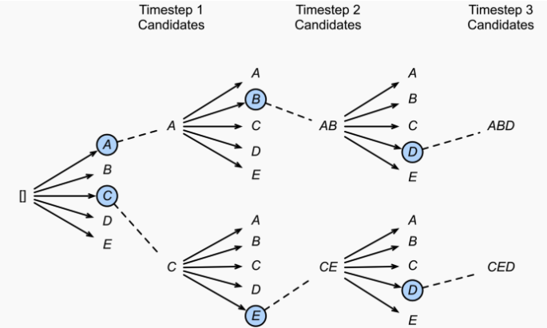

# Natural Language Generation

Natural Language Generation (NLG), a subcategory of Natural Language Processing (NLP), is a software process that automatically transforms structured data into human-readable text.

## Decoding

As you know, the language model is a system that produces the probability distribution of natural languages. The outputs of the language models are probability distribution vectors, which should be decoded to natural language texts. So, for generating the suitable result text for NLG with language models, we should select the suitable decoding method.

At each timestep during decoding, we take the vector (that holds the information from one step to another) and apply it with softmax function to convert it into an array of probability for each word.


### Greedy decoding

The simplest option we have is greedy decoding. This takes our list of potential outputs and the probability distribution already calculated — and chooses the option with the highest probability (argmax).

It would seem that this is entirely logical — and in many cases, it works perfectly well. However, for longer sequences, this can cause some problems.

This is most likely due to the greedy decoding method getting stuck on a particular word or sentence and repetitively assigning these sets of words the highest probability again and again.

Below is a sample code of using Greedy search decoding with GPT-2 by using Huggingface framework.

```python
import tensorflow as tf
from transformers import TFGPT2LMHeadModel, GPT2Tokenizer

tokenizer = GPT2Tokenizer.from_pretrained("gpt2")
# Use EOS token as a PAD token to avoid the warnings
model = TFGPT2LMHeadModel.from_pretrained("gpt2", pad_token_id=tokenizer.eos_token_id)

input_ids = tokenizer.encode('I enjoy walking with my cute dog', return_tensors='tf')
greedy_output = model.generate(input_ids, max_length=50)

print("Output:\n" + 100 * '-')
print(tokenizer.decode(greedy_output[0], skip_special_tokens=True))
```

### Beam search

Exhaustive search can solve the previous problem since it will search for the whole space. However, it would be computationally expensive. Suppose there are 10,000 vocabularies, to generate a sentence with the length of 10 tokens, it would be (10,000)¹⁰.



Beam search can cope with this problem. At each timestep, it generates all possible tokens in the vocabulary list; then, it will choose top B candidates that have the most probability. Those B candidates will move to the next time step, and the process repeats. In the end, there will only be B candidates. The search space is only (10,000)*B.

```
Context:    Try this cake. I baked it myself.
Response A: That cake tastes great.
Response B: Thank you.
```

But sometimes, it chooses an even more optimal (Response B). In this case, it makes perfect sense. But imagine that the model likes to play safe and keeps on generating “I don’t know” or “Thank you” to most of the context, that is a pretty bad bot.

Below is a sample code of using Beam search decoding with GPT-2 by using Huggingface framework.

```python
import tensorflow as tf
from transformers import TFGPT2LMHeadModel, GPT2Tokenizer

tokenizer = GPT2Tokenizer.from_pretrained("gpt2")
# Use EOS token as a PAD token to avoid the warnings
model = TFGPT2LMHeadModel.from_pretrained("gpt2", pad_token_id=tokenizer.eos_token_id)

input_ids = tokenizer.encode('I enjoy walking with my cute dog', return_tensors='tf')
beam_output = model.generate(
    input_ids, 
    max_length=50, 
    num_beams=5, # should be greater than 1
    no_repeat_ngram_size=2, # use penalty to avoid repeating 2-gram
    early_stopping=True # stop generation when meeting the EOS token
)

print("Output:\n" + 100 * '-')
print(tokenizer.decode(beam_output[0], skip_special_tokens=True))
```

You could also use "num_return_sequences" argument to make the model returns N sequences.

```python
beam_outputs = model.generate(
    input_ids, 
    max_length=50, 
    num_beams=5, 
    no_repeat_ngram_size=2, 
    num_return_sequences=5, # return 5 early generated sequences
    early_stopping=True
)
```

### Sampling

Read more about sampling method [here](./Sampling/)
