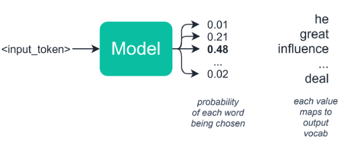
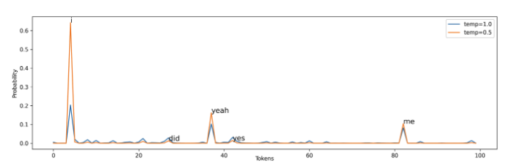
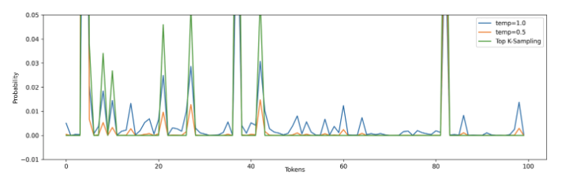
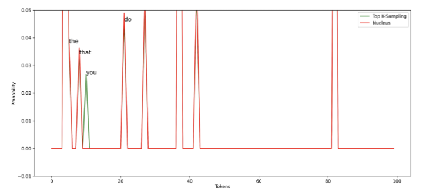

# Sampling

tl;dr

- Random Sampling: Random based on probability
- Temperature: Shrink or enlarge probabilities
- Top-K Sampling: Select top probable K tokens
- Nucleus Sampling: Dynamically choose the number of K (sort of)

## Random Sampling

Alternatively, we can look into stochastic approaches to avoid the response being generic. We can utilize the probability of each token from the softmax function to generate the next token.

Random sampling chooses the next word based on these probabilities — so in our example, we might have the following words and probability distribution:



If you see the image above, you could find that we would have a 48% chance of the model selecting ‘influence’, a 21% chance of it choosing ‘great’, and so on. This solves our problem of getting stuck in a repeating loop of the same words because we add randomness to our predictions. However, this introduces a different problem — we will often find that this approach can be too random and lacks coherence.

Below is a sample code of using Top-K sampling method with GPT-2 by using Huggingface framework.

```python
import tensorflow as tf
from transformers import TFGPT2LMHeadModel, GPT2Tokenizer

tokenizer = GPT2Tokenizer.from_pretrained("gpt2")
# Use EOS token as a PAD token to avoid the warnings
model = TFGPT2LMHeadModel.from_pretrained("gpt2", pad_token_id=tokenizer.eos_token_id)

input_ids = tokenizer.encode('I enjoy walking with my cute dog', return_tensors='tf')

tf.random.set_seed(0) # set random seed for re-producibility
sample_output = model.generate(
    input_ids, 
    do_sample=True, # use sampling
    max_length=50, 
    top_k=0 # 0 for random sampling
)
```

## Random Sampling with Temperature

Random sampling, by itself, could potentially generate a very random word by chance. Temperature is used to increase the probability of probable tokens while reducing the one that is not. Usually, the range is 0 < temp ≤ 1. Note that when temp=1, there is no effect.




If you see the plot above, with temp=0.5, the most probable words like i, yeah, me, have more chance of being generated. At the same time, this also lowers the probability of the less probable ones, although this does not stop them from occurring.

## Top-K sampling

[Top-K sampling [1]](https://arxiv.org/abs/1805.04833) is used to ensure that the less probable words should not have any chance at all. Only top K probable tokens should be considered for a generation.



The token index between 50 to 80 has some small probabilities if we use random sampling with temperature=0.5 or 1.0. With top-k sampling (K=10), those tokens have no chance of being generated.

This sampling technique has been adopted in many recent generation tasks; this technique is also known as the decoding algorithm that is used for GPT-2 model.

One limitation with this approach is the number of top K words need to be defined in the beginning. Suppose we choose K=300; however, at a decoding timestep, the model is sure that there should be 10 highly probable words. If we use Top-K, that means we will also consider the other 290 less probable words.

Below is a sample code of using Top-K sampling method with GPT-2 by using Huggingface framework.

```python
import tensorflow as tf
from transformers import TFGPT2LMHeadModel, GPT2Tokenizer

tokenizer = GPT2Tokenizer.from_pretrained("gpt2")
# Use EOS token as a PAD token to avoid the warnings
model = TFGPT2LMHeadModel.from_pretrained("gpt2", pad_token_id=tokenizer.eos_token_id)

input_ids = tokenizer.encode('I enjoy walking with my cute dog', return_tensors='tf')

tf.random.set_seed(0) # set random seed for re-producibility
sample_output = model.generate(
    input_ids, 
    do_sample=True, # use sampling
    max_length=50, 
    top_k=5 # Top-5 sampling
)
```

## Nucleus Sampling

[Nucleus Sampling [2]](https://arxiv.org/abs/1904.09751) is similar to Top-K sampling. Instead of focusing on Top-K words, nucleus sampling focuses on the smallest possible sets of Top-V words such that the sum of their probability is ≥ p. Then, the tokens that are not in V^(p) are set to 0; the rest are re-scaled to ensure that they sum to 1.


The intuition is that when the model is very certain on some tokens, the set of potential candidate tokens is small otherwise, there will be more potential candidate tokens.



Comparing nucleus sampling (p=0.5) with top-K sampling (K = 10), we can see the nucleus does not consider token “you” to be a candidate. This shows that it can adapt to different cases and select different numbers of tokens, unlike Top-K sampling.

## References

[1] Angela Fan, Mike Lewis, Yann Dauphin. [Hierarchical Neural Story Generation](https://arxiv.org/abs/1805.04833)

[2] Ari Holtzman, Jan Buys, Li Du, Maxwell Forbes, Yejin Choi. [The Curious Case of Neural Text Degeneration](https://arxiv.org/abs/1904.09751)
