# GPT (Generative Pre-Training)

GPT is the Transformer based model that is proposed by OpenAI.

## GPT

OpenAI GPT model was proposed in [Improving Language Understanding by Generative Pre-Training [1]](./papers/gpt.pdf) by Alec Radford, Karthik Narasimhan, Tim Salimans and Ilya Sutskever. It’s a causal (unidirectional) transformer pre-trained using language modeling on a large corpus will long range dependencies, the Toronto Book Corpus.

### Tips for using GPT

- GPT is a model with absolute position embeddings so it’s usually advised to pad the inputs on the right rather than the left.

- GPT was trained with a causal language modeling (CLM) objective and is therefore powerful at predicting the next token in a sequence.

## GPT-2

OpenAI GPT-2 model was proposed in [Language Models are Unsupervised Multitask Learners [2]](./papers/gpt2.pdf). It’s a causal (unidirectional) transformer pre-trained using language modeling on a very large corpus of ~40 GB of text data.

Basically, there were no much difference between the architecture of GPT and GPT-2 model. Simply, they just increase the size of the GPT model to generate GPT-2, so that they could train the model with much bigger dataset (40GB of text dataset). However, the GPT-2 model actually outperformed the original GPT model. Here, we could find that increasing the size of the neural network actually helps the model to increase the performance.

### What is GPT-2

The GPT-2 is basically the next word prediction feature of a keyboard app, but one that is much larger and more sophisticated than what your phone has. The GPT-2 was trained on a massive 40GB dataset called WebText that the OpenAI researchers crawled from the internet as part of the research effort. To compare in terms of storage size, the keyboard app I use, SwiftKey, takes up 78MBs of space. The smallest variant of the trained GPT-2, takes up 500MBs of storage to store all of its parameters. The largest GPT-2 variant is 13 times the size so it could take up more than 6.5 GBs of storage space.

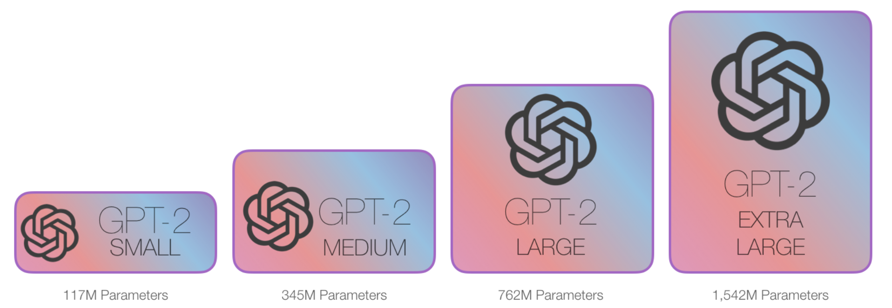

One great way to experiment with GPT-2 is using the [AllenAI GPT-2 Explorer](https://demo.allennlp.org/next-token-lm?text=AllenNLP%20is). It uses GPT-2 to display ten possible predictions for the next word (alongside their probability score). You can select a word then see the next list of predictions to continue writing the passage.

### Transformers for Language Modeling

The original transformer model is made up of an encoder and decoder – each is a stack of what we can call transformer blocks. That architecture was appropriate because the model tackled machine translation – a problem where encoder-decoder architectures have been successful in the past.

A lot of the subsequent research work saw the architecture shed either the encoder or decoder, and use just one stack of transformer blocks – stacking them up as high as practically possible, feeding them massive amounts of training text, and throwing vast amounts of compute at them (hundreds of thousands of dollars to train some of these language models, likely millions in the case of [AlphaStar](https://deepmind.com/blog/article/alphastar-mastering-real-time-strategy-game-starcraft-ii)).

How high can we stack up these blocks? It turns out that’s one of the main distinguishing factors between the different GPT2 model sizes:

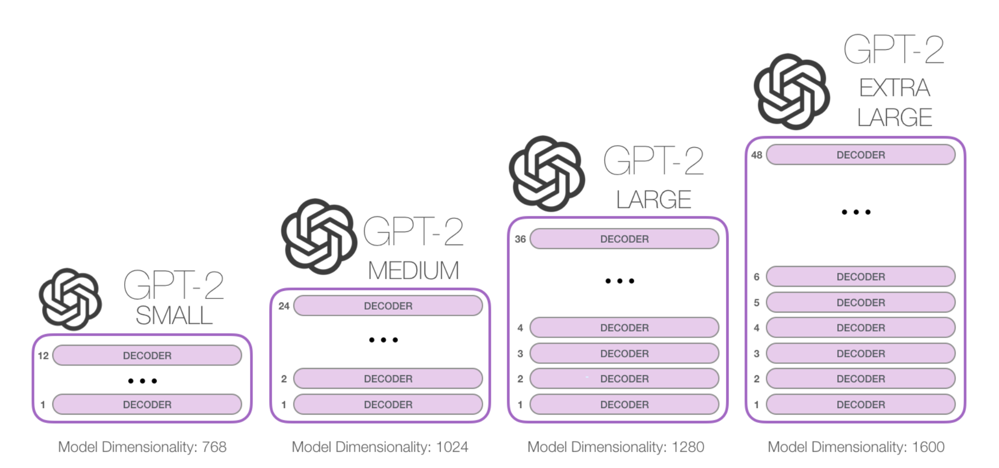

### One difference from BERT

The GPT-2 is built using transformer decoder blocks. BERT, on the other hand, uses transformer encoder blocks. But one key difference between the two is that GPT2, like traditional language models, outputs one token at a time.

The way these traditional language models actually work is that after each token is produced, that token is added to the sequence of inputs. And that new sequence becomes the input to the model in its next step. This is an idea called “auto-regression”. This is one of the ideas that [made RNNs unreasonably effective](https://karpathy.github.io/2015/05/21/rnn-effectiveness/).

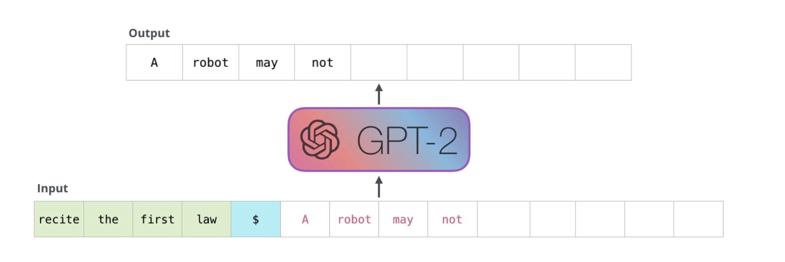

The GPT2, and some later models like TransformerXL and XLNet are auto-regressive in nature. BERT is not. That is a trade off. In losing auto-regression, BERT gained the ability to incorporate the context on both sides of a word to gain better results. XLNet brings back autoregression while finding an alternative way to incorporate the context on both sides.

### The Evolution of the Transformer Block

The [initial transformer paper](./papers/gpt.pdf) introduced two types of transformer blocks:

#### The Encoder Block

First is the encoder block:

#### The Decoder Block

Second, there’s the decoder block which has a small architectural variation from the encoder block – a layer to allow it to pay attention to specific segments from the encoder:

One key difference in the self-attention layer here, is that it masks future tokens – not by changing the word to [mask] like BERT, but by interfering in the self-attention calculation blocking information from tokens that are to the right of the position being calculated.

If, for example, we’re to highlight the path of position #4, we can see that it is only allowed to attend to the present and previous tokens:

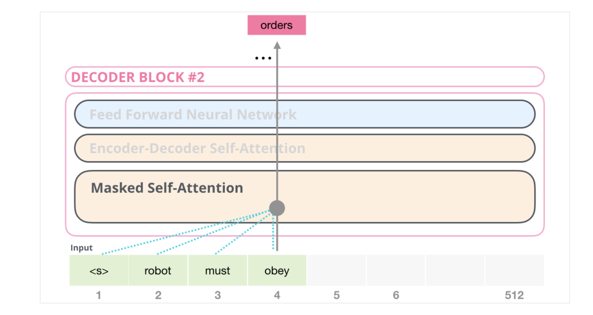

It’s important that the distinction between self-attention (what BERT uses) and masked self-attention (what GPT-2 uses) is clear. A normal self-attention block allows a position to peak at tokens to its right. Masked self-attention prevents that from happening:

#### The Decoder-Only Block

Subsequent to the original paper, [Generating Wikipedia by Summarizing Long Sequences [3]](https://arxiv.org/abs/1801.10198) proposed another arrangement of the transformer block that is capable of doing language modeling. This model threw away the Transformer encoder. For that reason, let’s call the model the “Transformer-Decoder”. This early transformer-based language model was made up of a stack of six transformer decoder blocks:

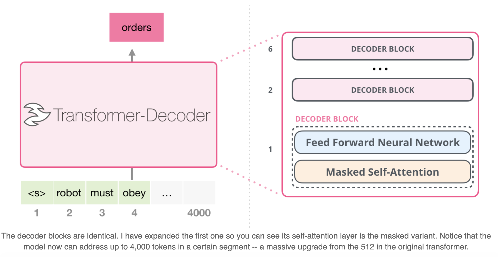

These blocks were very similar to the original decoder blocks, except they did away with that second self-attention layer. A similar architecture was examined in [Character-Level Language Modeling with Deeper Self-Attention [4]](https://arxiv.org/abs/1808.04444) to create a language model that predicts one letter/character at a time.

The OpenAI GPT-2 model uses these decoder-only blocks.

### Looking Inside GPT-2

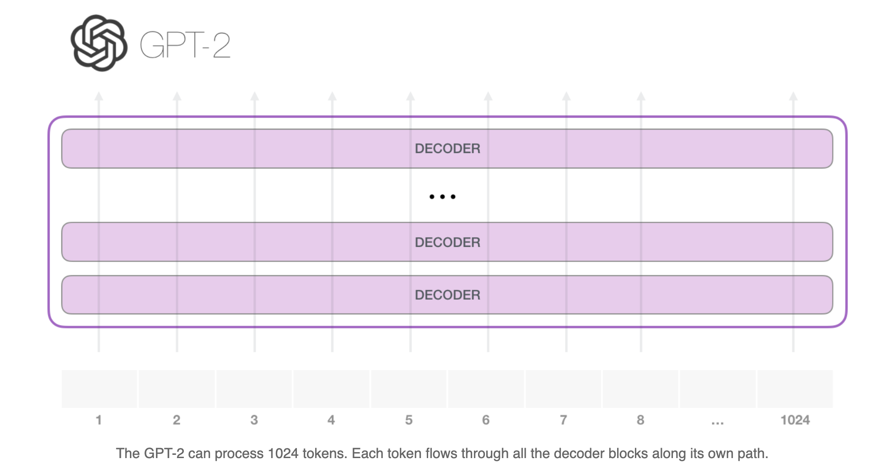

The simplest way to run a trained GPT-2 is to allow it to ramble on its own (which is technically called generating unconditional samples) – alternatively, we can give it a prompt to have it speak about a certain topic (a.k.a generating interactive conditional samples). In the rambling case, we can simply hand it the start token and have it start generating words (the trained model uses <|endoftext|> as its start token. Let’s call it \<s\> instead).

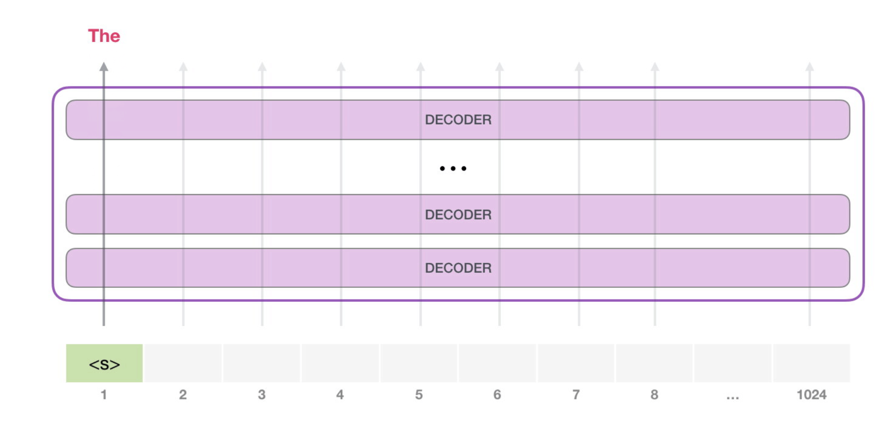

The model only has one input token, so that path would be the only active one. The token is processed successively through all the layers, then a vector is produced along that path. That vector can be scored against the model’s vocabulary (all the words the model knows, 50,000 words in the case of GPT-2). In this case we selected the token with the highest probability, ‘the’. But we can certainly mix things up – you know how if you keep clicking the suggested word in your keyboard app, it sometimes can stuck in repetitive loops where the only way out is if you click the second or third suggested word. The same can happen here. GPT-2 has a parameter called top-k that we can use to have the model consider sampling words other than the top word (which is the case when top-k = 1).

In the next step, we add the output from the first step to our input sequence, and have the model make its next prediction:

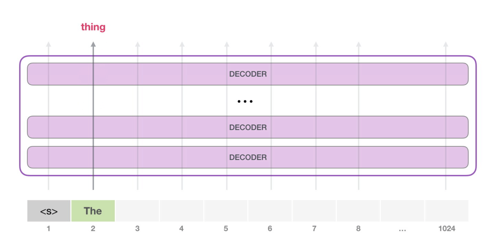

Notice that the second path is the only that’s active in this calculation. Each layer of GPT-2 has retained its own interpretation of the first token and will use it in processing the second token (we’ll get into more detail about this in the following section about self-attention). GPT-2 does not re-interpret the first token in light of the second token.

#### A Deeper Look Inside

##### Input Encoding

Let’s look at more details to get to know the model more intimately. Let’s start from the input. As in other NLP models we’ve discussed before, the model looks up the embedding of the input word in its embedding matrix – one of the components we get as part of a trained model.

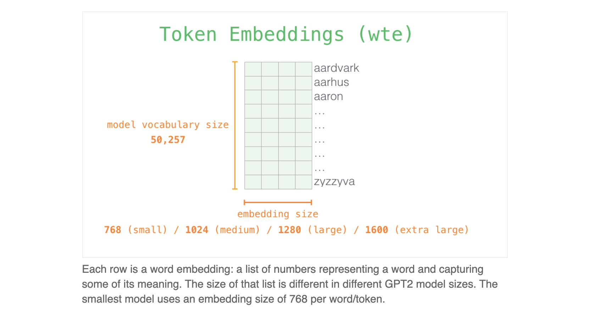

So in the beginning, we look up the embedding of the start token \<s\> in the embedding matrix. Before handing that to the first block in the model, we need to incorporate positional encoding – a signal that indicates the order of the words in the sequence to the transformer blocks. Part of the trained model is a matrix that contains a positional encoding vector for each of the 1024 positions in the input.

With this, we’ve covered how input words are processed before being handed to the first transformer block. We also know two of the weight matrices that constitute the trained GPT-2.

##### A journey up the Stack

The first block can now process the token by first passing it through the self-attention process, then passing it through its neural network layer. Once the first transformer block processes the token, it sends its resulting vector up the stack to be processed by the next block. The process is identical in each block, but each block has its own weights in both self-attention and the neural network sublayers.

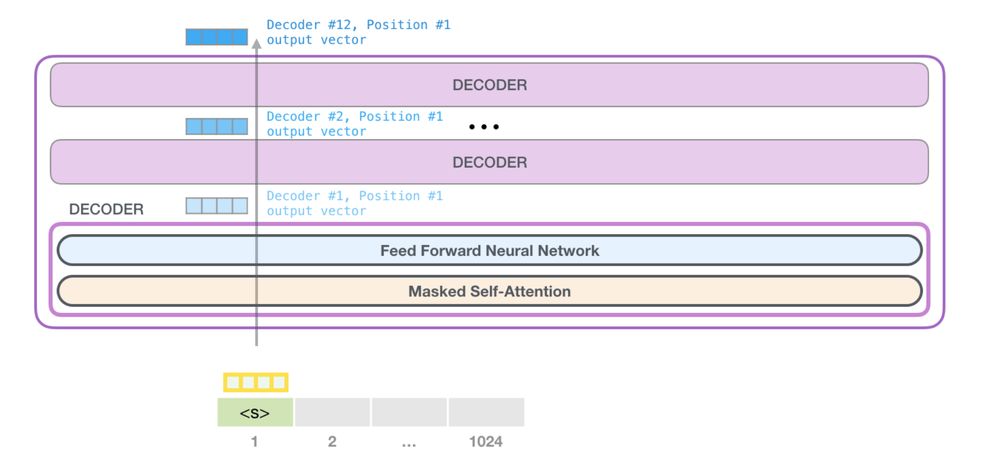

##### Self-Attention Recap

Language heavily relies on context. So, when the language model processes the sentence, it should know which word is referred to which word.

This is what self-attention does. It bakes in the model’s understanding of relevant and associated words that explain the context of a certain word before processing that word (passing it through a neural network). It does that by assigning scores to how relevant each word in the segment is, and adding up their vector representation.

##### Self-Attention Process

Self-attention is processed along the path of each token in the segment. The significant components are three vectors:

- Query: The query is a representation of the current word used to score against all the other words (using their keys). We only care about the query of the token we’re currently processing.

- Key: Key vectors are like labels for all the words in the segment. They’re what we match against in our search for relevant words.

- Value: Value vectors are actual word representations, once we’ve scored how relevant each word is, these are the values we add up to represent the current word.

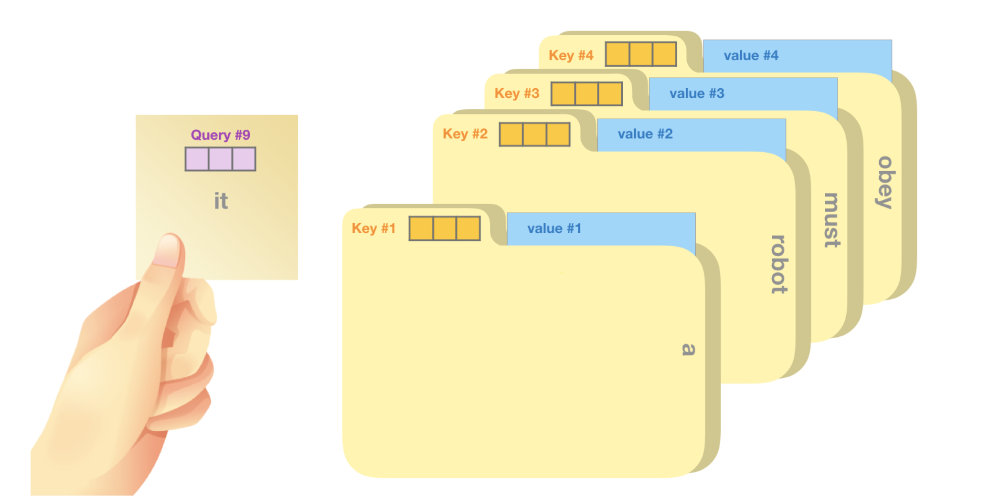

A crude analogy is to think of it like searching through a filing cabinet. The query is like a sticky note with the topic you’re researching. The keys are like the labels of the folders inside the cabinet. When you match the tag with a sticky note, we take out the contents of that folder, these contents are the value vector. Except you’re not only looking for one value, but a blend of values from a blend of folders.

Multiplying the query vector by each key vector produces a score for each folder (technically: dot product followed by softmax).

We multiply each value by its score and sum up – resulting in our self-attention outcome.

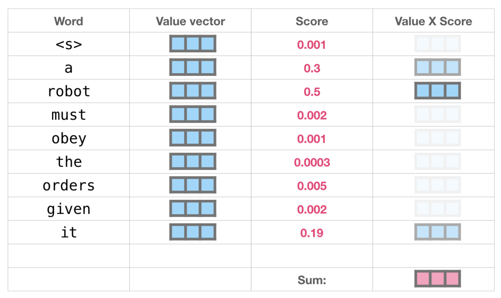

This weighted blend of value vectors results in a vector that paid 50% of its “attention” to the word "robot", 30% to the word "a", and 19% to the word "it". Later in the post, we’ll got deeper into self-attention. But first, let’s continue our journey up the stack towards the output of the model.

##### Model Output

When the top block in the model produces its output vector (the result of its own self-attention followed by its own neural network), the model multiplies that vector by the embedding matrix.

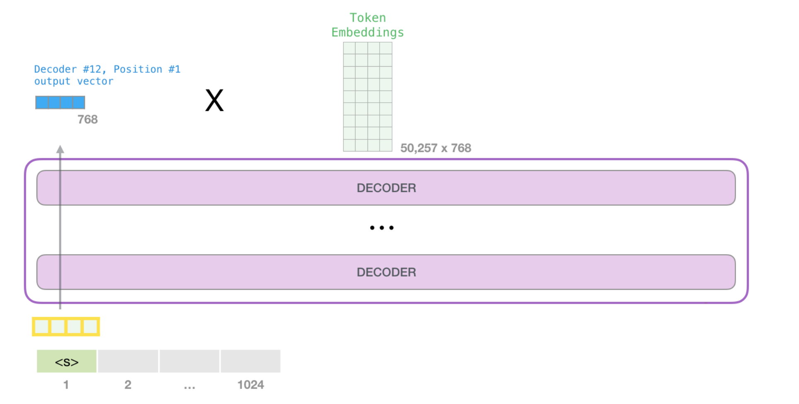

Recall that each row in the embedding matrix corresponds to the embedding of a word in the model’s vocabulary. The result of this multiplication is interpreted as a score for each word in the model’s vocabulary.

We can simply select the token with the highest score (top_k = 1). But better results are achieved if the model considers other words as well. So a better strategy is to sample a word from the entire list using the score as the probability of selecting that word (so words with a higher score have a higher chance of being selected). A middle ground is setting top_k to 40, and having the model consider the 40 words with the highest scores.

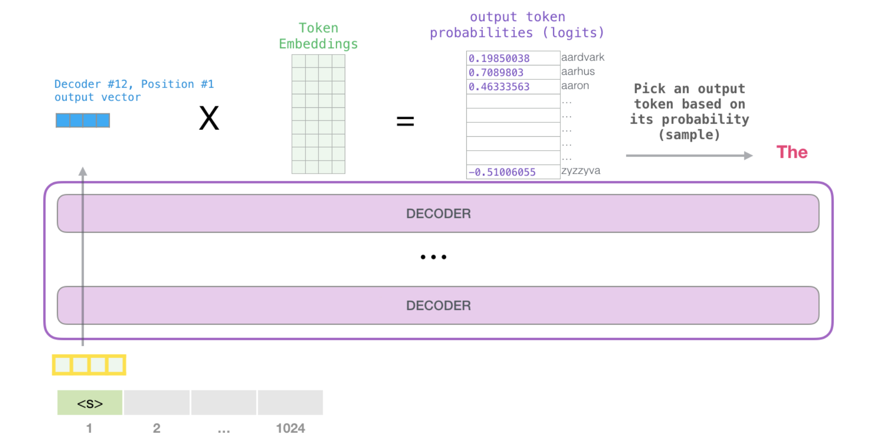

With that, the model has completed an iteration resulting in outputting a single word. The model continues iterating until the entire context is generated (1024 tokens) or until an end-of-sequence token is produced.

### Tips for using GPT-2

- GPT-2 is a model with absolute position embeddings so it’s usually advised to pad the inputs on the right rather than the left.

- GPT-2 was trained with a causal language modeling (CLM) objective and is therefore powerful at predicting the next token in a sequence.

## References

[1] Alec Radford, Karthik Narasimhan, Tim Salimans, Ilya Sutskever. [Improving Language Understanding by Generative Pre-Training [1]](./papers/gpt.pdf)

[2] Alec Radford, Jeffrey Wu, Rewon Child, David Luan, Dario Amodei, Ilya Sutskever. [Language Models are Unsupervised Multitask Learners [2]](./papers/gpt2.pdf)

[3] Peter J. Liu, Mohammad Saleh, Etienne Pot, Ben Goodrich, Ryan Sepassi, Lukasz Kaiser, Noam Shazeer. [Generating Wikipedia by Summarizing Long Sequences](https://arxiv.org/abs/1801.10198)

[4] Rami Al-Rfou, Dokook Choe, Noah Constant, Mandy Guo, Llion Jones. [Character-Level Language Modeling with Deeper Self-Attention](https://arxiv.org/abs/1808.04444)

[5] Jay Alammar. [The Illustrated GPT-2 (Visualizing Transformer Language Models)](http://jalammar.github.io/illustrated-gpt2/)
