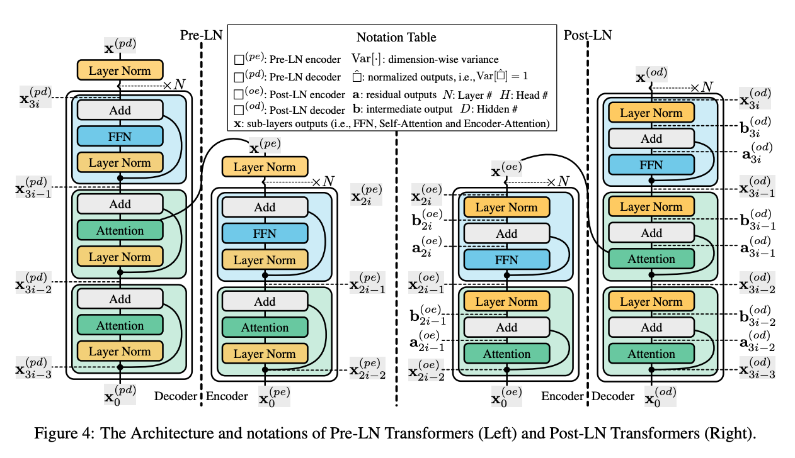

# Transformers

Transformers are a type of neural network architecture that have been gaining popularity. It was proposed by [Vaswani et al. [1]](https://arxiv.org/abs/1706.03762)

Basically, from 2018, the Transformer based models achieved SOTA for at least one NLP tasks (i.e. BERT achieved the SOTA for 11 NLP tasks). In 2020, the Transformer architecture is also used for CV tasks (i.e. DETR for object detection).

## Self-Attention

## Clinics

### Dependency and Amplification Effect

According to [Liu et al. [2]](https://arxiv.org/abs/2004.08249), Pre-LN is more robust than Post-LN, whereas Post-LN typically leads to a better performance.

With further exploration, Liu et al. find that for a N-layer residual network, after updating its parameters W to W*, its outputs change is proportion to the dependency on residual branches.

Intuitively, since a larger output change indicates a more unsmooth loss surface, the large dependency complicates training. In the paper, Liu et al. said that "each layer in a multi-layer Transformer model, heavy dependency on its residual branch makes training unstable since it amplifies small parameter perturbations (e.g., parameter updates) and result in significant disturbances in the model output, yet a light dependency limits the potential of model training and can lead to an inferior trained model".

Inspired by these analysis, Liu et al. proposed the Admin (adaptive model initialization), which starts the training from the area with a smoother surface.

## References

[1] Ashish Vaswani, Noam Shazeer, Niki Parmar, Jakob Uszkoreit, Llion Jones, Aidan N. Gomez, Lukasz Kaiser, Illia Polosukhin. [Attention Is All You Need](https://arxiv.org/abs/1706.03762)

[2] Liyuan Liu, Xiaodong Liu, Jianfeng Gao, Weizhu Chen, Jiawei Han. [Understanding the Difficulty of Training Transformers](https://arxiv.org/abs/2004.08249)
