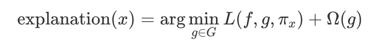

# DeusX

Basically, the main aim of this project is to eXplain the things about AI, so that we could go to the next level.

## XAI

_eXplainable Artificial Intelligence_

According to DARPA [[1]](https://www.darpa.mil/program/explainable-artificial-intelligence), the Explainable AI (XAI) program aims to create a suite of machine learning techniques that 1) Produce more explainable models, while maintaining a high level of learning performance (prediction accuracy); and 2) Enable human users to understand, appropriately trust, and effectively manage the emerging generation of artificially intelligent partners.

New machine-learning systems will have the ability to explain their rationale, characterize their strengths and weaknesses, and convey an understanding of how they will behave in the future. The strategy for achieving that goal is to develop new or modified machine-learning techniques that will produce more explainable models. These models will be combined with state-of-the-art human-computer interface techniques capable of translating models into understandable and useful explanation dialogues for the end user (Figure 2). Our strategy is to pursue a variety of techniques in order to generate a portfolio of methods that will provide future developers with a range of design options covering the performance-versus-explainability trade space.

### Table of Contents (XAI)

1. [LIME](#lime)
2. [SHAP](#shap)

### LIME

_Local surrogagte_

Local surrogate models are interpretable models that are used to explain individual predictions of black box machine learning models. [Local interpretable model-agnostic explanations (LIME) [2]](https://dl.acm.org/doi/abs/10.1145/2939672.2939778) is a paper in which the authors propose a concrete implementation of local surrogate models. Surrogate models are trained to approximate the predictions of the underlying black box model. Instead of training a global surrogate model, LIME focuses on training local surrogate models to explain individual predictions.

The idea is quite intuitive. First, forget about the training data and imagine you only have the black box model where you can input data points and get the predictions of the model. You can probe the box as often as you want. Your goal is to understand why the machine learning model made a certain prediction. LIME tests what happens to the predictions when you give variations of your data into the machine learning model. LIME generates a new dataset consisting of permuted samples and the corresponding predictions of the black box model. On this new dataset LIME then trains an interpretable model, which is weighted by the proximity of the sampled instances to the instance of interest. The interpretable model can be anything from the interpretable models chapter, for example Lasso or a decision tree. The learned model should be a good approximation of the machine learning model predictions locally, but it does not have to be a good 
global approximation. This kind of accuracy is also called local fidelity.

Mathematically, local surrogate models with interpretability constraint can be expressed as follows:

The explanation model for instance x is the model g (e.g. linear regression model) that minimizes loss L (e.g. mean squared error), which measures how close the explanation is to the prediction of the original model f (e.g. an xgboost model), while the model complexity Ω (g) is kept low (e.g. prefer fewer features). G is the family of possible explanations, for example all possible linear regression models. The proximity measure π_x defines how large the neighborhood around instance x is that we consider for the explanation. In practice, LIME only optimizes the loss part. The user has to determine the complexity, e.g. by selecting the maximum number of features that the linear regression model may use.

#### The recipe for training local surrogate models

- Select your instance of interest for which you want to have an explanation of its black box prediction.

- Perturb your dataset and get the black box predictions for these new points.

- Weight the new samples according to their proximity to the instance of interest.

- Train a weighted, interpretable model on the dataset with the variations.

- Explain the prediction by interpreting the local model.

#### Example (LIME)

[example code (1) - applying LIME to image data](./CV/src/Apply_LIME_to_Image_data.ipynb)

[example code (2) - applying LIME to text data](./Applying_LIME_to_text_data.ipynb)

### SHAP

[SHAP (SHapley Additive exPlanations) [3]](http://papers.nips.cc/paper/7062-a-unified-approach-to-interpreting-model-predictions) is a game theoretic approach to explain the output of any machine learning model. It connects optimal credit allocation with local explanations using the classic Shapley values from game theory and their related extensions.

#### Example (SHAP)

[example code](./src/SHAP.ipynb)

## References

[1] Matt Turek [Explainable Artificial Intelligence (XAI)](https://www.darpa.mil/program/explainable-artificial-intelligence)

[2] Marco Tulio Ribeiro, Sameer Singh profile imageSameer Singh, Carlos Ernesto Guestrin profile imageCarlos Guestrin ["Why Should I Trust You?": Explaining the Predictions of Any Classifier](https://dl.acm.org/doi/abs/10.1145/2939672.2939778)

[3] Scott M. Lundberg, Su-In Lee [A Unified Approach to Interpreting Model Predictions](http://papers.nips.cc/paper/7062-a-unified-approach-to-interpreting-model-predictions)
