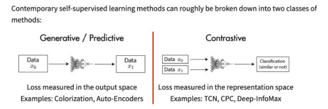
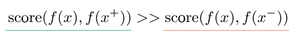
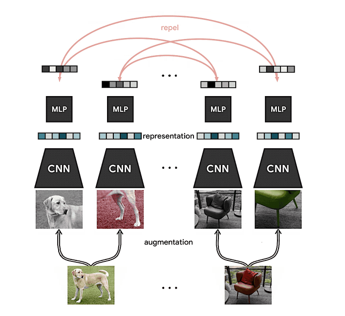

# Contrastive Learning

## Pretext Learning to Contrastive Learning

[J. B. Grill et. al. [1]](https://arxiv.org/abs/2006.07733) stated that some self-supervised learning methods, such as [Jigsaw Puzzles [2]](https://arxiv.org/abs/1603.09246), [C. Doersch et. al. [3]](https://www.cv-foundation.org/openaccess/content_iccv_2015/papers/Doersch_Unsupervised_Visual_Representation_ICCV_2015_paper.pdf), [Denoising Autoencoder [4]](http://www.jmlr.org/papers/volume11/vincent10a/vincent10a.pdf), [Image Colorization [5]](https://arxiv.org/abs/1603.08511), [Context Autoencoder [6]](https://arxiv.org/abs/1604.07379), [Split-Brain Autoencoder [7]](https://arxiv.org/abs/1611.09842), and [M. Noroozi et. al. [8]](https://openaccess.thecvf.com/content_ICCV_2017/papers/Noroozi_Representation_Learning_by_ICCV_2017_paper.pdf), are  not contrastive but rely on using auxiliary handcrafted prediction tasks to learn their representation. These models are called pretext models. However, the accuracy of these pretext models are not as good as models that are trained fully supervised learning. To overcome the weak points of these pretext models, researchers introduced a new concept called "Contrastive Learning".

## Principle of Contrastive Learning

Contrastive learning is an approach to formulate the task of finding similar and dissimilar things for an ML model. Using this approach, one can train a machine learning model to classify between similar and dissimilar images.

The inner working of contrastive learning can be formulated as a score function, which is a metric that measures the similarity between two features.

In the equation above, "x+" is data point similar to x, referred to as a positive sample, and "x−" is a data point dissimilar to x, referred to as a negative sample. Over this, a softmax classifier can be built that classifies positive and negative samples correctly.

## SimCLR

Google has introduced a framework called [SimCLR [9]](https://ai.googleblog.com/2020/04/advancing-self-supervised-and-semi.html) that uses contrastive learning. This framework first learns generic representations of images on an unlabeled dataset and then is fine-tuned with a small dataset of labelled images for a given classification task.

The basic representations are learned by simultaneously maximising agreement between different versions or views of the same image and cutting down the difference using contrastive learning.

When the parameters of a neural network are updated using this contrastive objective causes representations of corresponding views to “attract” each other, while representations of non-corresponding views “repel” each other.

## References

[1] Jean-Bastien Grill, Florian Strub, Florent Altché, Corentin Tallec, Pierre H. Richemond, Elena Buchatskaya, Carl Doersch, Bernardo Avila Pires, Zhaohan Daniel Guo, Mohammad Gheshlaghi Azar, Bilal Piot, Koray Kavukcuoglu, Rémi Munos, Michal Valko. [Bootstrap Your Own Latent: A New Approach to Self-Supervised Learning](https://arxiv.org/abs/2006.07733)

[2] Mehdi Noroozi, Paolo Favaro. [Unsupervised Learning of Visual Representations by Solving Jigsaw Puzzles](https://arxiv.org/abs/1603.09246)

[3] Carl Doersch, Abhinav Gupta, Alexei A. Efros. [Unsupervised Visual Representation Learning by Context Prediction](https://www.cv-foundation.org/openaccess/content_iccv_2015/papers/Doersch_Unsupervised_Visual_Representation_ICCV_2015_paper.pdf)

[4] Pascal Vincent, Hugo Larochelle, Isabelle Lajoie, Yoshua Bengio, Pierre-Antoine Manzagol. [Stacked Denoising Autoencoders: Learning Useful Representations in a Deep Network with a Local Denoising Criterion](http://www.jmlr.org/papers/volume11/vincent10a/vincent10a.pdf)

[5] Richard Zhang, Phillip Isola, Alexei A. Efros. [Colorful Image Colorization](https://arxiv.org/abs/1603.08511)

[6] Deepak Pathak, Philipp Krahenbuhl, Jeff Donahue, Trevor Darrell, Alexei A. Efros. [Context Encoders: Feature Learning by Inpainting](https://arxiv.org/abs/1611.09842)

[7] Richard Zhang, Phillip Isola, Alexei A. Efros. [Split-Brain Autoencoders: Unsupervised Learning by Cross-Channel Prediction](https://arxiv.org/abs/1611.09842)

[8] Mehdi Noroozi, Hamed Pirsiavash, Paolo Favaro. [Representation Learning by Learning to Count](https://openaccess.thecvf.com/content_ICCV_2017/papers/Noroozi_Representation_Learning_by_ICCV_2017_paper.pdf)

[9] Ting Chen, Geoffrey Hinton. [Advancing Self-Supervised and Semi-Supervised Learning with SimCLR](https://ai.googleblog.com/2020/04/advancing-self-supervised-and-semi.html)
