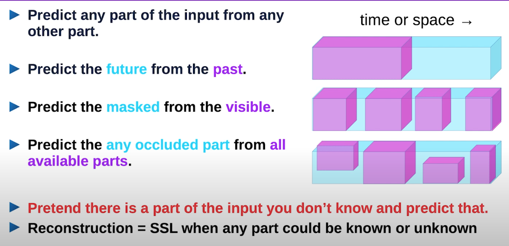
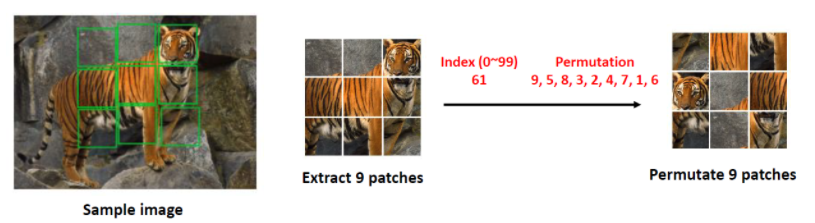
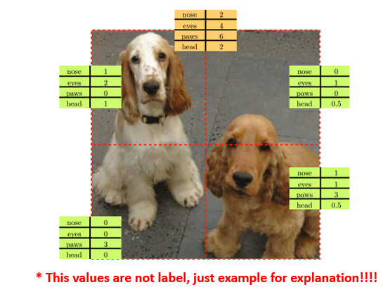
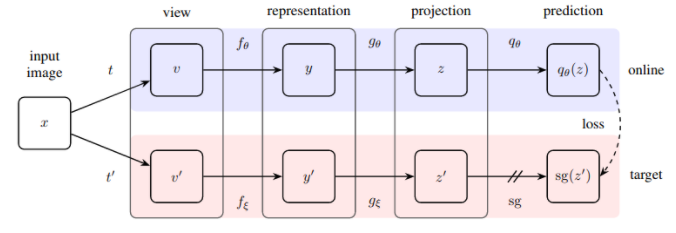
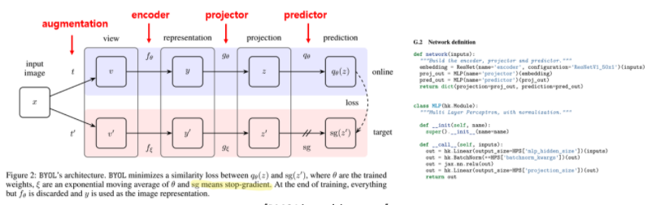
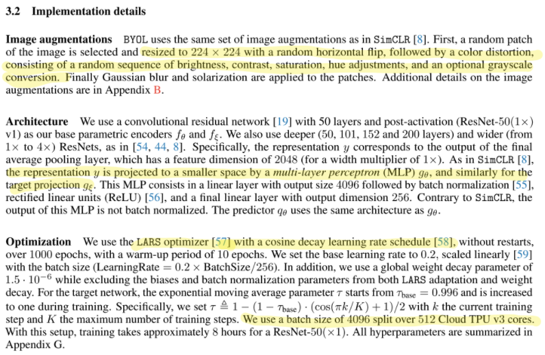
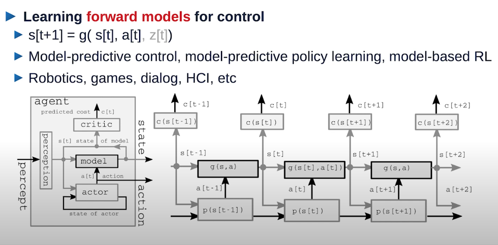
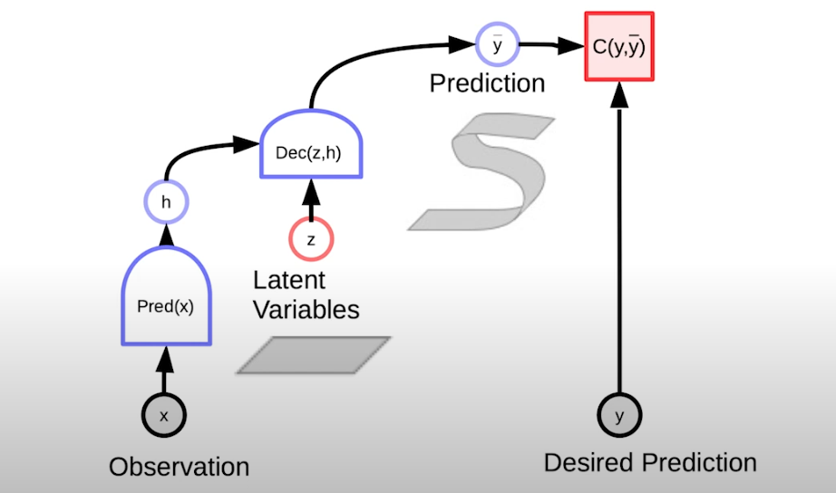

# Self-Supervised Learning

Self-supervised learning is autonomous supervised learning. It is a representation learning approach that eliminates the pre-requisite requiring humans to label data. Self-supervised learning systems extract and use the naturally available relevant context and embedded metadata as supervisory signals.

Cats continue to play an essential role in everything significant in machine learning. Self-supervised research [“Unsupervised Visual Representation Learning by Context Prediction” [1]](https://arxiv.org/abs/1505.05192) predicts the positional location of one rectangular section of an image relative to another by using spatial context as a supervisory signal for training a rich visual representation. For instance, the right ear of a cat would be in the top-right position relative to the eyes of a cat. This approach allows learning about cats, dogs, or buses without prior explicit semantic labeling.

## Overview of Self-Supervised Learning

Self-Supervised Learning = Filling in the blanks

## Table of Contents

1. [Self-Supervised and Unsupervised Learning](#self-supervised-and-unsupervised-learning)
2. [Self Supervised vs Semi-Supervised learning](#self-supervised-vs-semi-supervised-learning)
3. [Why is Self-Supervised Learning is relevant](#why-is-self-supervised-learning-is-relevant)
4. [CV](#cv)
5. [NLP](#nlp)
6. [Learning World Models for Autonomous AI Agents](#learning-world-models-for-autonomous-ai-agents)
7. [References](#references)

## Self Supervised and Unsupervised Learning

Self-supervised learning is like unsupervised Learning because the system learns without using explicitly-provided labels. Thus, it might be possible to say that the Self-Supervised Learning is sort of Unsupervised Learning.

## Self-Supervised vs Semi-Supervised learning

Combination of labeled and unlabeled data is used to train semi-supervised learning algorithms, where smaller amounts of labeled data in conjunction with large amounts of unlabeled data can speed up learning tasks. Self-supervised learning is different as systems learn entirely without using explicitly-provided labels.

## Why is Self-Supervised Learning is relevant

Self-supervised learning is essential for many reasons but mainly because of shortcomings in both approach and scalability of supervised learning.

Supervised learning is an arduous process, requiring collecting massive amounts of data, cleaning it up, manually labeling it, training and perfecting a model purpose-built for the classification or regression use case you are solving for, and then using it to predict labels for unknown data. For instance, with images, we collect a large image data set, label the objects in images manually, learn the network and then use it for one specific use case. This way is very different from the approach of learning in humans.

Human learning is trial-based, perpetual, multi-sourced, and simultaneous for multiple tasks. We learn mostly in an unsupervised manner, using experiments and curiosity. We also learn in a supervised manner but we can learn from much fewer samples, and we generalize exceptionally well.

For supervised learning, we have spent years collecting and professionally annotating tens of millions of labeled bounding boxes or polygons and image level annotations, but these labeled datasets collectively pale in comparison to billions of images generated on a daily basis on social media, or millions of videos requiring object detection or depth perception in autonomous driving. Similar scalability arguments exist for common sense knowledge.

Clearly, it is possible to say that the Self-supervised learning brings us closer to human-like autonomous learning.

## CV

### Table of Contents (CV)

1. [Jigsaw Puzzles](#jigsaw-puzzles)
2. [Autoencoder-Base Approaches](#autoencoder-base-approaches)
3. [Count](#count)
4. [Contrastive Learning](#contrastive-learning)
5. [Bootstrap Your Own Latent](#bootstrap-your-own-latent)

### Jigsaw Puzzles

On March 2016, [M. Noroozi et. al. [2]](https://arxiv.org/abs/1603.09246) introduced the Context-Free Network (CFN) that can be trained to solve Jigsaw puzzles as a pretext task, which requires no manual labeling, and then later repurposed to solve object classification and detection. Basically, CFN is a siamese-ennead CNN. The CFN takes image tiles as input and explicitly limits the receptive field (or context) of its early processing units to one tile at a time.

Basically, they created 3x3 = 9 patches from each image in the dataset, mix up the patches, and train the model to predict the best permutations of the patches (which is the most nearest to the original image).

By using this method, the CFN could learn the knowledges about objects, which could be useful for the object detection tasks.

As you know, searching all possible permutations take too much resources (9! = 362,880). Thus, what M. Noroozi et. al. did was choosing 100 representive permutations by removing all similar permutations, so that the model could perform the 100-class classification.

Also, [C. Doersch et. al. [1]](https://arxiv.org/abs/1505.05192) published similar paper, so please read the paper if you are interested in this topic.

### Autoencoder-Base Approaches

There are many Autoencoder-Base self-supervised learning tasks.

- [Denoising Autoencoder [3]](http://www.jmlr.org/papers/volume11/vincent10a/vincent10a.pdf)

- [Image Colorization [4]](https://arxiv.org/abs/1603.08511)

- [Context Autoencoder [5]](https://arxiv.org/abs/1604.07379)

- [Split-Brain Autoencoder [6]](https://arxiv.org/abs/1611.09842)

### Count

On 2017, [M. Noroozi et. al. [7]](https://openaccess.thecvf.com/content_ICCV_2017/papers/Noroozi_Representation_Learning_by_ICCV_2017_paper.pdf) proposed the Count method for representation learning that uses an artificial supervision signal based on counting visual primitives. This supervision signal is obtained from an equivariance relation, which does not require any manual annotation.

Unlike [Jigsaw Puzzles method](https://arxiv.org/abs/1603.09246) or Autoencoding methods, the Count method does not transform the input image, but it extracts the feature vectors from input images.

A method that M. Noroozi et. al. proposed counts visual primitives. This method requires discriminative features, which can be useful to classification, and it can be formulated via detection. Make sure that the visual primitives are not equal to the labels, but it is more like vectors in the NLP embedding methods.

Below is an example of Count method.

As you could see above, the number of visual primitives in the whole image should match the sum of the number of visual primitives in each tile. The example above assumed that there are 4 different types of visual primitives, and count the number of visual primitives in each tiles. After finish counting the number of visual primitives in each tiles, it counts the number of visual primitives in the whole image. Then, it calculates the sum of the number of visual primitives in all tiles, and check if the number of visual primitives in the whole image matches the sum of the number of visual primitives in each tile.

Basically, the previous self-supervised methods use information already present in the data as supervision signal so that supervised learning tools can be used. However, the Count method does not just use information already present in the data, but extracts the vectors from data.

### Contrastive Learning

[Contrastive Learning](./ContrastiveLearning)

### Bootstrap Your Own Latent

The [Bootstrp Your Own Latent (BYOL) [10]](https://arxiv.org/abs/2006.07733) is an approach to self-supervised image representation learning. BYOL relies on two neural networks, referred to as online and target networks, that interact and learn from each other.

The thing that makes the BYOL unique is that it achieved the state of the art without using the negative pair, where many previous self-supervised models such as contrastive learning models used negative pair to achieve the state of the art.

### Implementation Details

## NLP

### Transformer based models

NLP models such as [BERT [8]](https://arxiv.org/abs/1810.04805) and [GPT [9]]((https://s3-us-west-2.amazonaws.com/openai-assets/research-covers/language-unsupervised/language_understanding_paper.pdf)) uses the self-supervised method for pretraining. For example, the BERT method randomly chooses 15% of words in the corpus, converts those words to [MASK] token, and train the model to predict the word that is obscured by the [MASK] token.

## Learning World Models for Autonomous AI Agents

In the lecture in NYU [[11]](https://www.youtube.com/watch?v=tVwV14YkbYs&list=PLLHTzKZzVU9eaEyErdV26ikyolxOsz6mq&index=12), Yann LeCun suggested to use the latent variables with energy-based model to learn the world models for autonomous AI agents, since the latent variables allow systems to make multiple predictions

## References

[1] Carl Doersch, Abhinav Gupta, Alexei A. Efros. [Unsupervised Visual Representation Learning by Context Prediction](https://arxiv.org/abs/1505.05192)

[2] Mehdi Noroozi, Paolo Favaro. [Unsupervised Learning of Visual Representations by Solving Jigsaw Puzzles](https://arxiv.org/abs/1603.09246)

[3] Pascal Vincent, Hugo Larochelle, Isabelle Lajoie, Yoshua Bengio, Pierre-Antoine Manzagol. [Stacked Denoising Autoencoders: Learning Useful Representations in a Deep Network with a Local Denoising Criterion](http://www.jmlr.org/papers/volume11/vincent10a/vincent10a.pdf)

[4] Richard Zhang, Phillip Isola, Alexei A. Efros. [Colorful Image Colorization](https://arxiv.org/abs/1603.08511)

[5] Deepak Pathak, Philipp Krahenbuhl, Jeff Donahue, Trevor Darrell, Alexei A. Efros. [Context Encoders: Feature Learning by Inpainting](https://arxiv.org/abs/1611.09842)

[6] Richard Zhang, Phillip Isola, Alexei A. Efros. [Split-Brain Autoencoders: Unsupervised Learning by Cross-Channel Prediction](https://arxiv.org/abs/1611.09842)

[7] Mehdi Noroozi, Hamed Pirsiavash, Paolo Favaro. [Representation Learning by Learning to Count](https://openaccess.thecvf.com/content_ICCV_2017/papers/Noroozi_Representation_Learning_by_ICCV_2017_paper.pdf)

[8] Jacob Devlin, Ming-Wei Chang, Kenton Lee, Kristina Toutanova. [BERT: Pre-training of Deep Bidirectional Transformers for Language Understanding](https://arxiv.org/abs/1810.04805)

[9] Alec Radford, Karthik Narasimhan, Tim Salimans, Ilya Sutskever. [Improving Language Understanding by Generative Pre-Training](https://s3-us-west-2.amazonaws.com/openai-assets/research-covers/language-unsupervised/language_understanding_paper.pdf)

[10] Jean-Bastien Grill, Florian Strub, Florent Altché, Corentin Tallec, Pierre H. Richemond, Elena Buchatskaya, Carl Doersch, Bernardo Avila Pires, Zhaohan Daniel Guo, Mohammad Gheshlaghi Azar, Bilal Piot, Koray Kavukcuoglu, Rémi Munos, Michal Valko. [Bootstrap Your Own Latent: A New Approach to Self-Supervised Learning](https://arxiv.org/abs/2006.07733)

[11] Yann LeCun. [NYU DeepLearning lecture Week 7 – Lecture: Energy based models and self-supervised learning](https://www.youtube.com/watch?v=tVwV14YkbYs&list=PLLHTzKZzVU9eaEyErdV26ikyolxOsz6mq&index=12)
