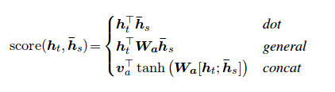

# Attention Mechanism

## Self-Attention

First introduced in Long Short-Term Memory-Networks for Machine Reading by Jianpeng Cheng et al. The idea is to relate different positions of the same hidden state space derived from the input sequence, based on the argument that multiple components together form the overall semantics of a sequence. This approach brings together these differently positioned information through multiple hops attention. This particular implementation follows A Structured Self-Attentive Sentence Embedding by Zhouhan Lin et al. where authors propose an additional loss metric for regularization to prevent the redundancy problems of the embedding matrix if the attention mechanism always provides similar annotation weights.

## Global Attention (Soft Attention)

First introduced in Neural Machine Translation by Jointly Learning to Align and Translate by Dzmitry Bahdanau et al. The idea is to derive a context vector based on all hidden states of the encoder RNN. Hence, it is said that this type of attention attends to the entire input state space.

## Local Attention (Hard Attention)

First introduced in Show, Attend and Tell: Neural Image Caption Generation with Visual Attention by Kelvin Xu et al. and adapted to NLP in Effective Approaches to Attention-based Neural Machine Translation by Minh-Thang Luong et al. The idea is to eliminate the attentive cost of global attention by instead focusing on a small subset of tokens in hidden states set derived from the input sequence. This window is proposed as [p_t-D, p_t+D] where D=width, and we disregard positions that cross sequence boundaries. The aligned position, p_t, is decided either through a) monotonic alignment: set p_t=t, or b) predictive alignment: set p_t = S*sigmoid(FC1(tanh(FC2(h_t))) where fully-connected layers are trainable weight matrices. Since yielding an integer index value is undifferentiable due to tf.cast() and similar methods, this implementation instead derives a aligned position float value and uses Gaussian distribution to adjust the attention weights of all source hidden states instead of slicing the actual window. We also propose an experimental alignment type, c) completely predictive alignment: set p_t as in ii), but apply it to all source hidden states (h_s) instead of the target hidden state (h_t). Then, choose top @window_width positions to build the context vector and zero out the rest. Currently, this option is only avaiable for many-to-one scenarios.

## Hierarchical Attention

First introduced in Hierarchical Attention Networks for Document Classification by Zichao Yang et al. The idea is to reflect the hierarchical structure that exists within documents. The original paper proposes a bottom-up approach by applying attention mechanisms sequentially at word- and sentence-levels, but a top-down approach (ex. word- and character-levels) is also applicable. Hence, this type of mechanisms is said to attend differentially to more and less important content when constructing the document representation.

## Luong Attention vs Bahdanau Attention

Luong attention used top hidden layer states in both of encoder and decoder. But Bahdanau attention take concatenation of forward and backward source hidden state (Top Hidden Layer).

In Luong attention they get the decoder hidden state at time t. Then calculate attention scores and from that get the context vector which will be concatenated with hidden state of the decoder and then predict.

But in the Bahdanau at time t we consider about t-1 hidden state of the decoder. Then we calculate alignment , context vectors as above. But then we concatenate this context with hidden state of the decoder at t-1. So before the softmax this concatenated vector goes inside a GRU.

Luong has diffferent types of alignments. Bahdanau has only concat score alignment model.

[PyTorch implementation of Luong Attention](./src/luong_attention.py)  [PyTorch implementation of Bahdanau Attention](./src/bahdanau_attention.py)
