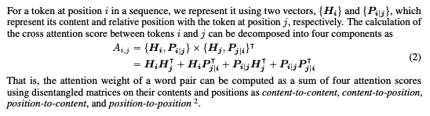
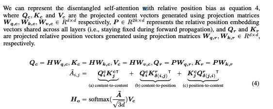
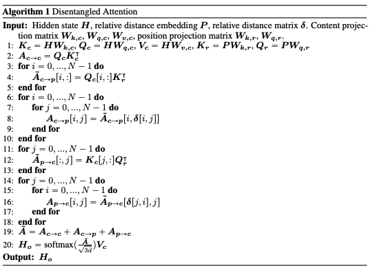

# DeBERTa

## Table of Contents

- [Overview](#overview)
- [Disentangled attention mechanism](#disentangled-attention-mechanism)
- [Enhanced mask decoder](#enhanced-mask-decoder)
- [Summary](#summary)
- [Additional Resources](#additional-resources)
- [References](#references)

## Overview

DeBERTa, Decoding-enhanced BERT with disentangled attention) is a model architecture that is proposed by [He. et. al [1]](https://arxiv.org/abs/2006.03654).

It improves the BERT and RoBERTa models using two novel techniques:

    - disentangled attention mechanism

    - an enhanced mask decoder

Furthermore, a new virtual adversarial training method is used for fine-tuning to improve models' generalization.

## Disentangled attention mechanism

TLDR;

In this mechanism, each word is represented using two vectors that encode its content and position, respectively, and the attention weights among words are computed using disentangled matrices on their contents and relative positions, respectively.

Unlike BERT where each word in the input layer is represented using a vector which is the sum of its word (content) embedding and position embedding, each word in DeBERTa is represented using two vectors that encode its content and position, respectively, and the attention weights among words are computed using disentangled matrices based on their contents and relative positions, respectively. This is motivated by the observation that the attention weight of a word pair depends on not only their contents but their relative positions.

### Self-Attention in DeBERTa

The image above is the equation of the original self-attention, and the image below is the equation of the self-attention in DeBERTa.

As you know, the DeBERTa uses the disentangled attention mechanism, which uses two vectors for a single word. Therefore, when we perform the self-attention, we need to calculate 3 different attention maps: 1) content-to-content that is the dot product of content vector Q_c and content vector K_c, 2) content-to-position that is the dot product of content vector Q_c and position vector K_p, and 3) position-to-content that is the dot product of position vector Q_p and content vector K_c. After calculating all 3 attention maps, the DeBERTa sums all 3 attention maps to generate the final attention map. Then, it uses the softmax funciton with the final attention map, and dot product the result with the content vector V_c.

Below is the algorithm of the disentangled self-attention mechanism.

## Enhanced mask decoder

TLDR;

An enhanced mask decoder is used to incorporate absolute positions in the decoding layer to predict the masked tokens in model pre-training.

Like BERT, DeBERTa is pre-trained using masked language modeling (MLM). MLM is a fill-in-the-blank task, where a model is taught to use the words surrounding a mask token to predict what the masked word should be. DeBERTa uses the content and position information of the context words for MLM. The disentangled attention mechanism already considers the contents and relative positions of the context words, but not the absolute positions of these words, which in many cases are crucial for the prediction. Consider the sentence “a new store opened beside the new mall” with the italicized words “store” and “mall” masked for prediction. Although the local contexts of the two words are similar, they play different syntactic roles in the sentence. (Here, the subject of the sentence is “store” not “mall,” for example.) These syntactical nuances depend, to a large degree, upon the words’ absolute positions in the sentence, and so it is important to account for a word’s absolute position in the language modeling process. DeBERTa incorporates absolute word position embeddings right before the softmax layer where the model decodes the masked words based on the aggregated contextual embeddings of word contents and positions.

DeBERTa is pretrained using MLM, where a model is trained to use the words surrounding a mask token to predict what the masked word should be. DeBERTa uses the content and position information of the context words for MLM. The disentangled attention mechanism already considers the contents and relative positions of the context words, but not the absolute positions of these words, which in many cases are crucial for the prediction.

Given a sentence “a new store opened beside the new mall” with the words “store” and “mall” masked for prediction. Using only the local context (e.g., relative positions and surrounding words) is insufficient for the model to distinguish store and mall in this sentence, since both follow the word new with the same relative positions. To address this limitation, the model needs to take into account absolute positions, as complement information to the relative positions. For example, the subject of the sentence is “store” not “mall”. These syntactical nuances depend, to a large degree, upon the words’ absolute positions in the sentence.

There are two methods of incorporating absolute positions. The BERT model incorporates absolute positions in the input layer. In DeBERTa, we incorporate them right after all the Transformer layers but before the softmax layer for masked token prediction, as shown in Figure 2. In this way, DeBERTa captures the relative positions in all the Transformer layers and only uses absolute positions as complementary information when decoding the masked words. Thus, we call DeBERTa’s decoding component an Enhanced Mask Decoder (EMD). In the empirical study, we compare these two methods of incorporating absolute positions and observe that EMD works much better. We conjecture that the early incorporation of absolute positions used by BERT might undesirably hamper the model from learning sufficient information of relative positions. In addition, EMD also enables us to introduce other useful information, in addition to positions, for pre-training. We leave it to future work.

## Summary

DeBERTa by Microsoft is the next iteration of BERT-style Self-Attention Transformer models, surpassing RoBERTa in State-of-the-art in multiple NLP tasks. DeBERTa brings two key improvements: First, they treat content and position information separately in a new form of disentangled attention mechanism. Second, they resort to relative positional encodings throughout the base of the transformer, and provide absolute positional encodings only at the very end. The resulting model is both more accurate on downstream tasks and needs less pretraining steps to reach good accuracy. Models are also available in Huggingface and on Github.

### 요약

DeBERTa는 BERT 기반 아키텍처로, disentangled attention과 enhanced mask decoder라는 개념을 도입함으로써 성능을 개선하였다.

기존의 Transformer 기반 모델들에서는 어텐션 메커니즘을 진행하기 전에 absolute position에 대한 정보를 벡터화시킨 뒤, 이를 단어 벡터와 더해서 위치와 의미 모두를 포함한 벡터를 만들어냈다. 하지만, disentangled attention 메커니즘은 단어를 2개의 벡터(의미 벡터와 relative position 벡터)로 인코딩한 뒤, content-to-content, content-to-position, 그리고 position-to-content 어텐션 맵을 만든 뒤, 이들을 모두 더해 최종 어텐션 맵을 만들고 이를 통해서 self-attention을 수행하였다.

또한, 더 나은 문장의 이해를 위해 absolute position에 대한 정보 역시 사용하게 하였는데, 기존의 Transformer 기반 모델들에서는 input layer에서 이 정보를 주는 데에 비해, DeBERTa는 마지막 attention layer와 softmax layer 사이에 absolute position에 대한 정보를 주는 층을 추가함으로써 디코딩 시에 모델이 위치 정보를 더 잘 파악할 수 있게 만들었다.

## Additional Resources

[official_code](https://github.com/microsoft/DeBERTa),  [huggingface models](https://huggingface.co/models?search=deberta)

## References

[1] Pengcheng He, Xiaodong Liu, Jianfeng Gao, Weizhu Chen. [DeBERTa: Decoding-enhanced BERT with Disentangled Attention](https://arxiv.org/abs/2006.03654)
