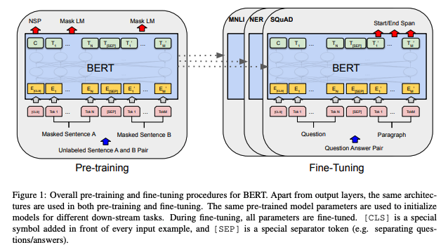
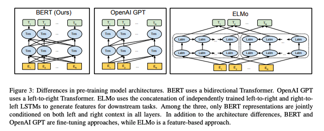
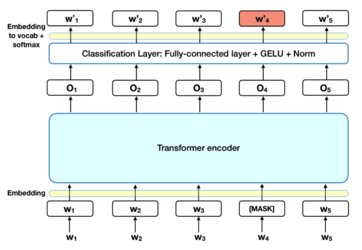
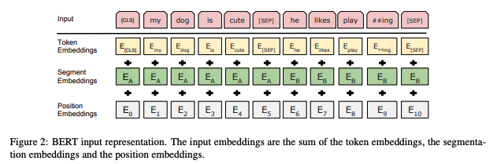
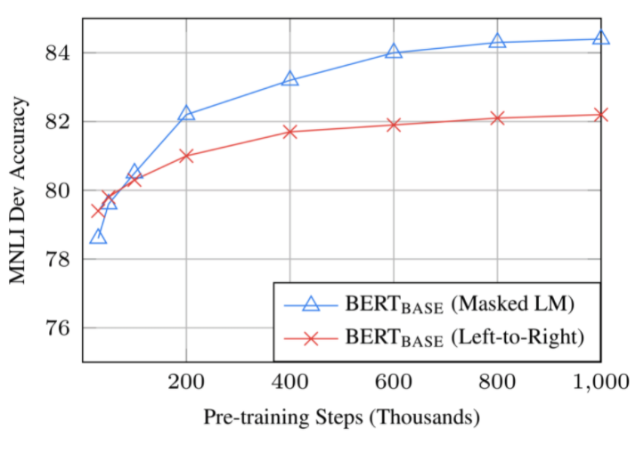
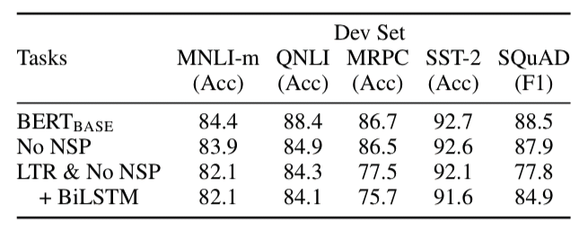
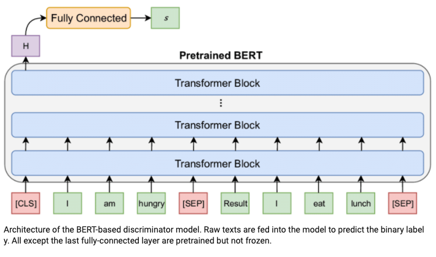
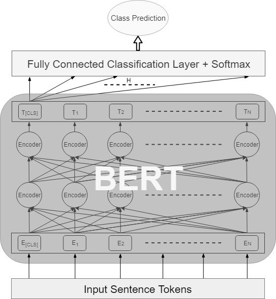
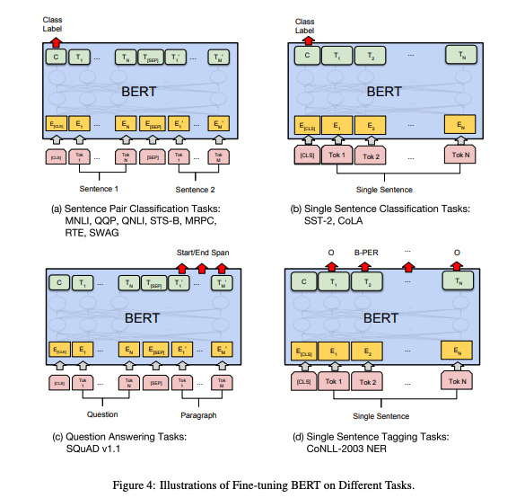
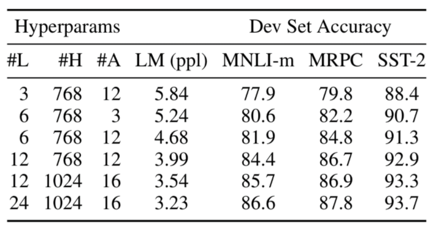

# BERT

## Overview

As you could see in it's name, the [BERT [1]](https://arxiv.org/abs/1810.04805) is a Transformer-based model that is for language representation.

Basically, it pretrained with unlabeled language data, and fine-tuning with downstreaming tasks. The pretraining process is self-supervision, which makes it possible to understand the language well.

As it's name depicts, BERT uses the bidirectional encoder representations, where previous researches such as ELMO or GPT only considered the unidirectional or shallow bidirectional representations. Devlin et. al. stated that the bidirectional encoder representations actually helps the neural network model to understand the natural lanugage well.

## Pretraining methods

### MLM (Masked Language Model)

Intuitively, it is reasonable to believe that a deep bidirectional model is strictly more powerful than either a left-to-right model or the shallow concatenation of a left-toright and a right-to-left model. Unfortunately, standard conditional language models can only be trained left-to-right or right-to-left, since bidirectional conditioning would allow each word to indirectly “see itself”, and the model could trivially predict the target word in a multi-layered context.

In order to train a deep bidirectional representation, we simply mask some percentage of the input tokens at random, and then predict those masked tokens. We refer to this procedure as a “masked LM” (MLM), although it is often referred to as a Cloze task in the literature. In this case, the final hidden vectors corresponding to the mask tokens are fed into an output softmax over the vocabulary, as in a standard LM. In all of our experiments, we mask 15% of all WordPiece tokens in each sequence at random. In contrast to denoising auto-encoders, we only predict the masked words rather than reconstructing the entire input.

Although this allows us to obtain a bidirectional pre-trained model, a downside is that we are creating a mismatch between pre-training and fine-tuning, since the [MASK] token does not appear during fine-tuning. To mitigate this, we do not always replace “masked” words with the actual [MASK] token. The training data generator chooses 15% of the token positions at random for prediction. If the i-th token is chosen, we replace the i-th token with (1) the [MASK] token 80% of the time (2) a random token 10% of the time (3) the unchanged i-th token 10% of the time. Then, T_i will be used to predict the original token with cross entropy loss.

### NSP (Next Sentence Prediction)

As you could see in it's name, the aim of this task is simply predicting if the given 2 sentences are connected. To do this, Devlin et. al. used the special token [SEP], which stands for "seperate". By using this token, the BERT will learn the end of the sentence, and will be able to check if the given 2 sentences are connected. This task helps the BERT to understand the semantic of the natural language.

### QnA

Question 1. To get a higher score in fine-tuning, do we need more training step in pre-training task?

Answer 1. Yes. As you could see below, the accuracy increases 1% between 0.5M step and 1M step.

Question 2. Isn't MLM converges slower than LTR (Left-To-Right)?

Answer 2. Yes it converges slower than LTR, however, MLM outperforms LTR in early stage.

Question 3. Are MLM and NSP actually effective?

Answer 3. Yes. In the paper, they tested the model performance by comparing 3 models: 1) BERT_base, 2) BERT_base without NSP, 3) LTR based model without NSP. As you could see below, the BERT_base model outperforms the BERT_base without NSP model, and the LTR based model without NSP shows the worst accuracy. Here, we could find that the MLM and NSP actually enhances the model.

## Model Architecture

Unlike GPT and ELMo, the BERT uses the Transformer encoder only (ELMo and GPT use the Transformer decoder only). The main reason that BERT uses the Transformer encoder is to pre-train the model with MLM and NSP tasks. Clearly, the Transformer encoder is the best choice for those tasks.

Based on the size of the model, there are 2 models: base model and large model.

    - BERT_base model: L=12, H=768, A=12, Total Parameters = 110M
    - BERT_large model: L=24, H=1024, A=16, Total Parameters = 340M

where, L is the number of Transformer blocks, H is the hidden size, and A is the number of self-attention heads. Moreover, feed-forward/filter size = 4H.

Here, you could find that the BERT_base model uses the same hyper parameters. This means that even if we use the same hyper parameters, we could enhance the model performance by changing the pre-training concepts.

## Fine tuning

Devlin et. al. used the BERT for diverse downstream tasks, and it actually achieve the SOTA in 11 NLP tasks!

## Effect of the model size

As you could see below, the bigger model, the higher accuracy. The bigger the better!

## References

[1] Jacob Devlin, Ming-Wei Chang, Kenton Lee, Kristina Toutanova. [BERT: Pre-training of Deep Bidirectional Transformers for Language Understanding](https://arxiv.org/abs/1810.04805)
