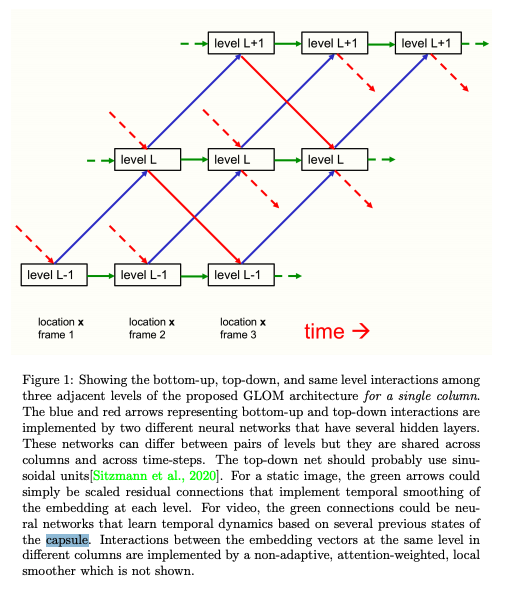
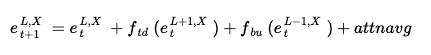
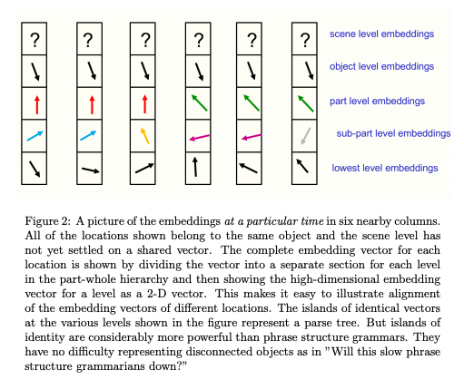
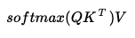
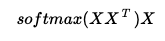

# GLOM

## Object Recongition as parse tree

Let's assume that there is an image of a car. A car has cabin, motor, and wheels. If we represent this as a parse tree, then the root node will be a car, and it has 3 children nodes: nodes for 1) cabin, 2) motor, and 3) wheels. A cabin includes windows and door area, so the cabin node will have 2 children nodes: window node and door area node.

So, the main object of the GLOM is to build a parse tree when the image is given, and the neural net will fully understand the content of the image if it could build the parse tree correctly. If the AI could build a suitable parse tree for the input image, then the AI could recognise the vision data just like a human recognise the world.

### Capsule network

So, let's assume that there is a capsule network, which has multiple layers of capsules. The first layer (the lowest layer) of the capsules would sort of recognise the smallest parts. And the upper layers will recognise the bigger parts, respectively. And each node will connected with other nodes in the subsequent layer. For example, the window node in the first layer will be connected with the cabin node in the second layer.

The capsule network idea was also considered by Hinton, however, Hinton published a newer idea in the GLOM paper.

## GLOM architecture

The GLOM architecture is composed of a large number of columns which all use exactly the same weights. Each column is a stack of spatially local autoencoders that learn multiple levels of representation for what is happening in a small image patch. Each autoencoder transforms the embedding at one level into the embedding at an adjacent level using a multilayer bottom-up encoder and a multilayer top-down decoder. These levels correspond to the levels in a part-whole hierarchy. When shown an image of a face, for example, a single
column might converge on embedding vectors representing a nostril, a nose, a face, and a person. The image below shows how the embeddings at different levels interact in a single column.

At each discrete time and in each column separately, the embedding at a level is updated to be the weighted average of four contributions:

    1) The embedding vector at the previous time step.

    2) The prediction produced by the bottom-up neural net acting on the embedding at the level below at the previous time.

    3) The prediction produced by the top-down neural net acting on the embedding at the level above at the previous time.

    4) The attention-weighted average of the embeddings at the same level in nearby columns at the previous time.

We could represent this as follow equation:

where f_td is the top-down function, f_bu is the bottom-up function, and attnavg is the attention-weighted average of the embeddings at the same level in nearby columns at the previous time.

So, the main aim of doing this is to build the islands as below.

If you see the image above, you could find that the vectors in the lowest layer are all different. This means that every cell in the lowest layer in each column represents different pixels (or different instance). If you see the second layer, then you could find that the first 2 columns have same vector, and the 3rd and 4th columns also have same vector. And in the third layer, first 3 columns have same vector, where the last 3 columns have same vector. The reason that multiple columns have same vector is because the target instance is located at a larger than one location. The layers in the columns represents different range of embeddings, where the lower layers are looking for the smaller locations, and the higher layers are looking for the larger locations.

### Cross column attention mechanism

To calculate the attention-weighted average of the embeddings at the same level in nearby columns at the previous time, we need to do the cross column attention mechanism. In general, we use the Q, K, V for self-attention mechanism, however, in GLOM architecture we just use the embeddings itself as Q, K and V. It seems like Hinton really wanted to simplify the attention mechanism.

self-attention:

attention in GLOM (X is the embeddings):

## Summary

Geoffrey Hinton describes [GLOM [1]](https://arxiv.org/abs/2102.12627), a Computer Vision model that combines transformers, neural fields, contrastive learning, capsule networks, denoising autoencoders and RNNs. GLOM decomposes an image into a parse tree of objects and their parts. However, unlike previous systems, the parse tree is constructed dynamically and differently for each input, without changing the underlying neural network. This is done by a multi-step consensus algorithm that runs over different levels of abstraction at each location of an image simultaneously. GLOM is just an idea for now but suggests a radically new approach to AI visual scene understanding.

## References

[1] Geoffrey Hinton. [How to represent part-whole hierarchies in a neural network](https://arxiv.org/abs/2102.12627)
