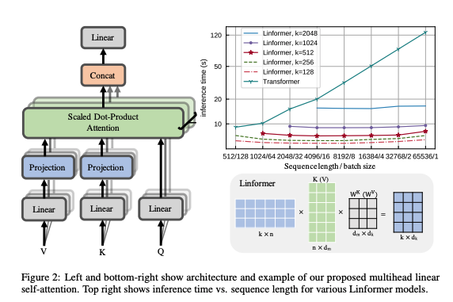
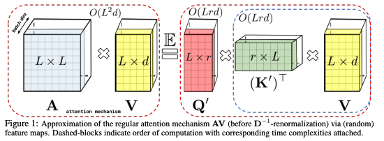
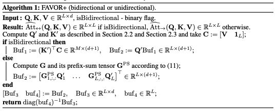
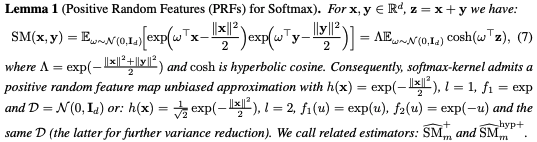

# Quadratic memory issue

Since the Transformer Layers compute the attention map by doing the dot product with K and V (Key and Value), the size of the memory increases quadratically when increasing the size of the input data.

## Linformer

[Wang. et. al [1]](https://arxiv.org/abs/2006.04768) stated that the self-attention is low rank. Based on this theorem, they proposed a new self-attention mechanism, which reduces the overall self-attention complexity from O(n^2) to O(n) in both time and space. The resulting linear transformer, the Linformer, performs on par with standard Transformer models, while being much more memory- and time-efficient.

### 해설 (Linformer)

"low rank"란 저차원이라는 뜻으로, 이 논문의 저자들은 self-attention을 통해 만든 attention map을 보면 대부분의 정보가 낮은 차원 (eigenvalue index < 128)에 몰려 있다는 점을 밝혔고, 고차원의 데이터를 저차원에 투영(projection)했을 때, 투영된 데이터 점들 사이의 거리는 원래의 데이터 점들 사이의 거리와 큰 괴리가 없다는 점 역시 밝혔다. 이를 통해서, 논문의 저자들은 V와 K의 차원을 줄이는 Projection layer를 Attention mechanism 내에 추가함으로써 별다른 성능저하 없이 어텐션 맵의 차원을 줄이는 데 성공해냈다.

## Performer

Transformers have huge memory and compute requirements because they construct an Attention matrix, which grows quadratically in the size of the input. The [Performer [2]](https://arxiv.org/abs/2009.14794) is a model that uses random positive orthogonal features to construct an unbiased estimator to the Attention matrix and obtains an arbitrarily good approximation in linear time! The method generalizes beyond attention and opens the door to the next generation of deep learning architectures.

- Performers do not rely on any priors such as sparsity or low-rankness.

- Performers use the FAVOR+ mechanism, leveraging new methods for approximating softmax and Gaussian kernels.

As you could see above, the Performers performs the attention mechanism by calculating the Q'(K'^T*V), where Q'!= Q and K'!= K.

### FAVOR+ mechanism

_Fast Attention Via Positive Orhogonal Random features_

The FAVOR+ mechanism provides scalable low-variance and unbiased estimation of attention mechanism that can be expressed by random feature map decompositions.

#### Positive Random Features (PRFs)

If you see the paper, you could find that both sin and cos are used for kernel function. As you know, the softmax function should always return the positive value, however, in this case there would be a chance that the negative values might be included. To overcome this issue, the unbiased positive random feature map mechanism is proposed.

By using the PRF, they show that any attention matrix can be effectively approximated in downstream Transformer-applications using random features.

#### Orthogonal Random features (ORFs)

To further reduce the variance of the estimator (which makes it possible to use an even smaller number of random features r), the method that entangles different random samples w1, w2,..., wm to be exactly orhogonal.

ORFs is a well-known method, yet it turns out that it works particularly well with the introduced PRFs for softmax. This leads to the first theoretical results showing that ORFs can be applied to reduce the variance of softmax/Gaussian kernel estimators for any dimensionality d rather than just asymptotically for large enough d (as is the case for previous methods) and leads to the first exponentially small bounds on large deviations probabilities that are strictly smaller than for non-orthogonal methods.
(직교(orthognality)를 사용한 버전이 사용하지 않은 버전보다 더 작은 범위를 가진다는 내용)

### 해설 (Performer)

핵심 내용은 Transformer의 softmax(QK^T)를 커널을 통해 근사(approximate)하는 함수를 사용해서 linearity를 갖게 한다는 것이다.

보통 커널트릭을 사용하게 되면 알맞은 커널함수 K를 구하면 원래의 식과 커널함수의 식이 거의 동일한 형태를 띄게 되고, 이를 활용해서 저차원과 고차원을 매핑하려고 한다. 즉, 커널함수를 찾는 것이 목표가 아니라 고차원과 저차원의 매핑이 주 목적이 되는 것이다. 하지만, Performers의 경우에는 커널함수 자체를 찾는 것을 목표로 한다. 왜냐하면 찾아낸 커널함수 자체가 바로 근접시킨 어텐션 메카니즘이기 때문이다.

논문에서 사용하는 커널 식에 sin과 cos이 사용이 된다. 알다시피 softmax는 하상 양수만 반환하는데 비해, 커널함수의 식에 sin과 cos이 포함되기 때문에 음수값을 포함할 수 있는 상황이 발생하게 된다. 따라서, 결론적으로 이는 올바른 근사가 아니기 때문에, 이를 극복하고자 unbiased positive random feature map 메커니즘을 사용한다.

또한, estimator의 분산을 줄이기 위해서 (estimator의 분산을 줄이게 되면 근사된 커널함수에서의 Q'와 K'의 차원과 관련된 변수 r의 크기를 줄일 수 있게 된다) w1, w2, ..., wm이 모두 정확히 직교하게 만든다. 논문에서는 이 직교(orthognality)를 사용한 버전이 사용하지 않은 버전보다 더 작은 범위를 가진다는 것을 증명해 냈다.

## Longformer

## References

[1] Sinong Wang, Belinda Z. Li, Madian Khabsa, Han Fang, Hao Ma. [Linformer: Self-Attention with Linear Complexity](https://arxiv.org/abs/2006.04768)

[2] Krzysztof Choromanski, Valerii Likhosherstov, David Dohan, Xingyou Song, Andreea Gane, Tamas Sarlos, Peter Hawkins, Jared Davis, Afroz Mohiuddin, Lukasz Kaiser, David Belanger, Lucy Colwell, Adrian Weller. [Rethinking Attention with Performers](https://arxiv.org/abs/2009.14794)
