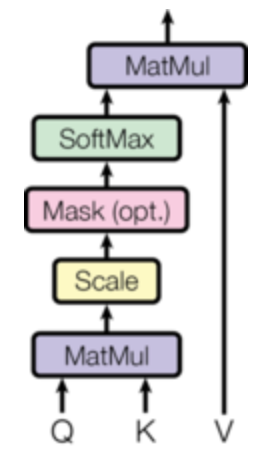
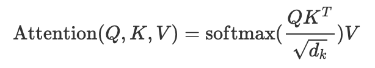
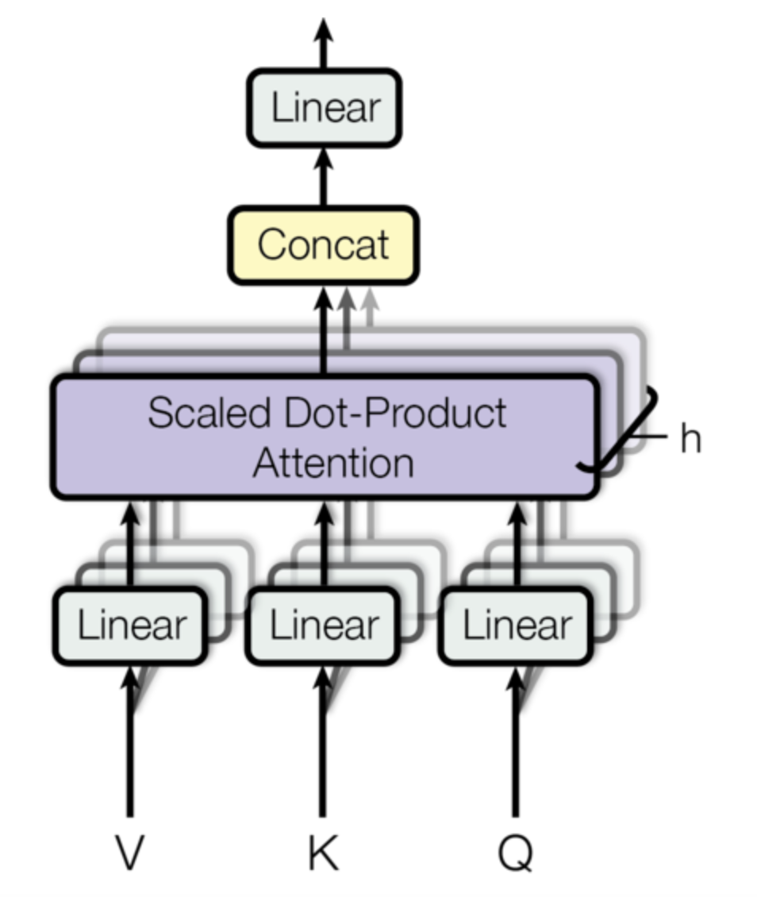
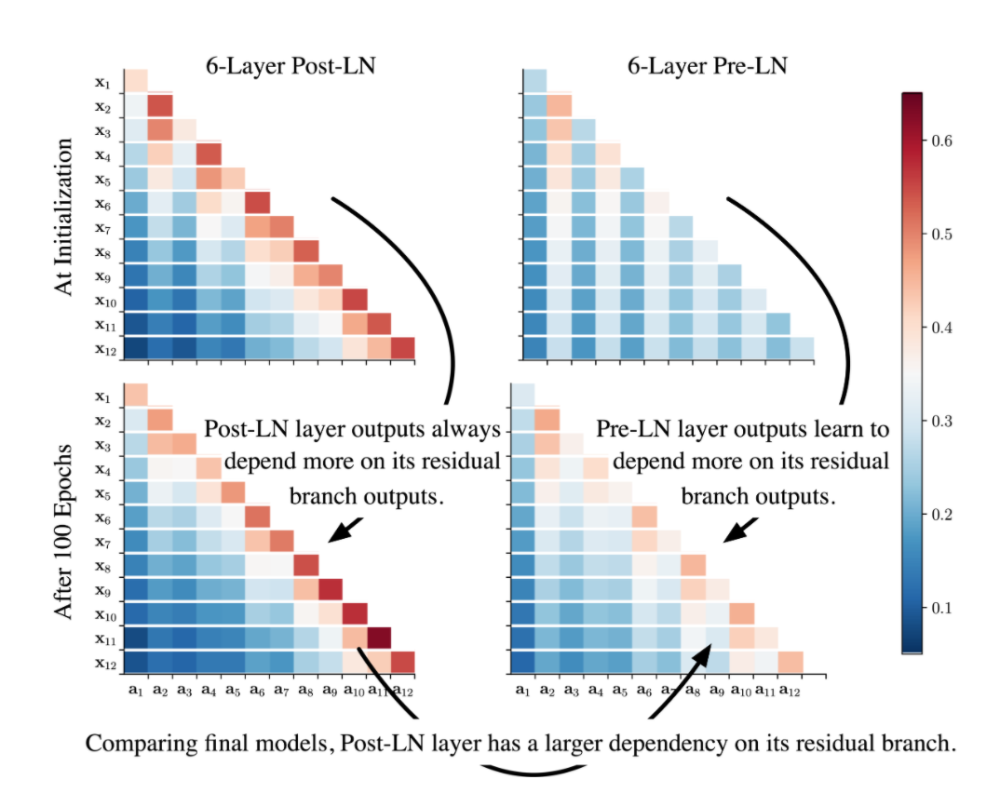
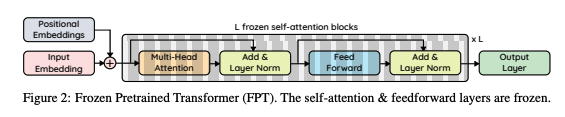

# Transformers

Transformers are a type of neural network architecture that have been gaining popularity. It was proposed by [Vaswani et al. [1]](https://arxiv.org/abs/1706.03762)

Basically, from 2018, the Transformer based models achieved SOTA for at least one NLP tasks (i.e. BERT achieved the SOTA for 11 NLP tasks). In 2020, the Transformer architecture is also used for CV tasks (i.e. DETR for object detection).

## Key advantage of Transformer

A key advantage of a Transformer over other neural network (NN) structures is that a longer-distanced context around a word is considered in a more computationally efficient way.

## Success factor of Transformer (Korean)

Transformers의 성공 요소는 크게 Self-Supervision 과 Self-Attention 으로 나눌 수 있습니다. 세상엔 굉장히 다양한 데이터가 존재하지만, Supervised Learning으로 학습을 시키기 위해선 일일이 annotation을 만들어줘야 하는데, 대신 무수히 많은 unlabeled 데이터들을 가지고 모델을 학습 시키는 Self-Supervised Learning을 통해 모델을 학습 시킬 수 있습니다. Self-Supervised Learning을 통해 주어진 막대한 데이터 셋에서 generalizable representations을 배울 수 있게 되며, 이렇게 pretraining시킨 모델을 downstream task에 fine-tuning 시키면 우수한 성능을 거둘 수 있게 됩니다.

또 다른 성공 요소인 Self-Attention은 말 그대로 스스로 attention을 계산하는 것을 의미하며 CNN, RNN과 같이 inductive bias가 많이 들어가 있는 모델들과는 다르게 최소한의 inductive bias를 가정합니다. Self-Attention Layer를 통해 주어진 sequence에서 각 token set elements(ex, words in language or patches in an image)간의 관계를 학습하면서 광범위한 context를 고려할 수 있게 됩니다.

## Semi-Supervised Learning

Transformers typically undergo semi-supervised learning involving unsupervised pretraining followed by supervised fine-tuning.

## Positional Encoding

Unlike traditional language models, the Transformer model has neither recurrence nor convolution. Thus, in order for the model to make use of the order of the sequence, we must inject some information about the relative or absolute position of the tokens in the sequence. To this end, we add “positional encodings” to the input embeddings at the bottoms of the encoder and decoder stacks. The positional encodings have the same dimension d_model as the embeddings, so that the two can be summed. There are many choices of positional encodings, learned and fixed [[5]](https://arxiv.org/abs/1705.03122).

To implement this, Vaswani et al. used the sine and cosine functions of different frequencies PE_(pos, 2i) = sin(pos / 10000^(2i / d_model)) and PE_(pos, 2i + 1) = cos(pos / 10000^(2i / d_model)) where pos is the position and i is the dimension. That is, each dimension of the positional encoding corresponds to a sinusoid. The wavelengths form a geometric progression from 2π to 10000 ⋅ 2π. This function is chosen because hypothesized it would allow the model to easily learn to attend by relative positions, since for any fixed offset k, PE_(pos + k) can be represented as a linear function of PE_pos.

## Attention mechanism in Transformers

An attention function can be described as mapping a query and a set of key-value pairs to an output, where the query, keys, values, and output are all vectors. The output is computed as a weighted sum of the values, where the weight assigned to each value is computed by a compatibility function of the query with the corresponding key.

We call our particular attention “Scaled Dot-Product Attention”. The input consists of queries and keys of dimension d_k, and values of dimension d_v.

In practice, we compute the attention function on a set of queries simultaneously, packed together into a matrix Q. The keys and values are also packed together into matrices K and V. We compute the matrix of outputs as below.

The two most commonly used attention functions are additive attention, and dot-product attention. Additive attention computes the compatibility function using a feed-forward network with a single hidden layer. While the two are similar in theoretical complexity, dot-product attention is much faster and more space-efficient in practice, since it can be implemented using highly optimized matrix multiplication code.

While for small values of d_k the two mechanisms perform similarly, additive attention outperforms dot product attention without scaling for larger values of d_k [[4]](https://arxiv.org/abs/1703.03906).

### Multi-head Attention

Multi-head attention allows the model to jointly attend to information from different representation subspaces at different positions. With a single attention head, averaging inhibits this.

By using this Multi-head Attention method, the Transformer model could perform attention mechanism for each sequence in parallel. In othre words, we could use GPU to perform attention mechanism for each sequence concurrently.

### Applications of Attention in Transformer

The Transformer model uses Attention mechanism in 3 different ways.

#### Encoder-Decoder Attention

The queries come from the previous decoder layer, and the memory keys and values come from the output of the encoder. This allows every position in the decoder to attend over all positions in the input sequence. This mimics the typical encoder-decoder attention mechanisms in sequence-to-sequence models such as [Google's Neural Machine Translation System [3]](https://arxiv.org/abs/1609.08144).

#### Self-Attention Layer in Encoder

The encoder contains self-attention layers. In a self-attention layer all of the keys, values and queries come from the same place, in this case, the output of the previous layer in the encoder. Each position in the encoder can attend to all positions in the previous layer of the encoder.

#### Self-Attention Layer in Decoder

Similar to the self-attention Layer in Encoder, self-attention layers in the decoder allow each position in the decoder to attend to all positions in the decoder up to and including that position.

When implement this layer, we need to prevent leftward information flow in the decoder to preserve the auto-regressive property.

## Clinics

### Dependency and Amplification Effect

According to [Liu et al. [2]](https://arxiv.org/abs/2004.08249), Pre-LN is more robust than Post-LN, whereas Post-LN typically leads to a better performance.

With further exploration, Liu et al. find that for a N-layer residual network, after updating its parameters W to W*, its outputs change is proportion to the dependency on residual branches.

Intuitively, since a larger output change indicates a more unsmooth loss surface, the large dependency complicates training. In the paper, Liu et al. said that "each layer in a multi-layer Transformer model, heavy dependency on its residual branch makes training unstable since it amplifies small parameter perturbations (e.g., parameter updates) and result in significant disturbances in the model output, yet a light dependency limits the potential of model training and can lead to an inferior trained model".

Inspired by these analysis, Liu et al. proposed the Admin (adaptive model initialization), which starts the training from the area with a smoother surface.

## Shortformer

[O.Press et. al. [6]](https://arxiv.org/abs/2012.15832) challenge the conventional wisdom that scaling transformer language models to longer sequences improves results. They show that by initially training on shorter sub-sequences and then progressing to longer ones via staged training, we can improve perplexity and reduce training time.

They additionally define a new method, position-infused attention, that enables caching and efficiently attending to previously computed representations. This method does not require large input sub-sequences.

## Towards AGI

[Lu et al. [7]](https://arxiv.org/abs/2103.05247) stated that it is possible to use the Transformer that is pre-trained with natural language dataset for fine-tuning with different domain. For example, they used the pre-trained Transformer (pre-trained with NLP dataset) for various non-language downstream tasks: image classfication, bitwise operation, homology detection, etc.

They found that the model that is pre-trained with the language dataset works well both language downstream tasks and non-language downstream tasks. While doing the tasks, they found that we could do the domain transfer learning with all domains as a pre-training task, however, the model that is pre-trained with language dataset outperforms the others. This means that we could use the language pre-training tasks for any other domains, and do the domain transfer learning for fine-tuning.

Furthermore, they stated that it is much efficient to freeze the self-attention layers and feed-forward layers when fine-tuning the Transfoermer. They stated that there is a possibility that the Transformer might be overfitted if we do not freeze the self-attention layers and feed-forward layers. In other words, it is possible to say that freezing these layers could help us to prevent overfitting.

Unlike self-attention layers and feed-forward layers, they stated that it is better to fine-tuning the output layer, input layer, layer-norm parameters, and positional embedding parameters.

## ∞ -former

Transformers struggle when attending to long contexts, since the amount of computation grows with the context length, and therefore they cannot model long-term memories effectively. Several variations have been proposed to alleviate this problem, but they all have a finite memory capacity, being forced to drop old information. [P. H. Martins et. al. [8]](https://arxiv.org/abs/2109.00301) propose the ∞-former, which extends the vanilla transformer with an unbounded long-term memory. By making use of a continuous-space attention mechanism to attend over the long-term memory, the ∞-former's attention complexity becomes independent of the context length. Thus, it is able to model arbitrarily long contexts and maintain "sticky memories" while keeping a fixed computation budget.

Unlike LSTM that backpropagates through time for learning via timesteps, everything in ∞ -former works heuristically. The ∞ -former uses the continuous attention, which adapts not the tokens but continuous signal to the self attention.

## References

[1] Ashish Vaswani, Noam Shazeer, Niki Parmar, Jakob Uszkoreit, Llion Jones, Aidan N. Gomez, Lukasz Kaiser, Illia Polosukhin. [Attention Is All You Need](https://arxiv.org/abs/1706.03762)

[2] Liyuan Liu, Xiaodong Liu, Jianfeng Gao, Weizhu Chen, Jiawei Han. [Understanding the Difficulty of Training Transformers](https://arxiv.org/abs/2004.08249)

[3] Yonghui Wu, Mike Schuster, Zhifeng Chen, Quoc V. Le, Mohammad Norouzi, Wolfgang Macherey, Maxim Krikun, Yuan Cao, Qin Gao, Klaus Macherey, Jeff Klingner, Apurva Shah, Melvin Johnson, Xiaobing Liu, Łukasz Kaiser, Stephan Gouws, Yoshikiyo Kato, Taku Kudo, Hideto Kazawa, Keith Stevens, George Kurian, Nishant Patil, Wei Wang, Cliff Young, Jason Smith, Jason Riesa, Alex Rudnick, Oriol Vinyals, Greg Corrado, Macduff Hughes, Jeffrey Dean. [Google's Neural Machine Translation System: Bridging the Gap between Human and Machine Translation](https://arxiv.org/abs/1609.08144)

[4] Denny Britz, Anna Goldie, Minh-Thang Luong, Quoc Le. [Massive Exploration of Neural Machine Translation Architectures](https://arxiv.org/abs/1703.03906)

[5] Jonas Gehring, Michael Auli, David Grangier, Denis Yarats, Yann N. Dauphin. [Convolutional Sequence to Sequence Learning](https://arxiv.org/abs/1705.03122)

[6] Ofir Press, Noah A. Smith, Mike Lewis. [Shortformer: Better Language Modeling using Shorter Inputs](https://arxiv.org/abs/2012.15832)

[7] Kevin Lu, Aditya Grover, Pieter Abbeel, Igor Mordatch. [Pretrained Transformers as Universal Computation Engines](https://arxiv.org/abs/2103.05247)

[8] Pedro Henrique Martins, Zita Marinho, André F. T. Martins. [∞-former: Infinite Memory Transformer](https://arxiv.org/abs/2109.00301)
