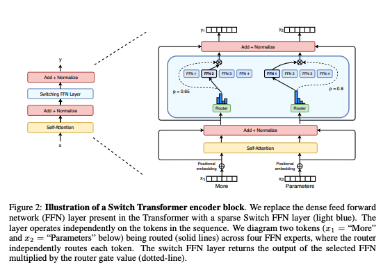
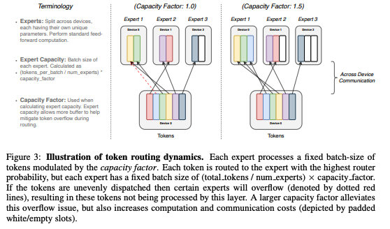
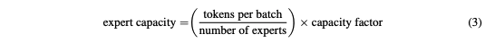
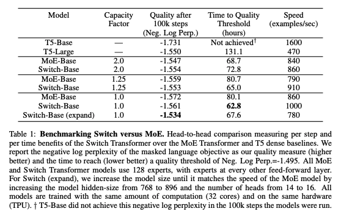
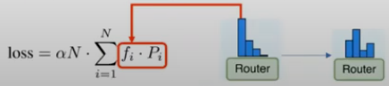
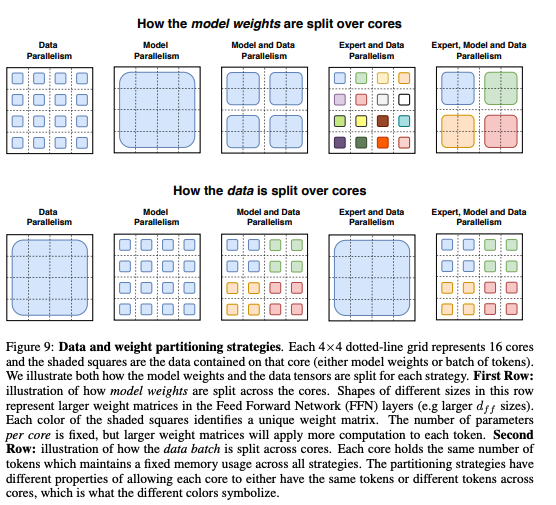
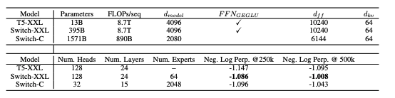
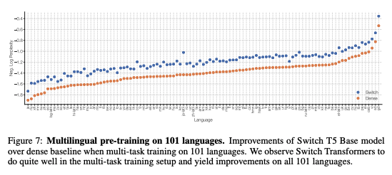

# Switch Transformers

## Mixture of Experts (MoE)

The key idea is to make each expert focus on predicting the right answer for the cases where it is already doing better than the other experts

- If we always average all the predictors, each model is trying to compensate for the combined error made by all the other models

## Switch_Transformers

Scale is the next frontier for AI. Google Brain uses sparsity and hard routing to massively increase a model's parameters, while keeping the FLOPs per forward pass constant.
The [Switch Transformer [1]](https://arxiv.org/abs/2101.03961) compares favorably to its dense counterparts in terms of speed and sample efficiency and breaks the next magic number: One Trillion Parameters.

[codebase](https://github.com/google-research/text-to-text-transfer-transformer)

### Abstract

In deep learning, models typically reuse the same parameters for all inputs. Mixture of Experts (MoE) defies this and instead selects different parameters for each incoming example. The result is a sparsely-activated model -- with outrageous numbers of parameters -- but a constant computational cost. However, despite several notable successes of MoE, widespread adoption has been hindered by complexity, communication costs and training instability -- we address these with the Switch Transformer. We simplify the MoE routing algorithm and design intuitive improved models with reduced communication and computational costs. Our proposed training techniques help wrangle the instabilities and we show large sparse models may be trained, for the first time, with lower precision (bfloat16) formats. We design models based off T5-Base and T5-Large to obtain up to 7x increases in pre-training speed with the same computational resources. These improvements extend into multilingual settings where we measure gains over the mT5-Base version across all 101 languages. Finally, we advance the current scale of language models by pre-training up to trillion parameter models on the "Colossal Clean Crawled Corpus" and achieve a 4x speedup over the T5-XXL model.

## Simplify and Improve MoE

One of the key ideas in the Switch Transformers is the simplified version of the MoE (Mixture of Experts). The Switch Transformer only selects the one expert from multiple experts, and route the token to the selected expert. If you see the image below, you could find that the routers in the switch transformer route the input token to the suitable FFN (Feed-Forward Network), where each FFN is an expert.

Basically, Fedus et. al. replaced the dense FFN layer in the Transformer with the sparse FFN layer with the MoE router. And this is actually an interesting point, sicne all previous papers that use MoE stated the the MoE only works when K > 2 for selecting Top K experts to route to. However, the Switch Transformer showed a meaningful result with Top 1 expert routing algorithm.

Since it only selects 1 expert, the Switch Trnasformer's router requires much less operations than the other MoE solutions. Also, if we routes the tokens to multiple experts, the model would be too complicated, which might occur some unexpected errors. However, by choosing Top 1 expert, the Switch Transformer simplified the MoE algorithm, and solve the complicateness issue.

### Distributed Switch Implementation

All of the tensor shapes are statically determined at compilation time, but the computation of the Switch Transformer is dynamic due to the routing decisions at training and inference.

Because of this, one important technical consideration is how to set the expert capacity. The expert capacity – the number of tokens each expert computes – is set by evenly dividing the number of tokens in the batch across the number of experts, and then further expanding by a capacity factor.

A capacity factor greater than 1.0 creates additional buffer to accommodate for when tokens are not perfectly balanced across experts. If too many tokens are routed to an expert (referred to later as dropped tokens), computation is skipped and the token representation is passed directly to the next layer through the residual connection. Increasing the expert capacity is not without drawbacks, however, since high values will result in wasted computation and memory.

Empirically Fedus et al. find ensuring lower rates of dropped tokens are important for the scaling of sparse expert-models.

Furthermore, to avoid the phenomenon that too many tokens are allocated to a single expert, Fedus et al. added a load-balancing loss function. The load-balancing loss helps the router to route the tokens to experts evenly by modulating the max value.

## Selective precision

Sparse expert models may introduce training difficulties over a vanilla Transformer. Instability can result because of the hard-switching (routing) decisions at each of these layers. Further, low precision formats like bfloat16 can exacerbate issues in the softmax computation for our router.

Model instability hinders the ability to train using efficient bfloat16 precision, and as a result, [Lepikhin et al. [2]](https://arxiv.org/abs/2006.16668) trains with float32 precision throughout their MoE Transformer. However, Fedus et al. show that by instead selectively casting to float32 precision within a localized part of the model, stability may be achieved, without incurring expensive communication cost of float32 tensors. Table 2 shows that our approach permits nearly equal speed to bfloat16 training while conferring the training stability of float32.

## Parallelism

In the paper, they compared the various parallelism methods: model parallelism, data parallelism, model and data parallelism, expert and data parallelism, and expert, data and model parallelism.

Clearly, the parallelism increased the performance, however, they found that the performance decreases when we do both model parallelism and expert parallelism. Probably, this is because that the training process is not stable since using both model and expert parallelism, which increased the complexity.

## Multi-lingual learning

Fedus et. al. tested if the Switch Transformer outperforms the previous model. What they did is that they modified the T5 model for multi-lingual task, and compare the accuracy between Switch Transformer and T5. As you could see below, the Switch Transformer outperform the T5 for all 101 languages.

## Summary

Scale is the next frontier for AI. Google Brain uses sparsity and hard routing to massively increase a model's parameters, while keeping the FLOPs per forward pass constant. The Switch Transformer compares favorably to its dense counterparts in terms of speed and sample efficiency and breaks the next magic number: One Trillion Parameters.

## References

[1] William Fedus, Barret Zoph, Noam Shazeer. [Switch Transformers: Scaling to Trillion Parameter Models with Simple and Efficient Sparsity](https://arxiv.org/abs/2101.03961)

[2] Dmitry Lepikhin, HyoukJoong Lee, Yuanzhong Xu, Dehao Chen, Orhan Firat, Yanping Huang, Maxim Krikun, Noam Shazeer, and Zhifeng Chen. [Gshard: Scaling giant models with conditional computation and automatic sharding](https://arxiv.org/abs/2006.16668)
